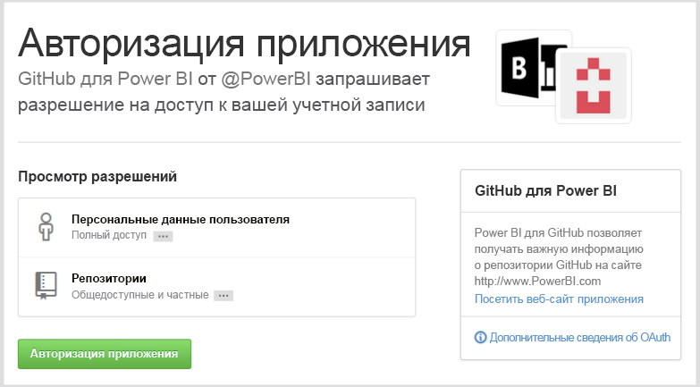
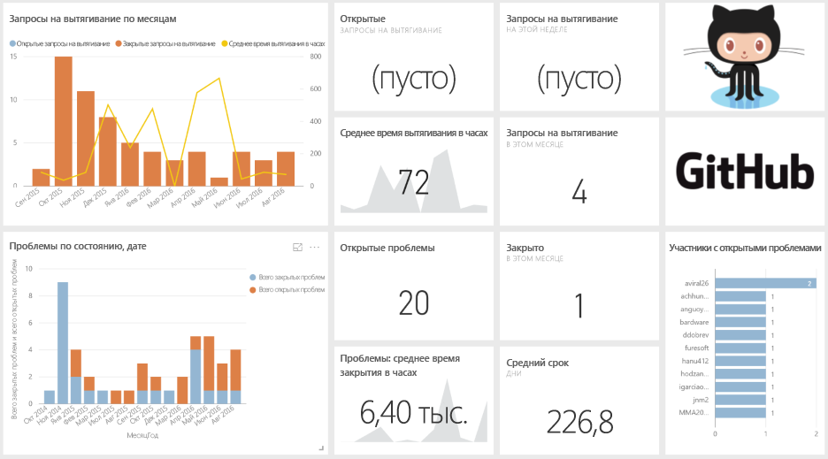
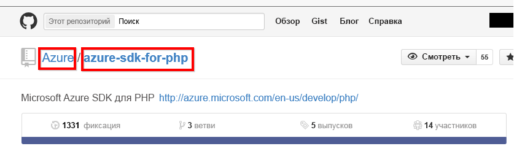

# Подключение к GitHub с помощью Power BI
Пакет контента GitHub для Power BI позволяет анализировать данные в репозитории GitHub, используя информацию о вкладах пользователей, проблемах, запросах получения и активных пользователях.

Подключитесь к [пакету содержимого GitHub](https://app.powerbi.com/getdata/services/github) или прочтите дополнительные сведения об [интеграции GitHub](https://powerbi.microsoft.com/integrations/github) с Power BI.

>[!NOTE]
>Для пакета содержимого требуется учетная запись GitHub для доступа к репозиторию. Дополнительные сведения о требованиях см. ниже.

## Способы подключения
1. Нажмите кнопку **Получить данные** в нижней части левой панели навигации.
   
    
2. В поле **Службы** выберите **Получить**.
   
    
3. Выберите **GitHub** \> **Получить**.
   
   
4. Введите имя и владельца репозитория. Сведения о том, как найти необходимые параметры, см. [ниже](#FindingParams).
   
   
5. Введите учетные данные GitHub (этот шаг можно пропустить, если вы уже выполнили вход в браузере). 
6. В качестве **метода проверки подлинности** выберите **oAuth2** \> **Войти**. 
7. Следуйте инструкциям на экране. Предоставьте пакету контента GitHub для Power BI разрешение для доступа к данным GitHub.
   
   
   
   После этого служба Power BI подключится к GitHub и сможет получать данные.  Данные обновляются раз в день.
8. После подключения к репозиторию служба Power BI импортирует данные. В области навигации слева появятся новая [информационная панель GitHub](https://powerbi.microsoft.com/integrations/github), отчет и набор данных. Новые элементы отмечены желтой звездочкой \*.
   
   

**Дальнейшие действия**

* Попробуйте [задать вопрос в поле "Вопросы и ответы"](power-bi-q-and-a.md) в верхней части информационной панели.
* [Измените плитки](service-dashboard-edit-tile.md) на информационной панели.
* [Выберите плитку](service-dashboard-tiles.md), чтобы открыть соответствующий отчет.
* Хотя набор данных будет обновляться ежедневно по расписанию, вы можете изменить график обновлений или попытаться выполнять обновления по запросу с помощью кнопки **Обновить сейчас**.

## Содержимое
В GitHub для Power BI доступны следующие данные:     

| Имя таблицы | Описание |
| --- | --- |
| Вклады |В таблице вкладов представлены общие дополнения, удаления и фиксации автора за неделю. Первые 100 участников включены. |
| Проблемы |Список всех проблем для выбранного репозитория и вычисления, например общее и среднее время закрытия проблемы, общее число открытых проблем и общее число закрытых проблем. При отсутствии проблем в репозитории эта таблица будет пустой. |
| Запросы на получение |В этой таблице содержатся все запросы на получение для репозитория и отправители запросов. Он также содержит вычисления, связанные с тем, сколько запросов на включение внесенных изменений открыто и закрыто, а также каково их общее количество, продолжительность выполнения и средняя продолжительность. При отсутствии проблем в репозиторий эта таблица будет пустой. |
| Пользователи |Эта таблица предоставляет список пользователей или участников GitHub, которые вносили свой вклад, заявляли о проблемах или обрабатывали запросы на получение для выбранного репозитория. |
| Вехи |Эта таблица содержит все вехи выбранного репозитория. |
| DateTable |Эта таблицы содержит даты от сегодняшнего дня до нескольких лет в прошлом, позволяющие анализировать данные GitHub по дате. |
| ContributionPunchCard |Эту таблицу можно использовать как карточку отметки вкладов для выбранного репозитория. Здесь отображаются фиксации по дням недели и времени. Таблица не связана с другими таблицами в модели. |
| RepoDetails |Эта таблица содержит сведения о выбранном репозитории. |

## Требования к системе
* Учетная запись GitHub с доступом к репозиторию.  
* Разрешения, предоставленные приложению Power BI для GitHub во время первого входа в систему. Подробные сведения об отзыве доступа см. ниже.  
* Наличие достаточного числа вызовов API для извлечения и обновления данных.  

### Отмена авторизации Power BI
Для отмены авторизации Power BI для подключения к репозиторию GitHub может отозвать доступ в GitHub. Дополнительные сведения см. в этом разделе [Справки по GitHub](https://help.github.com/articles/keeping-your-ssh-keys-and-application-access-tokens-safe/#reviewing-your-authorized-applications-oauth).

## Поиск параметров
Владельца и имя репозитория можно определить, просмотрев репозиторий на портале GitHub:

Первая часть, "Azure", — это владелец, а вторая часть, "azure-sdk-for-php", — это сам репозиторий.  Эти же два элемента можно увидеть в URL-адресе репозитория:

    <https://github.com/Azure/azure-sdk-for-php> .

## Устранение неполадок
При необходимости вы можете проверить учетные данные GitHub.  

1. В другом окне браузера перейдите на веб-сайт GitHub и войдите в GitHub. Состояние входа можно увидеть в правом верхнем углу сайта GitHub.    
2. На портале GitHub перейдите по URL-адресу репозитория, к которому вы планируете получать доступ к Power BI. Например: https://github.com/dotnet/corefx.  
3. Вернувшись в Power BI, попытайтесь подключиться к GitHub. В диалоговом окне настройки GitHub укажите название репозитория и имя его владельца.  

## Дальнейшие действия
* [Приступая к работе с Power BI](service-get-started.md)
* [Получение данных](service-get-data.md)

