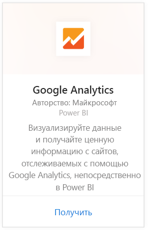
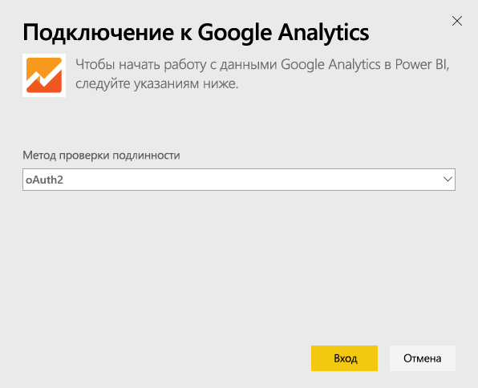
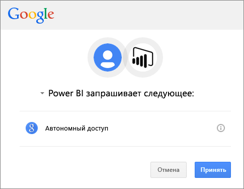
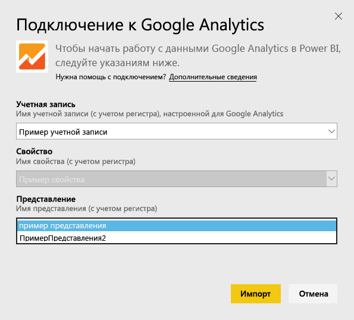
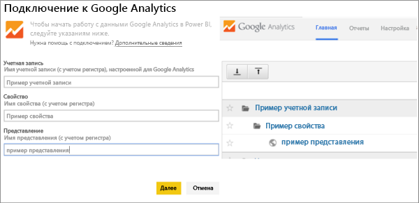

# Подключение к Google Analytics с помощью Power BI
Подключение к Google Analytics через Power BI начинается с подключения к учетной записи Google Analytics. Вы получите панель мониторинга Power BI с отчетами, с помощью которых можно получить представление о трафике сайта и измерениях пользователей. Вы можете взаимодействовать с панелью мониторинга и отчетами, но не сохранять изменения. Данные автоматически обновляются раз в день.

Подключитесь к [Google Analytics](https://app.powerbi.com/getdata/services/google-analytics) для Power BI. См. дополнительные сведения об [интеграции Google Analytics](https://powerbi.microsoft.com/integrations/google-analytics) с Power BI.

Вы можете создавать настраиваемые панели мониторинга и отчеты, используя [соединитель Google Analytics](service-google-analytics-connector.md) в Power BI Desktop. Просто подключитесь к учетной записи Google Analytics и создайте пользовательские отчеты, которые вы можете опубликовать в службе Power BI.

## Способы подключения
[!INCLUDE [powerbi-service-apps-get-more-apps](./includes/powerbi-service-apps-get-more-apps.md)]

1. Выберите **Google Analytics** \> **Получить**.
   
   
2. При появлении запроса введите учетные данные Google Analytics. Выберите механизм проверки подлинности **oAuth 2** и нажмите **Войти**. Следуйте инструкциям проверки подлинности Google (может использоваться двухфакторная проверка подлинности, если она настроена).
   
   
3. Нажмите кнопку **Принять** , чтобы предоставить Power BI доступ к данным Google Analytics.
   
   
4. Power BI подключается к определенному представлению Google Analytics. Выберите имя учетной записи, имя свойства и имя представления, к которому вы хотите подключиться. Эти сведения можно найти в учетной записи Google Analytics — в верхнем левом углу или на вкладке **Главная**. Подробности см. ниже. 
   
   
5. Нажмите кнопку **Подключить** , чтобы начать импорт. 

## Просмотр панели мониторинга и отчетов Google Analytics
[!INCLUDE [powerbi-service-apps-open-app](./includes/powerbi-service-apps-open-app.md)]

      

[!INCLUDE [powerbi-service-apps-open-app](./includes/powerbi-service-apps-what-now.md)]

## Требования к системе
Для подключения из Power BI вам требуется учетная запись [Google Analytics](https://www.google.com/analytics/). В других учетных записях Google, к которым не подключена учетная запись Google Analytics, появится ошибка проверки подлинности.

## Устранение неполадок
**Учетные данные** При наличии нескольких учетных записей Google используйте во время подключения анонимный вход или окно браузера в режиме InPrivate, чтобы убедиться, что используется правильная учетная запись.

Если отображается сообщение об ошибке, уведомляющее о недействительности учетных данных, но вход в Google выполняется, убедитесь, что у вас есть учетная запись [Google Analytics](https://www.google.com/analytics/).

**Параметры** Сейчас для параметров необходимо использовать уникальные имена. Если отображается сообщение об ошибке, уведомляющее, что выбранное значение повторяется, выберите другое значение или измените имена в Google Analytics, чтобы сделать их уникальными. Мы активно работаем над улучшением данной функции.

>[!NOTE]
>Параметры зависят от регистра. Введите их точно так, как они отображаются в вашей учетной записи Google Analytics.

По-прежнему есть проблемы? Отправьте запрос в службу поддержки для связи с группой Power BI:

* В приложении Power BI щелкните вопросительный знак \> и выберите **Обратиться в службу поддержки**.
* На сайте службы поддержки Power BI (где вы читаете эту статью) выберите **Обратиться в службу поддержки** в правой части страницы.

## Дальнейшие действия
* [Что из себя представляют приложения в Power BI?](service-install-use-apps.md)
* [Получение данных в Power BI](service-get-data.md)
* Появились дополнительные вопросы? [Попробуйте задать вопрос в сообществе Power BI.](http://community.powerbi.com/)

