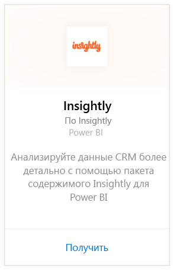
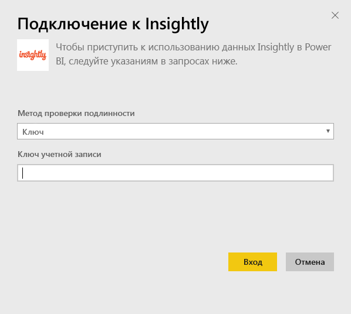
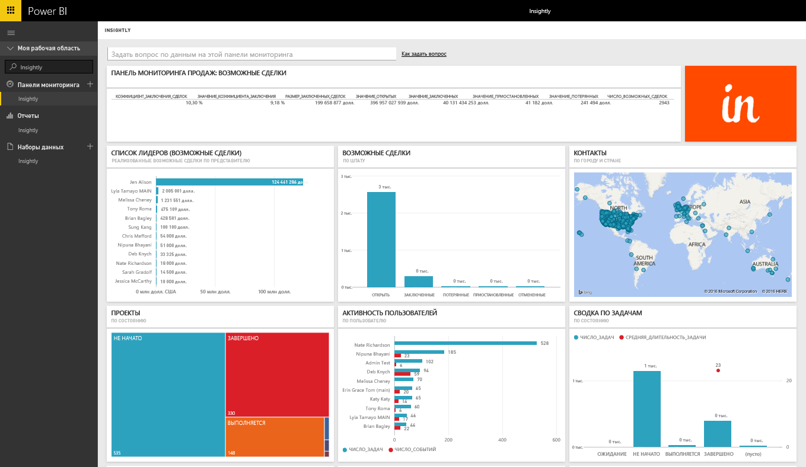
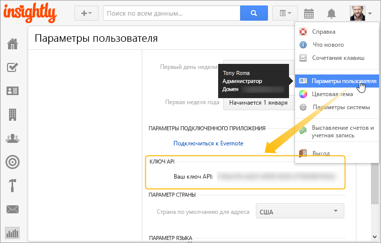

# Подключение к Insightly с помощью Power BI
Вы можете визуализировать и совместно использовать данные Insightly CRM в Power BI с помощью пакета содержимого Insightly. Подключитесь к Power BI с помощью ключа API Insightly для просмотра и создания отчетов и информационных панелей из данных CRM. С помощью Power BI можно анализировать данные новыми способами, создавать эффективные графики и диаграммы, а также отображать контакты, интересы и организации на карте.

[!INCLUDE [include-short-name](./includes/service-deprecate-content-packs.md)]

Подключитесь к [пакету содержимого Insightly](https://app.powerbi.com/getdata/services/insightly) для Power BI.

## Способы подключения
1. Нажмите кнопку **Получить данные** в нижней части левой панели навигации.
   
   
2. В поле **Службы** выберите **Получить**.
   
   
3. Выберите **Insightly** \> **Получить**.
   
   
4. Выберите **Ключ** в качестве типа проверки подлинности, введите ключ API Insight и выберите **Вход**. Дополнительные сведения о том, как [найти эти данные](#FindingParams), см. ниже.
   
   
5. После утверждения процесс импорта начнется автоматически. После завершения в области навигации появятся новая панель мониторинга, отчет и модель. Выберите панель мониторинга, чтобы просмотреть импортированные данные.
   
     

**Дальнейшие действия**

* Попробуйте [задать вопрос в поле "Вопросы и ответы"](consumer/end-user-q-and-a.md) в верхней части информационной панели.
* [Измените плитки](service-dashboard-edit-tile.md) на информационной панели.
* [Выберите плитку](consumer/end-user-tiles.md), чтобы открыть соответствующий отчет.
* Хотя набор данных будет обновляться ежедневно по расписанию, вы можете изменить график обновлений или попытаться выполнять обновления по запросу с помощью кнопки **Обновить сейчас**

## Содержимое
В пакет содержимого входят перечисленные ниже таблицы с полями из соответствующих записей.

| Таблицы |  |  |  |
| --- | --- | --- | --- |
| Контакты |Возможные сделки |Этапы воронки продаж |Дата завершения задачи |
| Пользовательские поля |Дата закрытия возможной сделки |Дата завершения проекта |Задачи |
| События |Прогнозная дата возможной сделки |Проекты |Группы и участники |
| Лиды |Организации |Теги |Пользователи |

Многие таблицы и отчеты также содержат уникальные вычисляемые поля, такие как описанные ниже.  

* Таблицы с группировкой (по месяцам, кварталам и годам) по прогнозируемым и фактическим датам закрытия возможных сделок, датам завершения проектов и задач для анализа.  
* Взвешенное поле стоимости возможных сделок (стоимость сделки * умноженная на вероятность ее заключения).  
* Поля средней и общей длительности для задач на основе дат их начала и завершения.  
* Отчеты с вычисляемыми полями для расчета доли заключенных сделок (количество заключенных сделок, деленное на общее количество возможных сделок) и коэффициентом стоимости заключенных сделок (стоимость заключенных сделок, деленная на стоимость всех возможных сделок).  

## Требования к системе
Требуется учетная запись Insightly с доступом к API Insightly. Разрешения видимости будут основаны на ключе API, используемом для установления соединения с Power BI. Все видимые вам записи Insightly будут также отображаться в отчетах и информационных панелях Power BI, которые вы используете совместно с другими пользователями.

## Поиск параметров
**Ключ API**

Чтобы скопировать ключ API из Insightly, выберите элемент «User Settings» (Пользовательские параметры) в меню профиля Insightly и выполните прокрутку вниз. Эта строка символов будет использоваться для подключения данных к Power BI.

## Устранение неполадок
Ваши данные импортируются через API Insightly, который предусматривает дневное ограничение, зависящее от вашего уровня плана подписки Insightly. Эти ограничения перечислены в разделе Rate Limiting/Throttling Requests (Ограничение частоты и числа запросов) нашей документации по API: https://api.insight.ly/v2.2/Help#!/Overview/Introduction#ratelimit

Предоставленные отчеты используют поля по умолчанию из Insightly и могут не учитывать ваши настройки. Измените отчет, чтобы просмотреть все доступные поля.

## Дальнейшие действия
[Приступая к работе с Power BI](service-get-started.md)

[Получение данных в Power BI](service-get-data.md)

