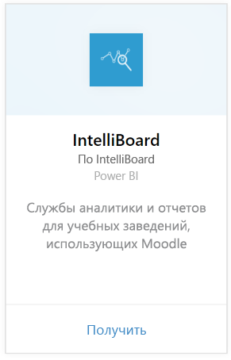
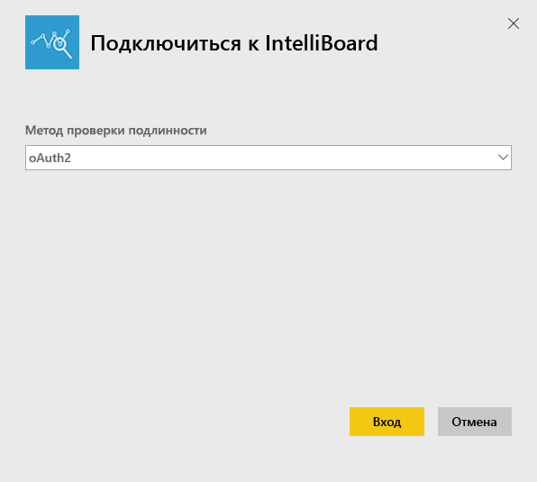
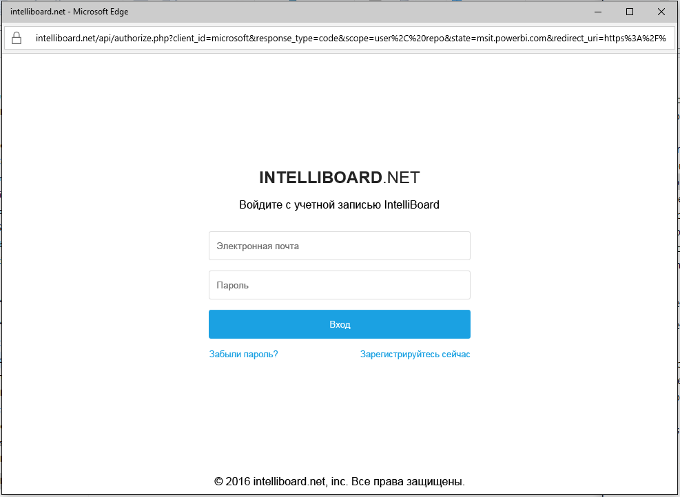
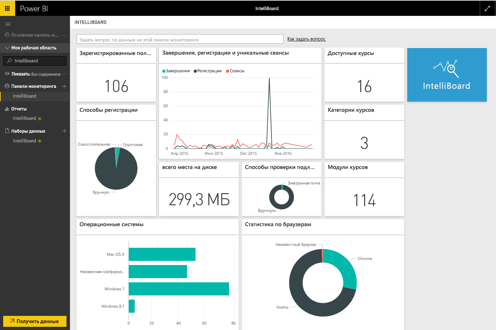

# Подключение к IntelliBoard с помощью Power BI
IntelliBoard предлагает упрощенный доступ к данным системы управления обучением Moodle через службы отчетов. Пакет содержимого IntelliBoard для Power BI предоставляет дополнительную аналитику, включая метрики ваших курсов, списки зарегистрированных пользователей, общую производительность и ваши действия в системе управления обучением.

Подключитесь к [пакету содержимого IntelliBoard](https://app.powerbi.com/getdata/services/intelliboard) для Power BI.

## Способы подключения
1. Нажмите кнопку **Получить данные** в нижней части левой панели навигации.  
   
    
2. В поле **Службы** выберите **Получить**.  
   
    
3. Выберите **IntelliBoard**, а затем нажмите **Получить**.  
   
    
4. Выберите **OAuth 2**, и затем нажмите **Войти**. При появлении запроса введите учетные данные IntelliBoard.
   
    
   
    
5. После подключения автоматически загрузятся информационная панель, отчет и набор данных. После завершения плитки обновятся в соответствии с данными из вашей учетной записи IntelliBoard.
   
    

**Дальнейшие действия**

* Попробуйте [задать вопрос в поле "Вопросы и ответы"](power-bi-q-and-a.md) в верхней части информационной панели.
* [Измените плитки](service-dashboard-edit-tile.md) на информационной панели.
* [Выберите плитку](service-dashboard-tiles.md), чтобы открыть соответствующий отчет.
* Хотя набор данных будет обновляться ежедневно по расписанию, вы можете изменить график обновлений или попытаться выполнять обновления по запросу с помощью кнопки **Обновить сейчас**.

## Содержимое
Пакет содержимого включает в себя данные из следующих таблиц.  

    - Действие  
    - "Агенты"  
    - "Авторизация"  
    - Страны  
    - "Прогресс обучения"  
    - "Зачисление"
    - "Язык"  
    - "Платформа"  
    - "Итоги"  
    - "Прогресс пользователя"    

## Требования к системе
Чтобы создать этот пакет содержимого, требуется учетная запись IntelliBoard с разрешениями для вышеперечисленных таблиц.

## Дальнейшие действия
[Приступая к работе с Power BI](service-get-started.md)

[Power BI — основные понятия](service-basic-concepts.md)

