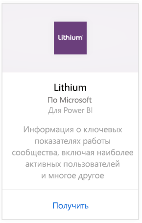
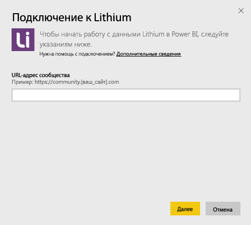
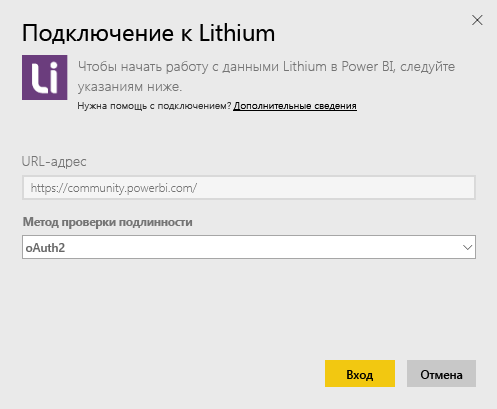
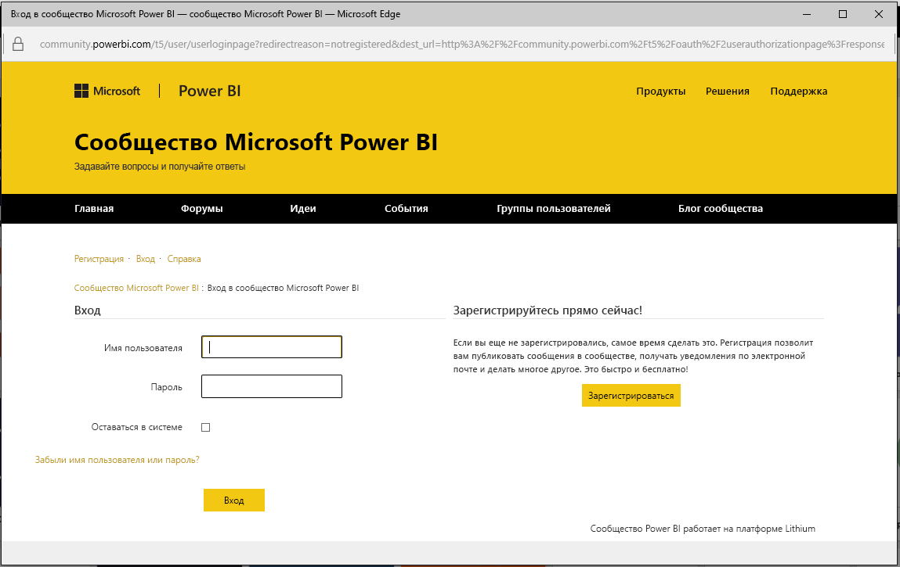
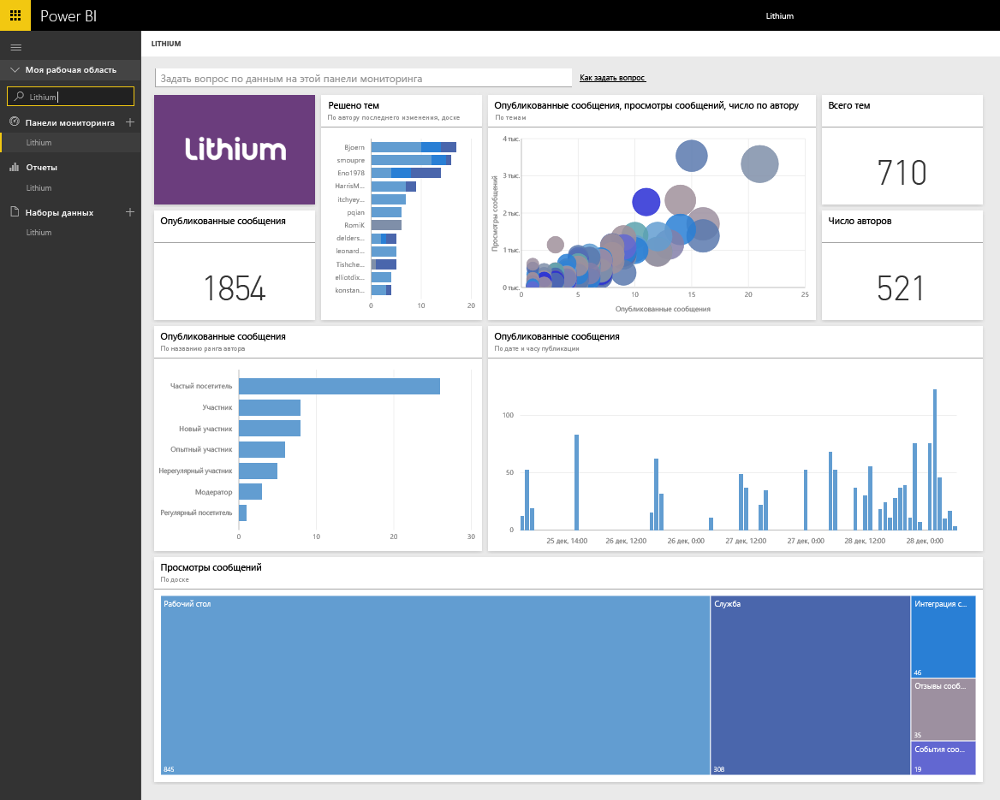

# Подключение к Lithium с помощью Power BI
Lithium помогает строить доверительные отношения между лучшими торговыми марками и клиентами, находить ответы и обмениваться опытом. Подключив пакет содержимого Lithium для Power BI, вы сможете оценивать основные метрики, связанные с интернет-сообществом, для повышения объемов продаж, снижения затрат на обслуживание и повышения уровня доверия со стороны клиентов. 

Подключитесь к [пакету содержимого Lithium](https://app.powerbi.com/getdata/services/lithium) для Power BI.

>[!NOTE]
>Пакет содержимого Power BI использует API-интерфейс Lithium. Большое число вызовов API может повлечь за собой взимание дополнительных платежей за использование Lithium. Уточните этот момент у администратора Lithium.

## Способы подключения
1. Нажмите кнопку **Получить данные** в нижней части левой панели навигации.
   
    
2. В поле **Службы** выберите **Получить**.
   
    
3. Выберите **Lithium** \> **Получить**.
   
   
4. Укажите URL-адрес вашего сообщества Lithium. Он будет иметь формат *https://community.yoursite.com*.
   
   
5. При появлении запроса введите учетные данные Lithium. Выберите **oAuth 2** в качестве механизма проверки подлинности, нажмите кнопку **Вход** и выполните процедуру проверки подлинности Lithium.
   
   
   
   
6. После завершения процедуры входа в систему начнется процесс импорта. После завершения в области навигации появятся новая панель мониторинга, отчет и модель. Выберите панель мониторинга, чтобы просмотреть импортированные данные.
   
    

**Дальнейшие действия**

* Попробуйте [задать вопрос в поле "Вопросы и ответы"](power-bi-q-and-a.md) в верхней части информационной панели.
* [Измените плитки](service-dashboard-edit-tile.md) на информационной панели.
* [Выберите плитку](service-dashboard-tiles.md), чтобы открыть соответствующий отчет.
* Хотя набор данных будет обновляться ежедневно по расписанию, вы можете изменить график обновлений или попытаться выполнять обновления по запросу с помощью кнопки **Обновить сейчас**.

## Требования к системе
Для пакета содержимого Lithium требуется Lithium community версии 15.9 или более поздней. Для подтверждения обратитесь к администратору Lithium.

## Дальнейшие действия
[Приступая к работе с Power BI](service-get-started.md)

[Power BI — основные понятия](service-basic-concepts.md)

