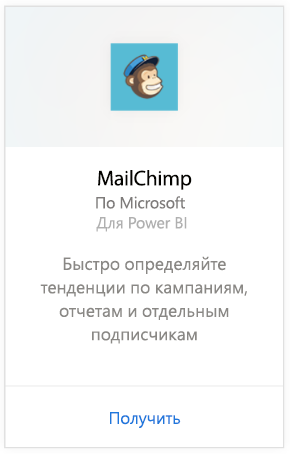
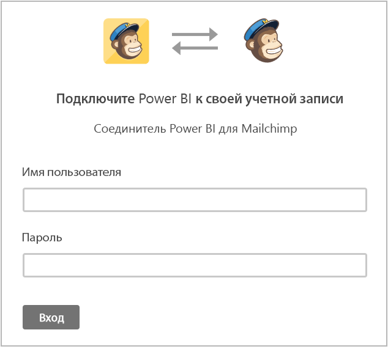
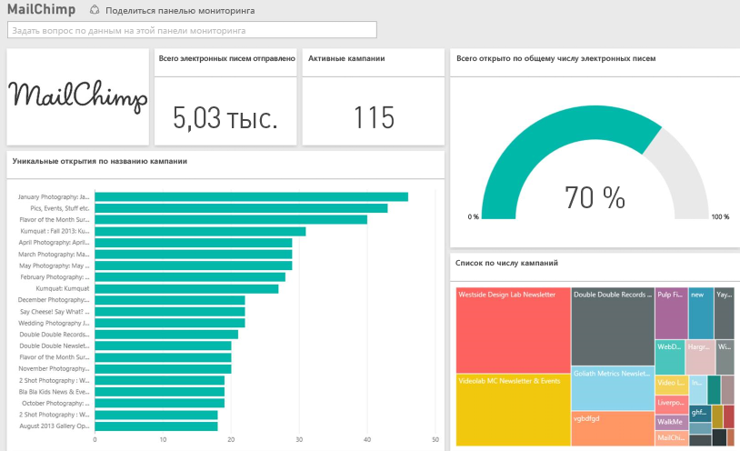

# Подключение к MailChimp с помощью Power BI
Пакет содержимого для Power BI извлекает данные из вашей учетной записи MailChimp и создает панель мониторинга, набор отчетов и набор данных, которые позволяют анализировать ваши данные. Используйте аналитику для создания [панелей мониторинга MailChimp](https://powerbi.microsoft.com/integrations/mailchimp), чтобы быстро определить тенденции по кампаниям, отчетам и отдельным подписчикам. Данные обновляются ежедневно, так что вам всегда доступны последние сведения.

Подключитесь к [пакету содержимого MailChimp](https://app.powerbi.com/getdata/services/mailchimp) для Power BI.

## Способы подключения
1. Нажмите кнопку **Получить данные** в нижней части левой панели навигации.
   
    
2. В поле **Службы** выберите **Получить**.
   
   
3. Выберите **MailChimp** \> **Получить**.
   
   
4. В качестве метода проверки подлинности выберите **oAuth2** \> **Войти**.
   
    При появлении запроса введите учетные данные MailChimp и пройдите процесс проверки подлинности.
   
    При первом подключении вам будет предложено разрешить Power BI доступ только для чтения к вашей учетной записи. Выберите **Разрешить**, чтобы начать импорт. Это может занять несколько минут в зависимости от объема данных в вашей учетной записи.
   
    
5. После импорта данных в Power BI в области навигации слева появятся новая панель мониторинга, отчеты и набора данных. Это панель мониторинга по умолчанию, которую Power BI создает для отображения данных. Вы можете изменить эту панель мониторинга для отображения данных любым нужным образом.
   
   

**Дальнейшие действия**

* Попробуйте [задать вопрос в поле "Вопросы и ответы"](power-bi-q-and-a.md) в верхней части информационной панели.
* [Измените плитки](service-dashboard-edit-tile.md) на информационной панели.
* [Выберите плитку](service-dashboard-tiles.md), чтобы открыть соответствующий отчет.
* Хотя набор данных будет обновляться ежедневно по расписанию, вы можете изменить график обновлений или попытаться выполнять обновления по запросу с помощью кнопки **Обновить сейчас**.

## Дальнейшие действия
[Приступая к работе с Power BI](service-get-started.md)

[Power BI — основные понятия](service-basic-concepts.md)

