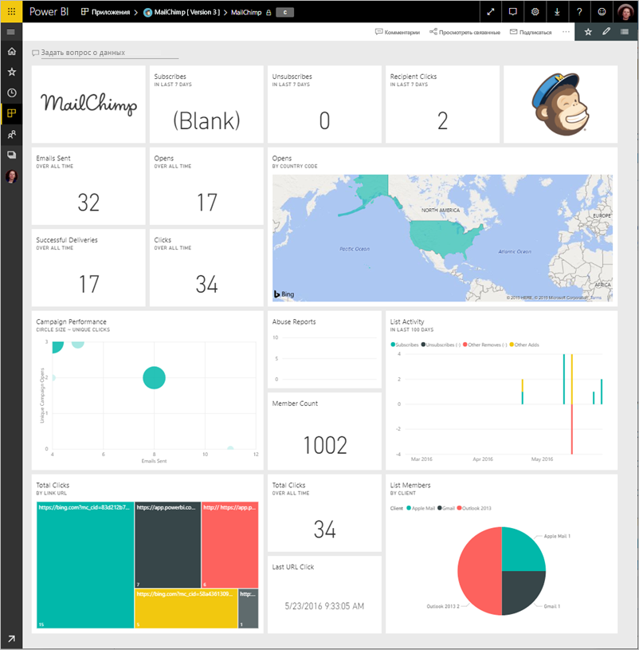
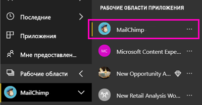
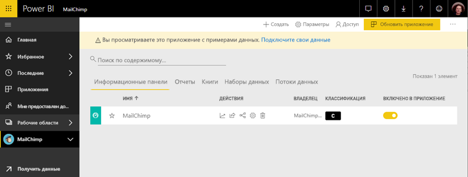

# Подключение к MailChimp с помощью Power BI
В этой статье рассматривается извлечение данных из вашей учетной записи MailChimp с помощью шаблона приложения Power BI. Приложение шаблон создает рабочую область с панели мониторинга, набор отчетов и набор данных, предоставляется возможность изучить данные MailChimp. Используйте аналитику для создания [панелей мониторинга MailChimp](https://powerbi.microsoft.com/integrations/mailchimp), чтобы быстро определить тенденции по кампаниям, отчетам и отдельным подписчикам. Данные обновляются ежедневно, убедитесь, что данные, которые вы отслеживаете находится в актуальном состоянии.

После установки шаблона приложения, можно изменить панель мониторинга и отчетов. Затем можно распространять его как приложение коллегам в организации.

Подключение к [MailChimp шаблона приложения](https://app.powerbi.com/getdata/services/mailchimp) для Power BI.

## Способы подключения

[!INCLUDE [powerbi-service-apps-get-more-apps](./includes/powerbi-service-apps-get-more-apps.md)]

3. Выберите **MailChimp** \> **получить сейчас**.
4. В **установить это приложение Power BI?** выберите **установить**.
4. В **приложений** области выберите **MailChimp** плитку.

    

6. В **приступить к работе с нового приложения**выберите **подключайте данные из**.

    

1. В качестве метода проверки подлинности выберите **oAuth2** \> **Войти**.
   
    При появлении запроса введите учетные данные MailChimp и пройдите процесс проверки подлинности.
   
    При первом подключении Power BI предлагает разрешить доступ только для чтения к вашей учетной записи. Нажмите кнопку **Разрешить** , чтобы начать импорт. Может занять несколько минут в зависимости от объема данных в вашей учетной записи.
   
    

5. После импорта данных в Power BI Откроется информационная панель MailChimp.
   
    

## Изменение и распространение приложения

Вы установили приложение шаблона MailChimp. Это означает, что вы также создали рабочую область приложения MailChimp. В рабочей области можно изменить отчет и информационную панель и затем распространить его как *приложения* коллегам в организации. 

1. Чтобы просмотреть все содержимое новой рабочей областью MailChimp, в панели навигации слева, выберите **рабочие области** > **MailChimp**. 

    

    Это представление является списке содержимого рабочей области. В правом верхнем углу, вы увидите **обновить приложение**. Когда вы будете готовы для распространения приложения, чтобы ваши коллеги, начнем именно это.

    

2. Выберите **отчеты** и **наборы данных** для отображения элементов в рабочей области. 

    Узнайте о [распространение приложений](service-create-distribute-apps.md) своим коллегам.

## Дальнейшие действия

* [Создание новых рабочих областей в Power BI](service-create-the-new-workspaces.md)
* [Установка и использование приложений с информационными панелями и отчетами в Power BI](consumer/end-user-apps.md)
* [Приложения Power BI для внешних служб](service-connect-to-services.md)
* У вас появились вопросы? [Попробуйте задать вопрос в сообществе Power BI.](http://community.powerbi.com/)

