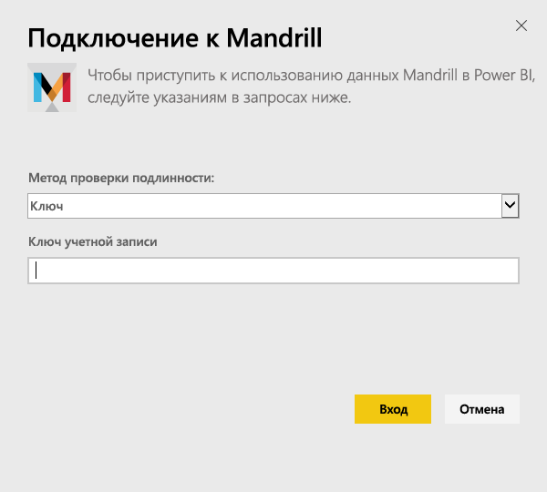
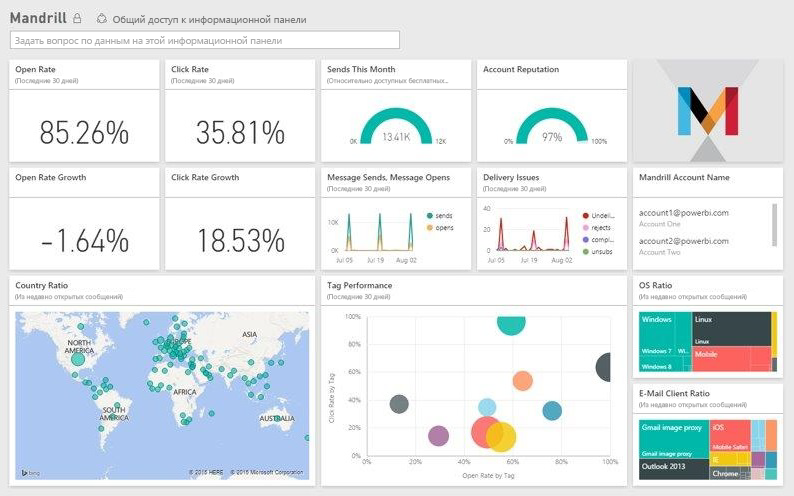

# Подключение к Mandrill с помощью Power BI
Пакет содержимого для Power BI извлекает данные из вашей учетной записи Mandrill и создает панель мониторинга, набор отчетов и набор данных, которые позволяют анализировать ваши данные. Решения аналитики Mandrill позволяют быстро анализировать кампании рассылки или маркетинговые кампании. Данные обновляются ежедневно, так что вам всегда доступны последние сведения.

[!INCLUDE [include-short-name](./includes/service-deprecate-content-packs.md)]

Подключитесь к [пакету содержимого Mandrill для Power BI](http://app.powerbi.com/getdata/services/mandrill).

## Способы подключения
1. Нажмите кнопку **Получить данные** в нижней части левой панели навигации.
   
    
2. В поле **Службы** выберите **Получить**.
   
    
3. Выберите **Mandrill** > **Получить**.
   
    
4. Выберите в качестве **метода проверки подлинности** **Ключ** и укажите ваш ключ API. Этот ключ можно найти на вкладке **Параметры** информационной панели Mandrill. Выберите **Вход**, чтобы начать импорт. Это может занять несколько минут в зависимости от объема данных в вашей учетной записи.
   
    
5. После импорта данных в Power BI в области навигации слева появятся новая панель мониторинга, отчеты и набора данных. Это панель мониторинга по умолчанию, которую Power BI создает для отображения данных.
   
    

**Дальнейшие действия**

* Попробуйте [задать вопрос в поле "Вопросы и ответы"](consumer/end-user-q-and-a.md) в верхней части информационной панели.
* [Измените плитки](service-dashboard-edit-tile.md) на информационной панели.
* [Выберите плитку](consumer/end-user-tiles.md), чтобы открыть соответствующий отчет.
* Хотя набор данных будет обновляться ежедневно по расписанию, вы можете изменить график обновлений или попытаться выполнять обновления по запросу с помощью кнопки **Обновить сейчас**

## Дальнейшие действия
[Что такое Power BI?](fundamentals/power-bi-overview.md)

[Основные понятия для разработчиков в службе Power BI](service-basic-concepts.md)

