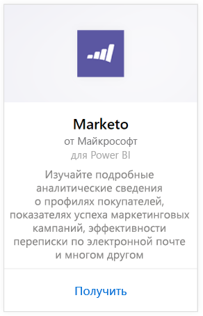
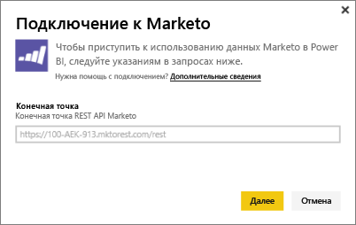
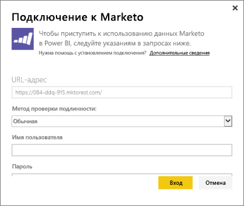
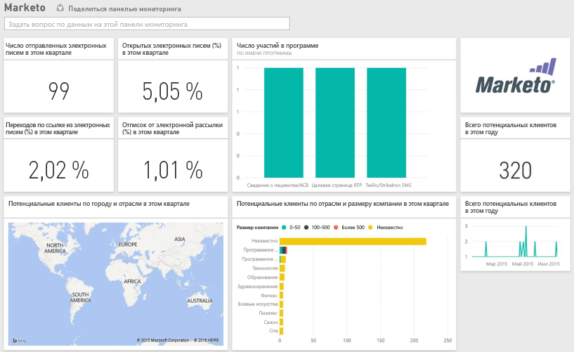

# Подключение к Marketo с помощью Power BI
Пакет содержимого Power BI для Marketo позволяет получить подробные сведения об учетной записи Marketo с данными о потенциальных клиентах и их действиях. При создании этого подключения вы извлечете данные и автоматически получите панель мониторинга и связанные отчеты на основе этих данных.

>[!IMPORTANT]
>4 сентября 2019 г. этот пакет содержимого будет объявлен устаревшим. Если пакет установлен до этой даты, он продолжит работать, но вы не сможете установить новый после указанного срока. Текущие пакеты содержимого служб заменяются приложениями-шаблонами.

Подключитесь к [пакету содержимого Marketo](https://app.powerbi.com/getdata/services/marketo) для Power BI.

## Способы подключения
1. Нажмите кнопку **Получить данные** в нижней части левой панели навигации.
   
   
2. В поле **Службы** выберите **Получить**.
   
    
3. Выберите **Marketo** \> **Получить**.
   
   
4. Введите конечную точку REST Marketo, предоставленную вам Marketo или администратором Marketo, и нажмите кнопку "Далее".
   
   
   
   Дополнительные сведения о конечной точке REST Marketo: [http://developers.marketo.com/documentation/rest/endpoint-url/ ](http://developers.marketo.com/documentation/rest/endpoint-url/).
5. Используя **обычную** проверку подлинности, введите идентификатор клиента как **имя пользователя** и секрет клиента как **пароль**. Идентификатор и секрет клиента можно узнать в Marketo или у вашего администратора Marketo ([http://developers.marketo.com/documentation/rest/custom-service/](http://developers.marketo.com/documentation/rest/custom-service/)). 
   
   
   
   Это предоставляет пакету содержимого *Marketo для Power BI* доступ к вашим данным [аналитики Marketo](https://powerbi.microsoft.com/integrations/marketo), позволяя анализировать их в Power BI. Данные обновляются раз в день.
6. После подключения к учетной записи Marketo загружается панель мониторинга со всеми данными:
   
   

**Дальнейшие действия**

* Попробуйте [задать вопрос в поле "Вопросы и ответы"](consumer/end-user-q-and-a.md) в верхней части информационной панели.
* [Измените плитки](service-dashboard-edit-tile.md) на информационной панели.
* [Выберите плитку](consumer/end-user-tiles.md), чтобы открыть соответствующий отчет.
* Хотя набор данных будет обновляться ежедневно по расписанию, вы можете изменить график обновлений или попытаться выполнять обновления по запросу с помощью кнопки **Обновить сейчас**

## Содержимое
В Marketo для Power BI, в которой между текущей датой и датой год назад произошло действие, доступны следующие данные:

| Имя таблицы | Описание |
| --- | --- |
| EmailActivities |Данные о сообщениях электронной почты, отправленных интересам и контактам, с подробными сведениями об устройствах, категориях, числе и проценте отклоненных, обработанных и открытых сообщений и имени программы. Действия по электронной почте, показанные в Power BI, — это абсолютный отчет о возможности доставки сообщений, он не применяет дополнительную логику к данным. Из-за этого возможно получение различных результатов в клиенте Marketo и в Power BI. |
| ProgramActivities |Данные о программах, для которых изменилось состояние. К ним относятся причина, успех, число и процент приобретения программ, а также число и процент успешных выполнений программы. |
| WebPageActivities |Данные о посещении пользователями веб-страницы, включая агент поиска, агент пользователя, веб-страницу и время дня. |
| Datetable |Даты от сегодняшней даты до соответствующей даты в прошлом году.  Позволяет анализировать данные Marketo по дате. |
| Лиды |Сведения об интересе, такие как компания, размер дохода, число сотрудников, страна, отрасль, оценка и состояние интереса. Лиды извлекаются на основе их присутствия в действиях электронной почты, программы и веб-страницы. |

Все даты указаны в формате UTC. Даты зависят от того, какой часовой пояс используется для учетной записи (как и в клиенте Marketo).

## Требования к системе
* У учетной записи Marketo, используемой для подключения, есть разрешения для доступа к лидам и действиям.
* Достаточное число вызовов API для подключения к данным.  У Marketo есть API для каждой учетной записи.  При достижении предела вы не сможете загружать данные в Power BI. 

**Сведения об ограничениях API**

Для импорта данных из Marketo используется API Marketo. К каждому клиенту Marketo применяется общее ограничение в 10 000 вызовов API в день, которые являются общими для всех приложений, использующих API-интерфейсы Marketo. Вы можете использовать API для других средств интеграции, а также для интеграции Power BI. Дополнительные сведения об интерфейсах API см.: <http://developers.marketo.com/documentation/rest/>.

Количество вызовов API, выполняемых Power BI к Marketo, зависит от объема данных в вашей учетной записи Marketo. Power BI импортирует всех лидов и все действия за последний год. Ниже приведен пример данных из Marketo и число вызовов API, используемых Power BI при импорте.  

| Тип данных | Число строк | Вызовы API |
| --- | --- | --- |
| Сведения об интересах |15 000 |50 |
| Действия электронной почты |150 000 |1000 |
| Действия программы |15 000 |100 |
| Веб-действия |150 000 |1000 |
| Изменения программы |7500 |50 |
| **Всего вызовов API** | |**2200** |

## Дальнейшие действия
[Что такое Power BI?](power-bi-overview.md)

[Получение данных для Power BI](service-get-data.md)

[Блог Power BI. Мониторинг и анализ данных Marketo с помощью Power BI](http://blogs.msdn.com/b/powerbi/archive/2015/03/19/monitor-and-analyze-your-marketo-data-with-power-bi.aspx)

