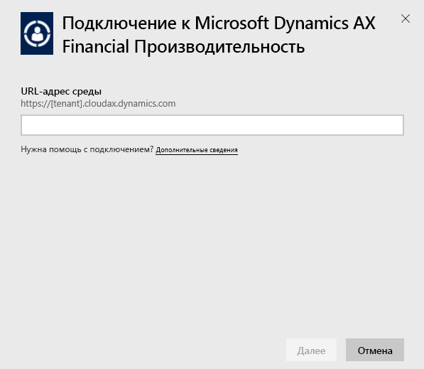
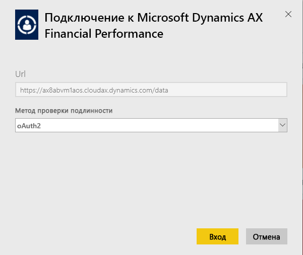
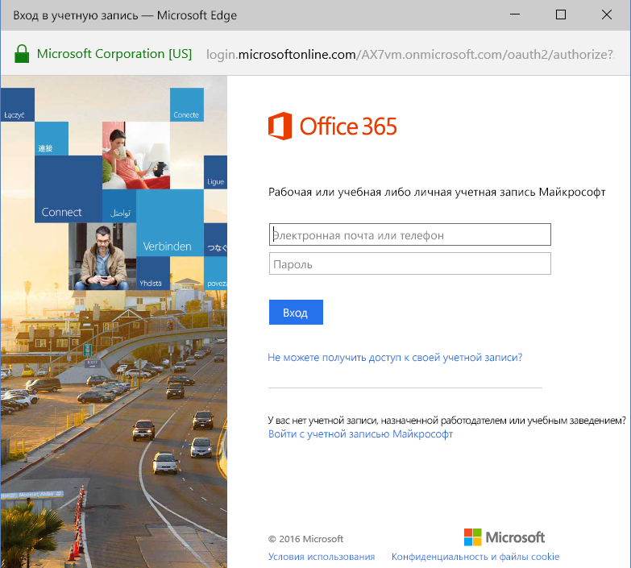
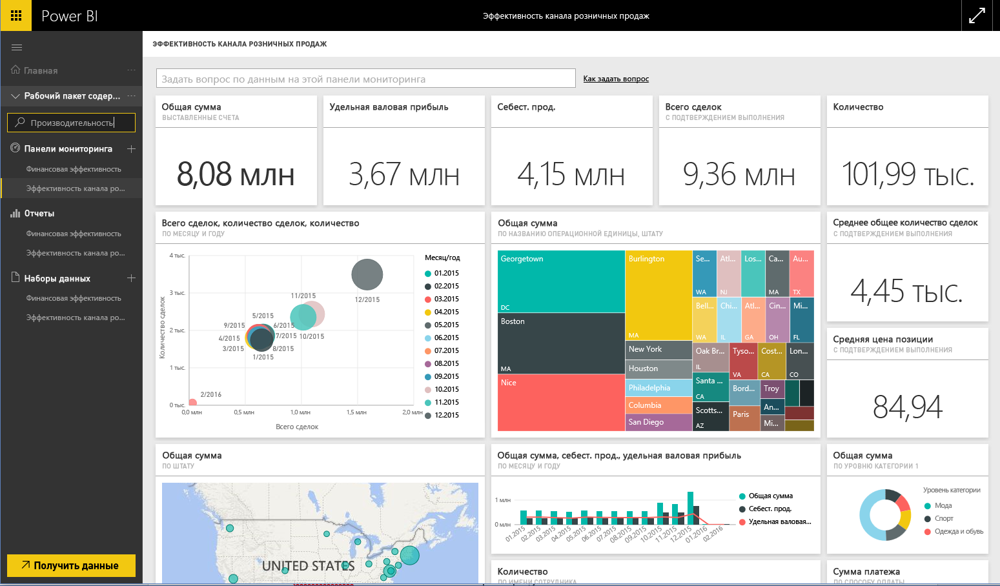

# Подключение к пакету содержимого Microsoft Dynamics AX с помощью Power BI
В Microsoft Dynamics AX есть три пакета содержимого для Power BI, предназначенных для разных категорий бизнес-пользователей. Пакет содержимого «Финансовая эффективность» специально для финансовых директоров служит для доступа в полезным данным о финансовых показателях организации. Пакет содержимого «Эффективность продаж» предназначен для руководителей продаж и позволяет оценить их эффективность, спрогнозировать тенденции и обнаружить полезную информацию на основе непосредственных данных о розничных продажах и коммерческих показателях. Пакет содержимого "Управление стоимостью" предназначен для директоров по производству и финансовых директоров и содержит подробные сведения о производительности операций.

Подключитесь к пакетам содержимого Microsoft Dynamics AX [Эффективность продаж](https://app.powerbi.com/getdata/services/dynamics-ax-retail-channel-performance), [Финансовая эффективность](https://app.powerbi.com/getdata/services/dynamics-ax-financial-performance) и [Управление стоимостью](https://app.powerbi.com/getdata/services/dynamics-ax-cost-management) для Power BI.

## Способы подключения
1. Нажмите кнопку **Получить данные** в нижней части левой панели навигации.
   
   
2. В поле **Службы** выберите **Получить**.
   
   
3. Выберите один из пакетов содержимого Dynamics AX и нажмите **Получить**.
   
   
4. Укажите URL-адрес своей среды Dynamics AX 7. Сведения о том, как [найти эти параметры](#FindingParams), см. ниже.
   
   
5. В качестве **метода проверки подлинности** выберите **oAuth2** \> **Войти**. Когда будет предложено, введите учетные данные Dynamics AX.
   
    
   
    
6. После утверждения процесс импорта начнется автоматически. После завершения в области навигации появятся новая панель мониторинга, отчет и модель. Выберите панель мониторинга, чтобы просмотреть импортированные данные.
   
     

**Дальнейшие действия**

* Попробуйте [задать вопрос в поле "Вопросы и ответы"](power-bi-q-and-a.md) в верхней части информационной панели.
* [Измените плитки](service-dashboard-edit-tile.md) на информационной панели.
* [Выберите плитку](service-dashboard-tiles.md), чтобы открыть соответствующий отчет.
* Хотя набор данных будет обновляться ежедневно по расписанию, вы можете изменить график обновлений или попытаться выполнять обновления по запросу с помощью кнопки **Обновить сейчас**.

## Содержимое
Пакет содержимого использует для импорта данных об эффективности продаж, финансовой эффективности и управлении стоимостью канал Dynamics AX 7 OData.

## Требования к системе
Этому пакету содержимого необходим URL-адрес среды Dynamics AX 7; кроме того, у пользователя должен быть доступ к каналу OData.

## Поиск параметров

URL-адрес среды Dynamics AX 7 указан в браузере при входе. Просто скопируйте URL-адрес корневого каталога среды Dynamics AX в диалоговое окно Power BI.

## Устранение неполадок
В зависимости от размера вашего экземпляра загрузка данных может занять некоторое время. Если вы видите в Power B пустые отчеты, убедитесь в том, что у вас есть доступ к таблицам OData, которые для них необходимы.

## Дальнейшие действия
[Приступая к работе с Power BI](service-get-started.md)

[Получение данных в Power BI](service-get-data.md)

