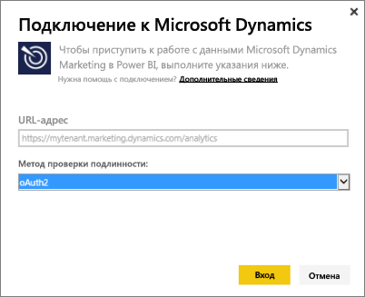
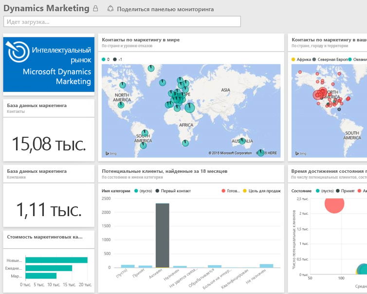

# Подключение к Microsoft Dynamics Marketing с помощью Power BI
Пакет содержимого Microsoft Dynamics Marketing для Power BI позволяет легко получать доступ к данным Dynamics Marketing и анализировать их. Пакет содержимого использует описательные модели на основе веб-канала OData, содержащие все необходимые сущности и измерения, такие как программы, кампании, маркетинговые контакты и компании, интересы, взаимодействия с интересами, оценки интересов, маркетинговые веб-сайты и сообщения электронной почты, наблюдения поведения, бюджеты, финансовые операции, ключевые показатели эффективности и многое другое. 

Подключитесь к [пакету содержимого Dynamics Marketing](https://app.powerbi.com/getdata/services/microsoft-dynamics-marketing) для Power BI.

>[!NOTE]
>Вам необходимо указать допустимый URL-адрес OData для экземпляра Dynamics Marketing (пакет содержимого не будет работать с локальной версией CRM-системы). Дополнительные требования см. в разделе ниже.

## Способы подключения
1. Выберите "Получить данные" в нижней части левой панели навигации.
   
    
2. В поле **Службы** выберите **Получить**.
   
    
3. Выберите **Microsoft Dynamics Marketing** \> **Получить**.
   
   
4. Укажите URL-адрес OData, связанный с вашей учетной записью.  Он использует формат "https:// [имя\_экземпляра].marketing.dynamics.com/analytics".
   
   
5. При появлении запроса укажите учетные данные (этот шаг можно пропустить, если вы уже выполнили вход в браузере). В качестве метода проверки подлинности введите **oAuth2** и нажмите кнопку **Вход**:
   
   
6. После подключения вы увидите панель мониторинга Dynamics Marketing, заполненную вашими данными. Новые элементы помечаются в левой области навигации желтой звездочкой.
   
   

**Дальнейшие действия**

* Попробуйте [задать вопрос в поле "Вопросы и ответы"](power-bi-q-and-a.md) в верхней части информационной панели.
* [Измените плитки](service-dashboard-edit-tile.md) на информационной панели.
* [Выберите плитку](service-dashboard-tiles.md), чтобы открыть соответствующий отчет.
* Хотя набор данных будет обновляться ежедневно по расписанию, вы можете изменить график обновлений или попытаться выполнять обновления по запросу с помощью кнопки **Обновить сейчас**.

## Требования к системе
* Вам необходимо указать допустимый URL-адрес OData для экземпляра Dynamics Marketing (пакет содержимого не будет работать с локальной версией CRM-системы).  
* Администратор должен включить конечную точку OData в настройках сайта. Чтобы найти адрес конечной точки OData, перейдите в меню **Главная \> Параметры \> Параметры сайта** в разделе **Служба данных организации**.  URL-адрес OData использует формат следующий: https:// [имя\_экземпляра].marketing.dynamics.com/analytics.  
* Для доступа к Microsoft Dynamics Marketing необходимо применять ту же учетную запись или удостоверение пользователя, с помощью которых вы зарегистрировались для использования службы Power BI. При входе в Microsoft Dynamics Marketing вы автоматически входите с удостоверением, используемым для Power BI. Если вы хотите войти в Microsoft Dynamics Marketing под другой учетной записью, зарегистрируйте как пользователь Power BI, указав другую учетную запись. Мы надеемся устранить эту проблему в будущей версии.   

## Устранение неполадок
Если при попытке подключиться к вашей учетной записи Dynamics CRM появляется сообщение "Ошибка входа", убедитесь, что вы входите в Power BI с той же учетной записью, которая используется для доступа к каналу OData CRM Online. Попробуйте войти в веб-канал в браузере и протестируйте его.

Обратитесь к администратору, чтобы убедиться, что URL-адрес OData правильный, а конечная точка OData включена.

Проверьте используемую версию Dynamics Marketing — в версиях 18.0 и 18.1 были внесены дополнительные исправления, если у вас по-прежнему возникают проблемы в более старой версии, рекомендуется обновить ее.

Если у вас по-прежнему возникают проблемы, создайте запрос в службу поддержки, чтобы связаться с группой Power BI:

* В приложении Power BI щелкните вопросительный знак и выберите **Обратиться в службу поддержки**.
* На сайте службы поддержки Power BI (где вы читаете эту статью) выберите **Обратиться в службу поддержки** в правой части страницы.

## Дальнейшие действия
[Получение данных для Power BI](service-get-data.md)

[Что такое Power BI?](power-bi-overview.md)

