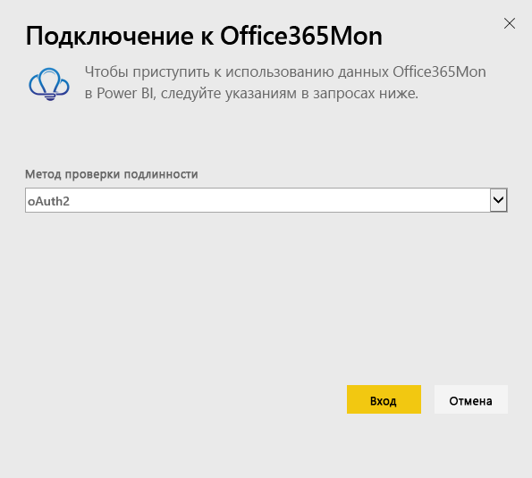
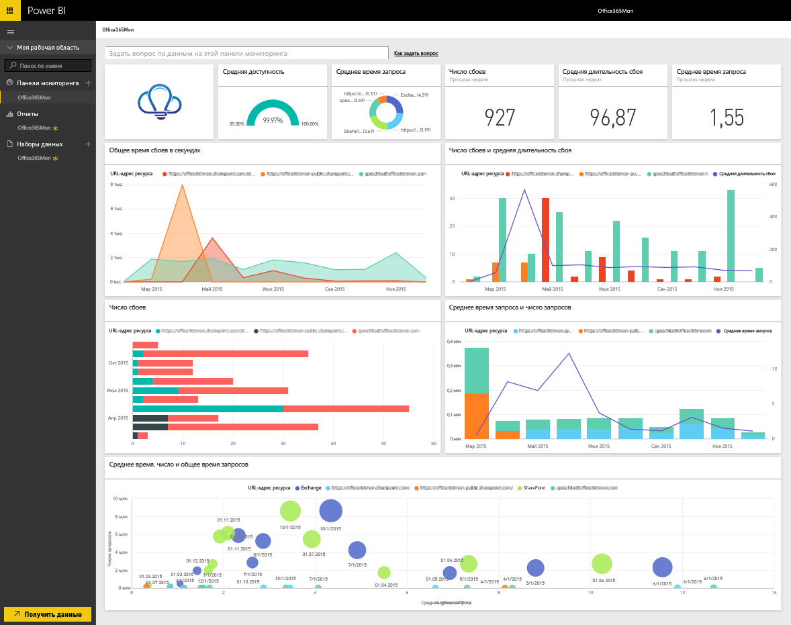

# Подключение к Office365Mon с помощью Power BI
С функциями Power BI и пакетом содержимого Office365Mon вам будет легко анализировать данные о перебоях в работе и состоянии служб Office 365. Power BI извлекает данные, в том числе сведения о сбоях в работе и проверках работоспособности, затем создает стандартную панель мониторинга и формирует на основе этой информации отчеты.

Подключите [пакет содержимого Office365Mon](https://app.powerbi.com/groups/me/getdata/services/office365mon) для Power BI.

>[!NOTE]
>Для подключения и загрузки пакета содержимого для Power BI необходима учетная запись администратора Office365Mon.

## Способы подключения
1. Нажмите кнопку **Получить данные** в нижней части левой панели навигации.
   
   
2. В поле **Службы** выберите **Получить**.
   
    
3. Выберите **Office365Mon** \> **Получить**.
   
   
4. В качестве метода проверки подлинности выберите **oAuth2** \> **Войти**.
   
   При появлении запроса введите учетные данные администратора Office365Mon и пройдите проверку подлинности.
   
   
   
   
5. После импорта данных в Power BI в области навигации слева появятся новая панель мониторинга, отчеты и набора данных. Новые элементы будут отмечены желтой звездочкой (\*). Выберите Office365Mon.
   
   

**Дальнейшие действия**

* Попробуйте [задать вопрос в поле "Вопросы и ответы"](power-bi-q-and-a.md) в верхней части информационной панели.
* [Измените плитки](service-dashboard-edit-tile.md) на информационной панели.
* [Выберите плитку](service-dashboard-tiles.md), чтобы открыть соответствующий отчет.
* Хотя набор данных будет обновляться ежедневно по расписанию, вы можете изменить график обновлений или попытаться выполнять обновления по запросу с помощью кнопки **Обновить сейчас**.

## Устранение неполадок
Если после входа с учетными данными подписки Office365Mon возникает ошибка **Ошибка входа** , у вашей учетной записи отсутствуют разрешения на извлечение данных Office365Mon. Убедитесь, что это учетная запись администратора, и повторите попытку.

## Дальнейшие действия
[Приступая к работе с Power BI](service-get-started.md)

[Получение данных для Power BI](service-get-data.md)

