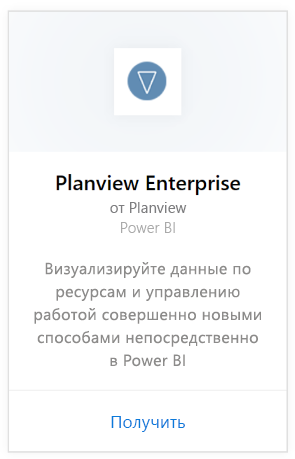
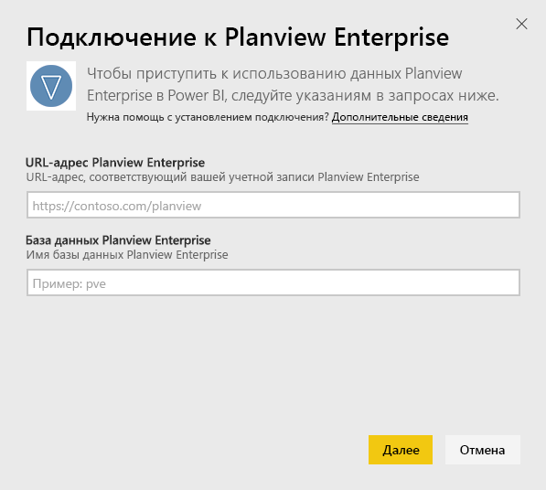
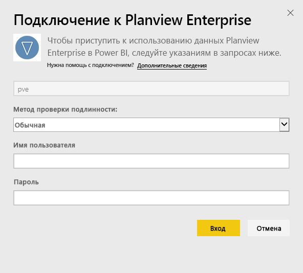
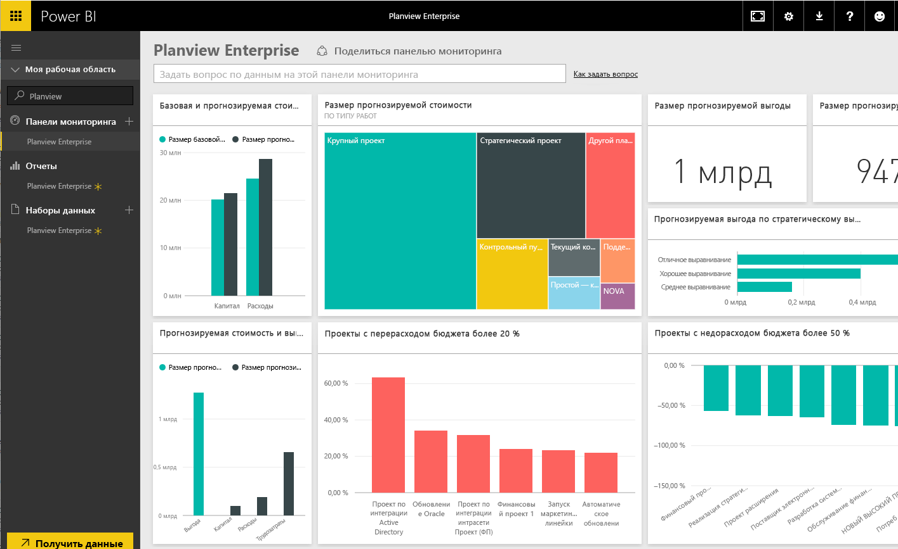

# Подключение к Planview Enterprise с помощью Power BI
С помощью пакета содержимого Planview Enterprise вы можете визуализировать данные о ресурсах и управлении работой совершенно новыми способами непосредственно в Power BI. Используйте учетные данные Planview Enterprise для интерактивного просмотра инвестиционных расходов на портфель, определить состояние работ и соответствие бюджету, а также узнать, насколько хорошо проекты соответствуют стратегическим целям вашей компании. Также можно расширить готовую информационную панель и отчеты, чтобы получить именно те ценные сведения, которые необходимы вам.

Подключение к [пакету содержимого Planview Enterprise для Power BI](https://app.powerbi.com/getdata/services/planview-enterprise)

>[!NOTE]
>Для импорта данных Planview Enterprise в Power BI вы должны быть пользователем Planview Enterprise, а для вашей роли должна быть включена функция просмотра портала отчетов Reporting Portal Viewer. Дополнительные требования см. в разделе ниже.

## Способы подключения
1. Нажмите кнопку **Получить данные** в нижней части левой панели навигации.
   
    
2. В поле **Службы** выберите **Получить**.
   
    
3. На странице Power BI выберите **Planview Enterprise**, а затем выберите **Получить**.  
    
4. В текстовом поле Planview Enterprise URL (URL-адрес Planview Enterprise) введите URL-адрес сервера Planview Enterprise, который вы хотите использовать. В текстовом поле Planview Enterprise Database (База данных Planview Enterprise) введите имя базы данных, Planview Enterprise, а затем нажмите кнопку "Далее".  
    
5. В списке "Метод проверки подлинности" выберите **Обычная** , если это значение еще не установлено. Введите **Имя пользователя** и **Пароль** для своей учетной записи и выберите **Вход**.  
   
6. На левой панели выберите Planview Enterprise в списке информационных панелей.  
     Power BI импортирует данные Planview Enterprise в информационную панель. Обратите внимание, что загрузка данных может занять некоторое время.  
    

**Дальнейшие действия**

* Попробуйте [задать вопрос в поле "Вопросы и ответы"](consumer/end-user-q-and-a.md) в верхней части информационной панели.
* [Измените плитки](service-dashboard-edit-tile.md) на информационной панели.
* [Выберите плитку](consumer/end-user-tiles.md), чтобы открыть соответствующий отчет.
* Хотя набор данных будет обновляться ежедневно по расписанию, вы можете изменить график обновлений или попытаться выполнять обновления по запросу с помощью кнопки **Обновить сейчас**

## Требования к системе
Для импорта данных Planview Enterprise в Power BI вы должны быть пользователем Planview Enterprise, а для вашей роли должна быть включена функция просмотра портала отчетов Reporting Portal Viewer. Дополнительные требования см. в разделе ниже.

Эта процедура предполагает, что вы уже выполнили вход на домашнюю страницу Microsoft Power BI с помощью учетной записи Power BI. Если у вас нет учетной записи Power BI, перейдите на сайт [powerbi.com](https://powerbi.microsoft.com/get-started/) и в разделе **Power BI — совместная работа и общий доступ в облаке** нажмите кнопку **Попробовать бесплатно**. Затем нажмите кнопку **Получить данные**.

## Дальнейшие действия:

[Что такое Power BI?](power-bi-overview.md)

[Получение данных для Power BI](service-get-data.md)