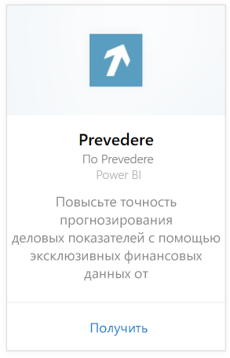
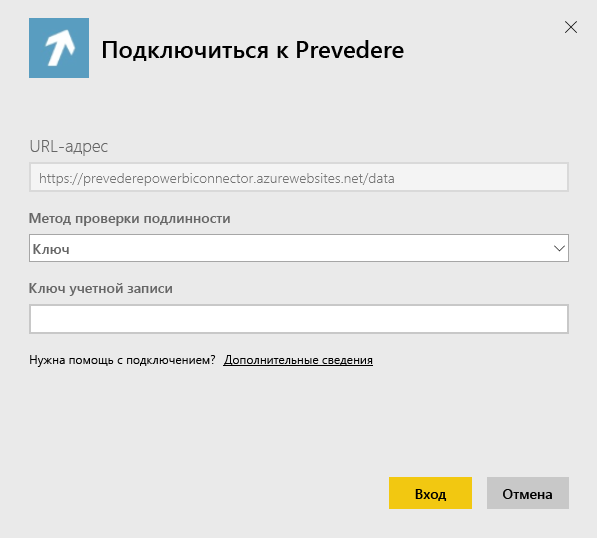
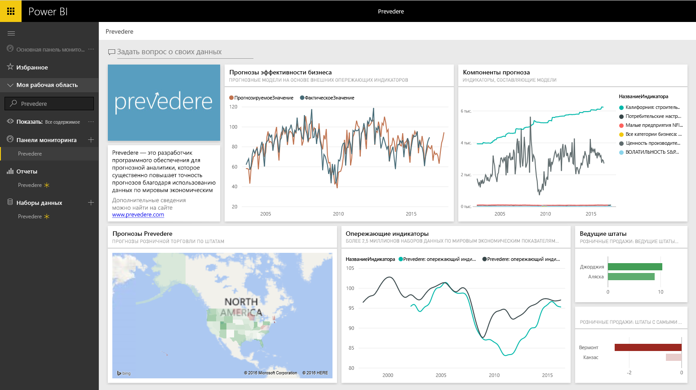

# Подключение к Prevedere с помощью Power BI
Доступ к эксклюзивной и важной финансовой информации для последовательного и оперативного развития бизнеса.

Подключитесь к [пакету содержимого Prevedere](https://app.powerbi.com/getdata/services/prevedere) для Power BI.

>[!NOTE]
>Если вы еще не работали с Prevedere, вы можете испытать этот пакет в действии с помощью [ключа-образца](https://prevederepowerbiconnector.azurewebsites.net/static/learnmore.html).

## Способы подключения
1. Нажмите кнопку **Получить данные** в нижней части левой панели навигации.
   
   
2. В поле **Службы** выберите **Получить**.
   
   
3. Выберите **Prevedere** и нажмите **Получить**.
   
   
4. В качестве **метода проверки подлинности** выберите **Ключ** и введите ключ API Prevedere.
   
    
5. Выберите **Войти**, чтобы начать импорт. После завершения в области навигации появятся новая панель мониторинга, отчет и модель. Выберите панель мониторинга, чтобы просмотреть импортированные данные.
   
     

**Дальнейшие действия**

* Попробуйте [задать вопрос в поле "Вопросы и ответы"](consumer/end-user-q-and-a.md) в верхней части информационной панели.
* [Измените плитки](service-dashboard-edit-tile.md) на информационной панели.
* [Выберите плитку](consumer/end-user-tiles.md), чтобы открыть соответствующий отчет.
* Хотя набор данных будет обновляться ежедневно по расписанию, вы можете изменить график обновлений или попытаться выполнять обновления по запросу с помощью кнопки **Обновить сейчас**

## Содержимое
Пакет содержимого анализирует ваши прогнозы в отношении продаж, модели прогнозирования, индикаторы перспективных клиентов и т. д.

## Требования к системе
Для работы с этим пакетом содержимого необходим доступ к ключу API Prevedere или ключу-образцу (см. ниже).

## Поиск параметров

Существующие клиенты могут получить доступ к своим данным с помощью своего ключа API. Если вы еще не являетесь клиентом, вы можете оценить образец данных и пример анализа с помощью [ключа-образца](https://prevederepowerbiconnector.azurewebsites.net/static/learnmore.html).

## Устранение неполадок
В зависимости от размера вашего экземпляра загрузка данных может занять некоторое время.

## Дальнейшие действия
[Приступая к работе с Power BI](service-get-started.md)

[Получение данных в Power BI](service-get-data.md)

