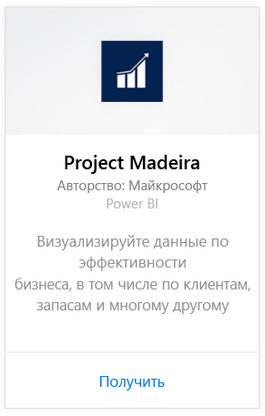
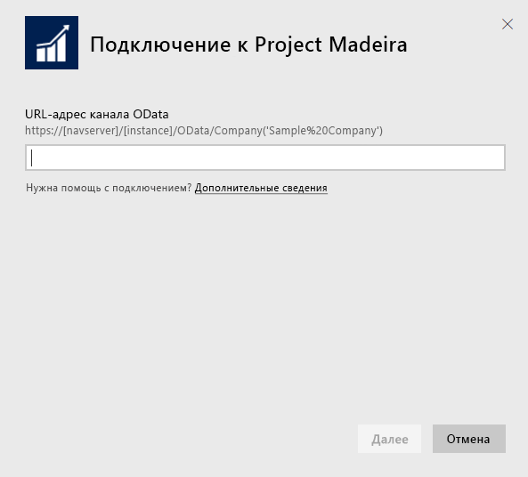
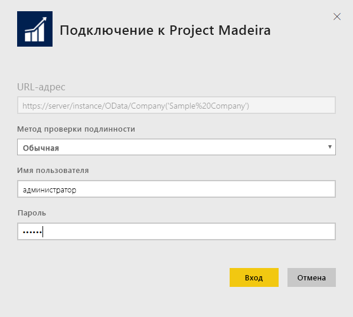
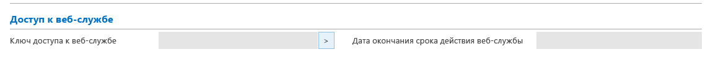
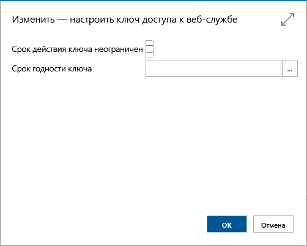
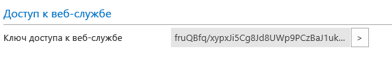

# Подключение к Project Madeira с помощью Power BI
Power BI и пакет содержимого Project Madeira значительно упрощают получение аналитических сведений из данных Project "Madeira". Power BI извлекает данные (по продажам и финансовые), затем создает стандартную панель мониторинга и формирует на основе этих данных отчеты.
Подключитесь к Project "Madeira" для Power BI или прочтите дополнительные сведения об интеграции Project Madeira с Power BI.

>[!NOTE]
>Для этого пакета содержимого требуются разрешения для таблиц, из которых извлекаются данные (в этом случае — данные о продажах и финансовые данные). Дополнительные сведения о требованиях см. [ниже](#Requirements).

Подключитесь к [пакету содержимого Project "Madeira" Analytics](https://app.powerbi.com/getdata/services/project-madeira) для Power BI.

## Способы подключения
1. Нажмите кнопку **Получить данные** в нижней части левой панели навигации.  
    
2. В поле **Службы** выберите **Получить**.  
    
3. Выберите **Project "Madeira"**, а затем **Получить**.  
    
4. В ответ на соответствующий запрос введите URL-адрес Project "Madeira". URL-адрес должен точно соответствовать шаблону https://mycronusus.projectmadeira.com:7048/NAV/OData/Company(('CRONUS%20US') и использовать название вашей организации для Project Madeira. Обратите внимание, что косая черта в конце отсутствует, а подключение выполняется по протоколу HTTPS. Дополнительные сведения о поиске [этого URL-адреса](#FindingParams) см. ниже.  
   
    
5. При появлении запроса выберите основной метод проверки подлинности, введите адрес электронной почты Project "Madeira" в качестве имени пользователя и ключ доступа к веб-службе для учетной записи Project "Madeira" в качестве пароля. Если вы уже выполнил вход в Project "Madeira" в браузере, возможно, учетные данные не будут запрошены. Подробнее о создании этого ключа доступа см. [ниже](#FindingParams).  
   
    >[!NOTE]
    >Необходимо быть суперпользователем в Project "Madeira".
   
   
6. После подключения автоматически загрузятся информационная панель, отчет и набор данных. После завершения плитки обновятся в соответствии с данными из вашей учетной записи.  
   
    

**Дальнейшие действия**

* Попробуйте [задать вопрос в поле "Вопросы и ответы"](power-bi-q-and-a.md) в верхней части информационной панели.
* [Измените плитки](service-dashboard-edit-tile.md) на информационной панели.
* [Выберите плитку](service-dashboard-tiles.md), чтобы открыть соответствующий отчет.
* Хотя набор данных будет обновляться ежедневно по расписанию, вы можете изменить график обновлений или попытаться выполнять обновления по запросу с помощью кнопки **Обновить сейчас**.

## Требования к системе
Для импорта данных Project "Madeira" в Power BI необходимо иметь разрешения на доступ к таблицам данных о продажах и финансовых данных, из которых извлекаются данные. Все таблицы (с учетом регистра), необходимые для пакета содержимого:  
 
    ´´´ 
    - ItemSalesAndProfit  
    - ItemSalesByCustomer  
    - powerbifinance  
    - SalesDashboard  
    - SalesOpportunities  
    - SalesOrdersBySalesPerson  
    - TopCustomerOverview  
    ´´´ 

## Поиск параметров
**Получение подходящего URL-адреса** Простой способ получить этот URL-адрес: в Project "Madeira" перейдите к веб-службам, найдите веб-службу powerbifinance и скопируйте URL-адрес OData (щелкните правой кнопкой мыши и выберите пункт "Копировать ярлык"), оставив "/powerbifinance…" в строке URL-адреса.

**Ключи доступа к веб-службе** Чтобы использовать данные из Project "Madeira", необходимо создать ключ доступа к веб-службе для своей учетной записи пользователя. Выполните поиск страницы "Пользователи" в Project "Madeira" и откройте карточку для своей учетной записи пользователя. В ней можно создать новый ключ доступа к веб-службе и скопировать его в поле "Пароль" на странице подключения Power BI.

Начав использовать ключи доступа к веб-службе , которые потребуются в дальнейшем, нажмите кнопку "ОК" в появившемся сообщении.
При создании для ключа можно указать срок действия.

При нажатии кнопки "ОК" создается ключ, который можно скопировать его в поле "Пароль" на странице подключения Power BI.

## Устранение неполадок
Панель мониторинга Power BI зависит от перечисленных выше опубликованных веб-служб и отображает данные для демонстрационной организации или вашей организации, если вы импортируете данные из имеющегося финансового решения. Если же что то пойдет не так, в этом разделе отображаются инструкции по решению наиболее типичных проблем.

**"Сбой проверки параметров. Убедитесь, что все параметры допустимы"**

Если эта ошибка возникает после ввода URL-адреса Project "Madeira", убедитесь, что выполнены следующие требования:  

   - URL-адрес в точности соответствует этому шаблону: https://*mycronusus*.projectmadeira.com:7048/NAV/OData/Company('*CRONUS%20US*').  
   - Удален весь текст после названия организации в скобках.  
   - Убедитесь, что в конце URL-адреса отсутствует завершающая косая черта.  
   - URL-адрес использует безопасное подключение (URL-адрес начинается с HTTPS).  

**"Сбой при входе"** Если при входе панель мониторинга с использованием учетных данных Project "Madeira" возникает ошибка "Сбой при входе", это может быть вызвано одной из следующих проблем:  

   - Используемая учетная запись не имеет разрешений на чтение данных Project "Madeira" из вашей учетной записи. Проверьте учетную запись пользователя Project "Madeira", убедитесь, что в качестве пароля используется подходящий ключ доступа к веб-службе, и повторите попытку.  
   - У экземпляра Project "Madeira", к которому вы пытаетесь подключиться, нет действительного SSL-сертификата. В этом случае вы увидите более подробное сообщение об ошибке (о том, что не удается установить отношение доверия SSL). Обратите внимание на то, что самозаверяющие сертификаты не поддерживаются.  

**"Ошибка"** Если при переходе с диалогового окна проверки подлинности отображается диалоговое окно "Ошибка", чаще всего, это вызвано проблемой с подключением к данным для пакета содержимого. Убедитесь, что URL-адрес соответствует приведенному выше шаблону:  
    https://*mycronusus*.projectmadeira.com:7048/NAV/OData/Company('*CRONUS%20US*')

Распространенная ошибка заключается в том, чтобы указать полный URL-адрес для конкретной веб-службы:  
    https://*mycronusus*.projectmadeira.com:7048/NAV/OData/Company('*CRONUS%20US*')/powerbifinance

Возможно, вы также забыли указать название организации:   
    https://*mycronusus*.projectmadeira.com:7048/NAV/OData/

## Дальнейшие действия
[Приступая к работе с Power BI](service-get-started.md)

[Power BI — основные понятия](service-basic-concepts.md)

