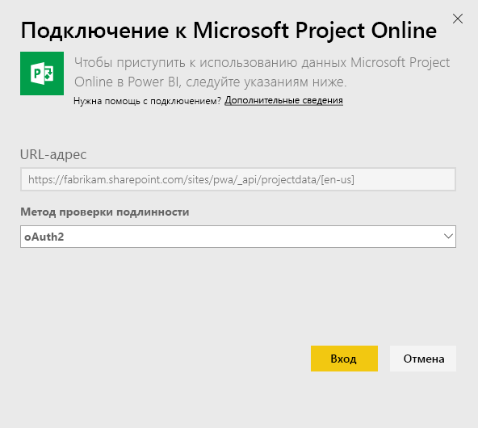
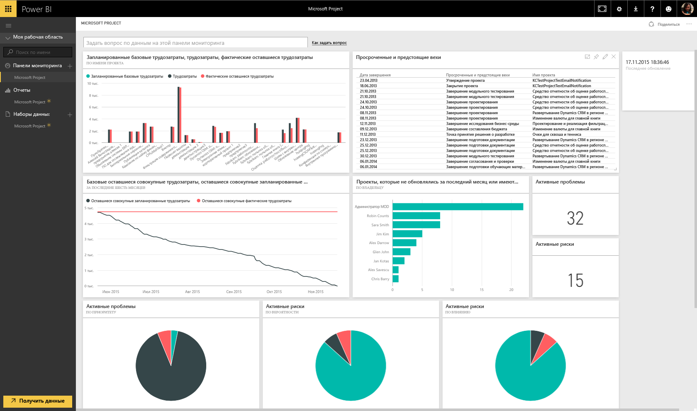

# Подключение к Project Online с помощью Power BI
Microsoft Project Online — это гибкое решение для управления портфелем проекта (PPM) и повседневной работы. Project Online позволяет организациям приступить к работе, расставить приоритеты по инвестициям в портфель проектов, а также добиться запланированного уровня ценности для бизнеса. Пакет содержимого Project Online для Power BI позволяет использовать функции аналитики Project Online для управления проектами, портфолио и ресурсами.

Подключитесь к [пакету содержимого Project Online](https://app.powerbi.com/getdata/services/project-online) для Power BI.

## Способы подключения
1. Нажмите кнопку **Получить данные** в нижней части левой панели навигации.
   
    
2. В поле **Службы** выберите **Получить**.
   
   
3. Выберите **Microsoft Project Online** \> **Получить**.
   
   
4. В текстовом поле **URL-адрес Project Web App** введите URL-адрес для Project Web App (PWA), к которому требуется подключиться, и нажмите кнопку **Далее**. Обратите внимание, что в личном домене ситуация может отличаться от приведенной в примере. В текстовом поле **Язык сайта PWA** введите номер, который соответствует нужному языку сайта PWA. Введите одну цифру "1" для английского языка, "2" для французского языка, "3" для немецкого языка, "4" для португальского (Бразилия), "5" для португальского (Португалия) и "6" для испанского языка. 
   
    
5. В качестве метода проверки подлинности выберите **oAuth2** \> **Войти**. При появлении запроса введите учетные данные Project Online и пройдите процесс проверки подлинности.
   
    
    
Обратите внимание, что вам нужно использовать разрешения на уровне средства просмотра портфеля, диспетчера портфелей или администратора для Project Web App, к которому вы подключаетесь.

6. Вы увидите уведомление, указывающее на загрузку данных. В зависимости от размера вашей учетной записи это может занять некоторое время. После импорта данных в Power BI в области навигации слева появятся новая панель мониторинга, 13 отчетов и набор данных. Это панель мониторинга по умолчанию, которую Power BI создает для отображения данных. Вы можете изменить эту панель мониторинга для отображения данных любым нужным образом.

   

7. После подготовки панели мониторинга и отчетов вы можете приступить к изучению данных Project Online. Пакет содержимого включает 13 удобных и подробных отчетов по обзору портфеля (6 страниц отчетов), обзору ресурсов (5 страниц отчетов) и состоянию проекта (2 страницы отчетов). 

   
   
   
   
   

**Дальнейшие действия**

* Попробуйте [задать вопрос в поле "Вопросы и ответы"](power-bi-q-and-a.md) в верхней части информационной панели.
* [Измените плитки](service-dashboard-edit-tile.md) на информационной панели.
* [Выберите плитку](service-dashboard-tiles.md), чтобы открыть соответствующий отчет.
* Хотя набор данных будет обновляться ежедневно по расписанию, вы можете изменить график обновлений или попытаться выполнять обновления по запросу с помощью кнопки **Обновить сейчас**.

**Расширение пакета содержимого**

Загрузка [PBIT-файла в GitHub](https://github.com/OfficeDev/Project-Power-BI-Content-Packs) для дальнейшей настройки и обновления пакета содержимого

## Дальнейшие действия
[Приступая к работе с Power BI](service-get-started.md)

[Получение данных в Power BI](service-get-data.md)

