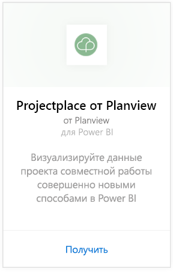
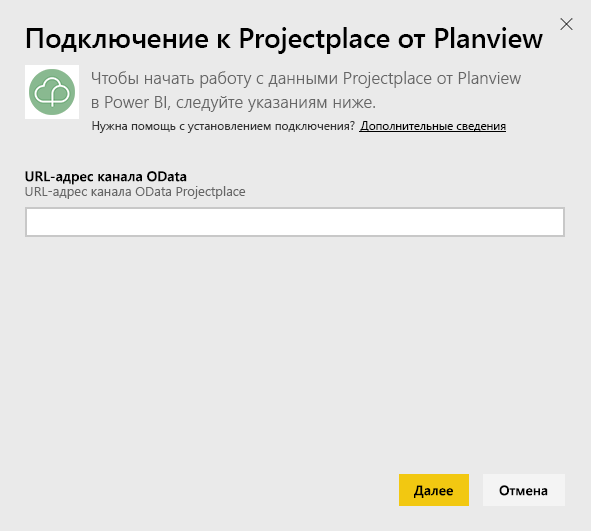
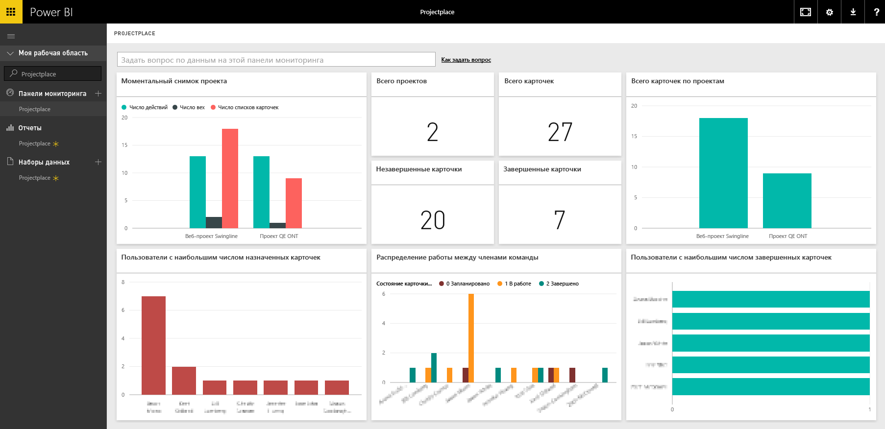

# Подключение к Projectplace от Planview с помощью Power BI
С помощью пакета содержимого Projectplace by Planview вы можете визуализировать данные о совместной работе над проектом совершенно новыми способами непосредственно в Power BI. Используйте учетные данные для входа Projectplace, чтобы интерактивно просмотреть ключевую статистику по проектам, узнать, кто в группе является наиболее активным и продуктивным, а также определить рискованные области и действия в проектах в вашей учетной записи Projectplace. Также можно расширить готовую информационную панель и отчеты, чтобы получить именно те ценные сведения, которые необходимы вам.

[Подключение к пакету содержимого Projectplace в Power BI](https://app.powerbi.com/getdata/services/projectplace)

>[!NOTE]
>Чтобы импортировать данные Projectplace в Power BI, необходимо быть пользователем Projectplace. Дополнительные требования см. в разделе ниже.

## Способы подключения
1. Нажмите кнопку **Получить данные** в нижней части левой панели навигации.
   
    
2. В поле **Службы** выберите **Получить**.
   
    
3. На странице Power BI выберите **Projectplace by Planview** и затем **Получить**:  
   
    
4. В текстовом поле OData Feed URL (URL-адрес веб-канала OData) введите URL-адрес веб-канала OData Projectplace, который вы хотите использовать, как показано на следующем рисунке:
   
    
5. В списке "Метод проверки подлинности" выберите **OAuth** , если это значение еще не установлено. Щелкните **Вход** и следуйте процедуре входа в систему.  
   
   
6. На левой панели выберите **Projectplace** в списке информационных панелей. Power BI импортирует данные Projectplace в информационную панель. Обратите внимание, что загрузка данных может занять некоторое время.  
   
    Информационная панель содержит плитки, которые отображают данные из базы данных Projectplace. Ниже приведен пример информационной панели Projectplace по умолчанию в Power BI.
   
    

**Дальнейшие действия**

* Попробуйте [задать вопрос в поле "Вопросы и ответы"](power-bi-q-and-a.md) в верхней части информационной панели.
* [Измените плитки](service-dashboard-edit-tile.md) на информационной панели.
* [Выберите плитку](service-dashboard-tiles.md), чтобы открыть соответствующий отчет.
* Хотя набор данных будет обновляться ежедневно по расписанию, вы можете изменить график обновлений или попытаться выполнять обновления по запросу с помощью кнопки **Обновить сейчас**.

## Требования к системе
Чтобы импортировать данные Projectplace в Power BI, необходимо быть пользователем Projectplace. Эта процедура предполагает, что вы уже выполнили вход на домашнюю страницу Microsoft Power BI с помощью учетной записи Power BI. Если у вас нет учетной записи Power BI, создайте новую бесплатную учетную запись Power BI на домашней странице Power BI, а затем нажмите кнопку "Получить данные".

## Дальнейшие действия
[Приступая к работе с Power BI](service-get-started.md)

[Power BI — основные понятия](service-basic-concepts.md)

