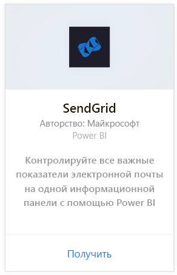
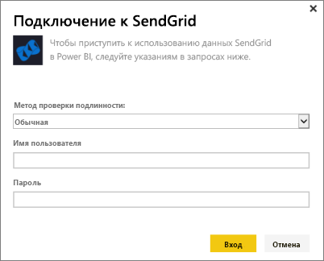
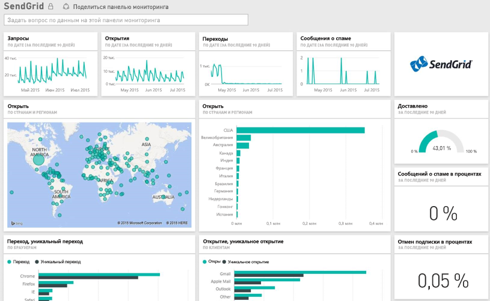

# Подключение к SendGrid с помощью Power BI
Пакет контента Power BI для SendGrid позволяет извлекать информацию и статистику из вашей учетной записи SendGrid. С помощью пакета контента SendGrid можно визуализировать статистику SendGrid на панели мониторинга.

Подключите [пакет содержимого SendGrid](https://app.powerbi.com/getdata/services/sendgrid) для Power BI.

## Способы подключения
1. Нажмите кнопку **Получить данные** в нижней части левой панели навигации.
   
    
2. В поле **Службы** выберите **Получить**.
   
    
3. Выберите пакет содержимого **SendGrid** и нажмите кнопку **Получить**.
   
    
4. При появлении запроса введите имя пользователя и пароль SendGrid. Выберите **Войти**.
   
   
5. После импорта данных в Power BI в области навигации слева появятся новая панель мониторинга, отчет и набор данных, заполненные статистикой по электронной почте за последние 90 дней. Новые элементы отмечены желтой звездочкой \*.
   
   

**Дальнейшие действия**

* Попробуйте [задать вопрос в поле "Вопросы и ответы"](consumer/end-user-q-and-a.md) в верхней части информационной панели.
* [Измените плитки](service-dashboard-edit-tile.md) на информационной панели.
* [Выберите плитку](consumer/end-user-tiles.md), чтобы открыть соответствующий отчет.
* Хотя набор данных будет обновляться ежедневно по расписанию, вы можете изменить график обновлений или попытаться выполнять обновления по запросу с помощью кнопки **Обновить сейчас**

## Содержимое
На панели мониторинга SendGrid доступны следующие метрики:

* Общая статистика по электронной почте — запрошено, доставлено, отклонен, заблокировано как нежелательная почта, отчет о нежелательной почте и т. д.
* Статистика по электронной почте по категориям
* Статистика по электронной почте по географии
* Статистика по электронной почте по ISP
* Статистика по электронной почте по устройствам, клиентам, браузерам

## Дальнейшие действия
[Что такое Power BI?](power-bi-overview.md)

[Получение данных](service-get-data.md)

