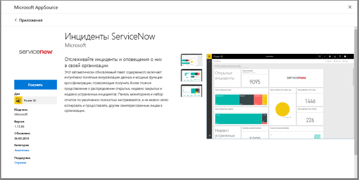
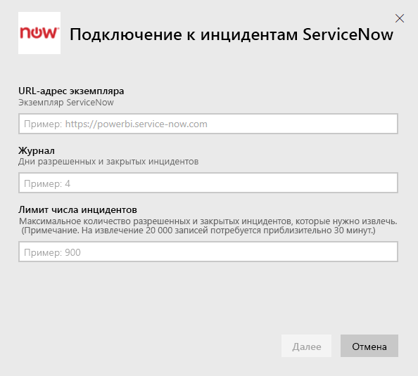
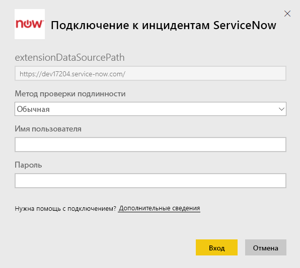
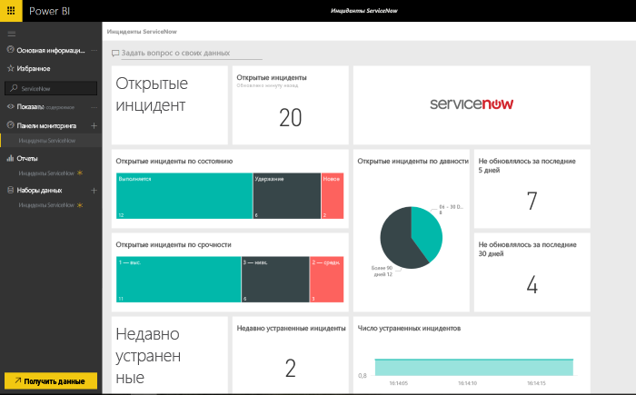

# Подключение к ServiceNow с помощью Power BI для создания отчетов об инцидентах
ServiceNow предлагает несколько продуктов и решений, в частности для бизнеса, операционной деятельности и управления ИТ, которые позволяют повысить эффективность работы предприятия. Этот пакет содержимого включает отчеты и аналитические инструменты для работы с открытыми, недавно решенными и недавно закрытыми инцидентами.  

Подключитесь к пакету содержимого Power BI для [инцидентов ServiceNow](https://app.powerbi.com/getdata/services/servicenow).

## Способы подключения
1. Нажмите кнопку **Получить данные** в нижней части левой панели навигации.
   
    
2. В поле **Службы** выберите **Получить**.
   
    
3. Выберите **Инциденты ServiceNow** \> **Получить**.
   
   
4. Укажите URL-адрес экземпляра ServiceNow, также количество дней и записей, которые нужно импортировать. Обратите внимание, что импорт остановится, как только будет достигнуто первое ограничение.
   
   
5. При появлении запроса введите учетные данные ServiceNow для **обычного** метода проверки подлинности. Обратите внимание, что единый вход пока не поддерживается. Дополнительные сведения о требованиях к системе см. ниже.
   
   
6. После завершения процедуры входа в систему начнется процесс импорта. После завершения в области навигации появятся новая панель мониторинга, отчет и модель. Выберите панель мониторинга, чтобы просмотреть импортированные данные.
   
    

**Дальнейшие действия**

* Попробуйте [задать вопрос в поле "Вопросы и ответы"](service-q-and-a.md) в верхней части информационной панели.
* [Измените плитки](service-dashboard-edit-tile.md) на информационной панели.
* [Выберите плитку](service-dashboard-tiles.md), чтобы открыть соответствующий отчет.
* Хотя набор данных будет обновляться ежедневно по расписанию, вы можете изменить график обновлений или попытаться выполнять обновления по запросу с помощью кнопки **Обновить сейчас**.

## Требования к системе
Для установки соединения нужны:  

* Учетная запись, у которой есть доступ к домену ваша_организация.service-now.com с обычной проверкой подлинности (единый вход не поддерживается в этой версии).  
* Учетная запись должна иметь роль rest_service и права на чтение таблицы инцидентов.  

## Устранение неполадок
Если во время загрузки появляется ошибка, указывающая на неправильные учетные данные, ознакомьтесь с приведенными выше требованиями. Если у вас есть все необходимые разрешения, но ошибка не исчезает, попросите своего администратора ServiceNow проверить, есть ли у вас все дополнительные разрешения, которые могут требоваться для вашего экземпляра.

Если на загрузку уходит много времени, просмотрите количество инцидентов и дней, которые вы указали во время подключения, и при необходимости уменьшите эти цифры.

## Дальнейшие действия
[Приступая к работе с Power BI](service-get-started.md)

[Power BI — основные понятия](service-basic-concepts.md)

