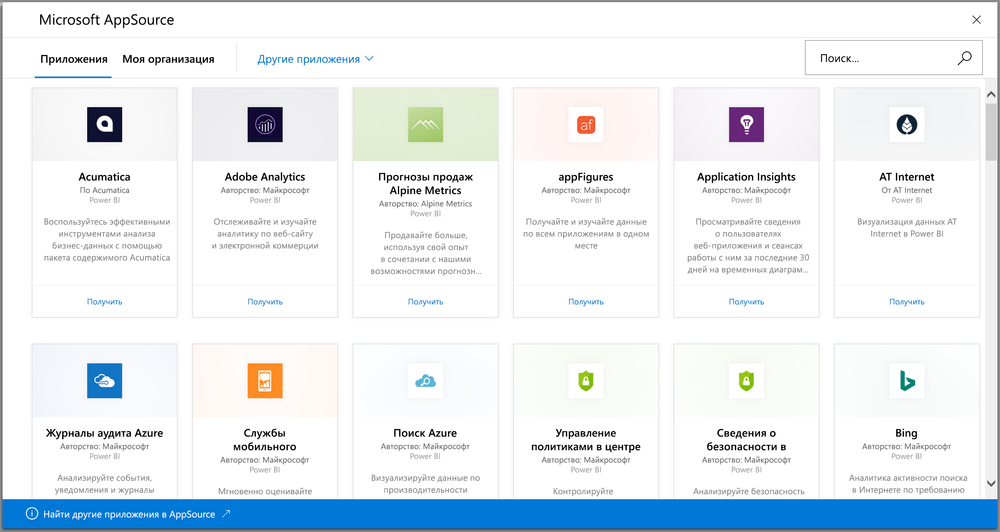
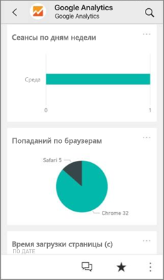
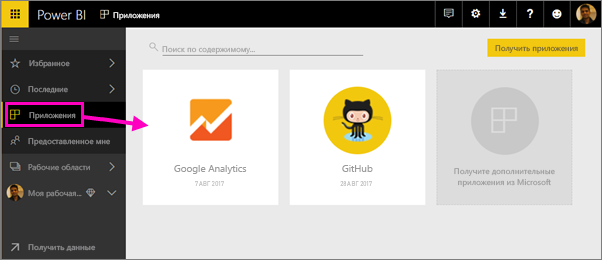
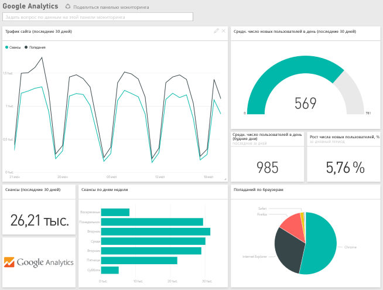
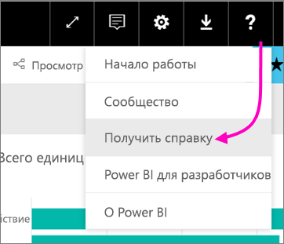

# Подключение к используемым службам с помощью Power BI
Вы можете подключаться к различным службам, используемым для обеспечения работы вашей организации, таким как Salesforce, Microsoft Dynamics и Google Analytics. Power BI сначала подключается к службе с помощью ваших учетных данных, а затем создает приложение Power BI с панелью мониторинга и набором отчетов Power BI, которые автоматически представляют ваши данные и выводят сведения о вашем бизнесе в визуальной форме. 

Войдите в Power BI, чтобы просмотреть все [службы, к которым можно подключиться](https://app.powerbi.com/getdata/services). Группа разработчиков Power BI регулярно добавляет новые службы.

Установив приложение, вы можете просматривать отчеты и панели мониторинга в службе Power BI ([https://powerbi.com](https://powerbi.com)) и мобильных приложениях Power BI. 

## Начало работы
[!INCLUDE [powerbi-service-apps-get-more-apps](./includes/powerbi-service-apps-get-more-apps.md)]

## Просмотр панели мониторинга и отчетов
По завершении импорта на странице приложений появится новое приложение.

1. На панели навигации слева щелкните **Приложения** и выберите приложение.
   
     
2. Вы можете задать вопрос, введя его в поле вопросов и ответов, или щелкнуть плитку, чтобы открыть базовый отчет. 
   
    
   
    Вы можете фильтровать и выделять данные в отчете, но не сохранять изменения.

## Содержимое
После подключения к службе вы увидите новое приложение с панелью мониторинга, отчетами и набором данных. Данные из службы предназначены для конкретного сценария и могут включать не все сведения из службы. Согласно расписанию данные автоматически обновляются раз в день. Вы можете управлять расписанием обновлений, выбирая набор данных.

Вы также можете использовать [Power BI Desktop](desktop-get-the-desktop.md) для подключения к некоторым службам, таким как Google Analytics, и создания собственных настраиваемых информационных панелей и отчетов.  

Дополнительные сведения о подключении к определенным службам см. на соответствующих страницах справки.

## Устранение неполадок
**Пустые плитки**  
При первом подключении Power BI к службе на панели мониторинга может отображаться пустой набор плиток. Если спустя 2 часа по-прежнему отображается пустая панель мониторинга, скорее всего, произошел сбой при подключении. Если сообщение об ошибке с инструкциями по устранению проблемы не отображается, отправьте запрос в службу поддержки.

* В правом верхнем углу щелкните значок с вопросительным знаком (**?**) и выберите пункт **Справка**.
  
    

**Отсутствующие данные**  
Панель мониторинга и отчеты включают содержимое из службы, предназначенное для конкретного сценария, и не включают все сведения из службы. Если есть конкретная метрика, которую вы не видите в пакете содержимого, сообщите об этом на странице [поддержки Power BI](https://support.powerbi.com/forums/265200-power-bi).

## Предложения по службам
Вы используете службу, которую хотели бы предложить для приложения Power BI? Перейдите на страницу [поддержки Power BI](https://support.powerbi.com/forums/265200-power-bi) и сообщите нам об этом.

У вас есть служба, для которой вы хотели бы создать приложение? [Отправьте свое предложение](https://azure.microsoft.com/marketplace/programs/certified/apply/) и выберите "Опубликовать пакет содержимого Power BI", чтобы приступить к его созданию.

## Дальнейшие действия
* [Что из себя представляют приложения в Power BI?](service-install-use-apps.md)
* [Получение данных в Power BI](service-get-data.md)
* Появились дополнительные вопросы? [Попробуйте задать вопрос в сообществе Power BI.](http://community.powerbi.com/)

