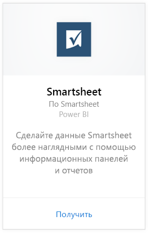

# Подключение к Smartsheet с помощью Power BI
Smartsheet — это удобная платформа для совместной работы и обмена файлами. Пакет содержимого Smartsheet для Power BI включает панель мониторинга, отчеты и набор данных с обзором вашей учетной записи Smartsheet. Вы можете также использовать [Power BI Desktop](desktop-connect-to-data.md) для подключения напрямую к отдельным листам в учетной записи. 

Подключитесь к [пакету содержимого Smartsheet](https://app.powerbi.com/groups/me/getdata/services/smartsheet) для Power BI.

>[!NOTE]
>Для подключения и загрузки пакета содержимого для Power BI рекомендуется использовать учетную запись администратора Smartsheet, так как она обеспечивает доступ к дополнительным возможностям.

## Способы подключения
1. Нажмите кнопку **Получить данные** в нижней части левой панели навигации.
   
   
2. В поле **Службы** выберите **Получить**.
   
    
3. Выберите **Smartsheet \> Получить**.
   
   
4. В качестве метода проверки подлинности выберите **oAuth2 \> Войти**.
   
   При появлении запроса введите учетные данные Smartsheet и пройдите проверку подлинности.
   
   
   
   
5. После импорта данных в Power BI в области навигации слева появятся новая панель мониторинга, отчеты и набора данных. Новые элементы будут отмечены желтой звездочкой (\*). Выберите Smartsheet.
   
   

**Дальнейшие действия**

* Попробуйте [задать вопрос в поле "Вопросы и ответы"](power-bi-q-and-a.md) в верхней части информационной панели.
* [Измените плитки](service-dashboard-edit-tile.md) на информационной панели.
* [Выберите плитку](service-dashboard-tiles.md), чтобы открыть соответствующий отчет.
* Хотя набор данных будет обновляться ежедневно по расписанию, вы можете изменить график обновлений или попытаться выполнять обновления по запросу с помощью кнопки **Обновить сейчас**.

## Содержимое
Пакет содержимого Smartsheet для Power BI содержит общие сведения о вашей учетной записи Smartsheet, например число рабочих областей, отчеты и листы, в которые вносятся изменения, и т. д. Пользователи с правами администратора смогут также видеть некоторые сведения о пользователях в системе, например создателей верхних листов.  

Вы можете использовать соединитель Smartsheet в [Power BI Desktop](desktop-connect-to-data.md) для подключения напрямую к отдельным листам в учетной записи.  

## Дальнейшие действия:

[Что такое Power BI?](power-bi-overview.md)

[Получение данных для Power BI](service-get-data.md)