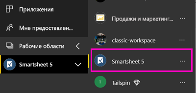
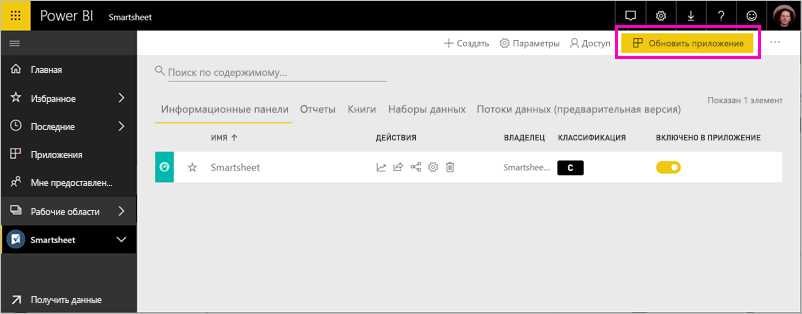

# Подключение к Smartsheet с помощью Power BI
В этой статье рассматривается извлечение данных из вашей учетной записи Smartsheet с помощью шаблона приложения Power BI. Smartsheet — это удобная платформа для совместной работы и обмена файлами. Шаблон приложения Smartsheet для Power BI предоставляет панель мониторинга, отчеты и набора данных, в которой представлены общие сведения о вашей учетной записи Smartsheet. Можно также использовать [Power BI Desktop](desktop-connect-to-data.md) подключиться напрямую к отдельным листам в учетной записи. 

После установки шаблона приложения, можно изменить панель мониторинга и отчетов. Затем можно распространять его как приложение коллегам в организации.

Подключение к [Smartsheet шаблона приложения](https://app.powerbi.com/groups/me/getdata/services/smartsheet) для Power BI.

>[!NOTE]
>Учетная запись администратора Smartsheet является предпочтительным для подключения и загрузки шаблона приложения Power BI, так как она обеспечивает доступ к дополнительным возможностям.

## Способы подключения

[!INCLUDE [powerbi-service-apps-get-more-apps](./includes/powerbi-service-apps-get-more-apps.md)]

3. Выберите **Smartsheet** \> **получить сейчас**.
4. В **установить это приложение Power BI?** выберите **установить**.
4. В **приложений** области выберите **Smartsheet** плитку.

    

6. В **приступить к работе с нового приложения**выберите **подключайте данные из**.

    

4. В качестве метода проверки подлинности выберите **oAuth2 \> Войти**.
   
   При появлении запроса введите учетные данные Smartsheet и пройдите проверку подлинности.
   
   
   
   

5. После импорта данных в Power BI открывается панель мониторинга Smartsheet.
   
   

## Изменение и распространение приложения

Вы установили приложение шаблона Smartsheet. Это означает, что вы также создали рабочую область приложения Smartsheet. В рабочей области можно изменить отчет и информационную панель и затем распространить его как *приложения* коллегам в организации. 

1. Чтобы просмотреть все содержимое новой рабочей областью Smartsheet, в панели навигации слева, выберите **рабочие области** > **Smartsheet**. 

    

    Это представление является списке содержимого рабочей области. В правом верхнем углу, вы увидите **обновить приложение**. Когда вы будете готовы для распространения приложения, чтобы ваши коллеги, начнем именно это. 

    

2. Выберите **отчеты** и **наборы данных** для отображения элементов в рабочей области.

    Узнайте о [распространение приложений](service-create-distribute-apps.md) своим коллегам.

## Содержимое
У Smartsheet шаблона приложения для Power BI содержит общие сведения о вашей учетной записи Smartsheet, например число рабочих областей, отчеты и листы, вы, изменяются и т.д. Пользователи с правами администратора также видеть некоторые сведения о пользователях в системе, например создателей верхних листов.  

Вы можете использовать соединитель Smartsheet в [Power BI Desktop](desktop-connect-to-data.md) для подключения напрямую к отдельным листам в учетной записи.  

## Дальнейшие действия

* [Создание новых рабочих областей в Power BI](service-create-the-new-workspaces.md)
* [Установка и использование приложений с информационными панелями и отчетами в Power BI](consumer/end-user-apps.md)
* [Подключение к приложениям Power BI для внешних служб](service-connect-to-services.md)
* У вас появились вопросы? [Попробуйте задать вопрос в сообществе Power BI.](http://community.powerbi.com/)