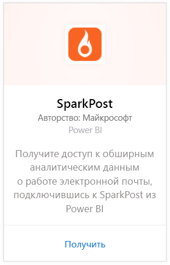
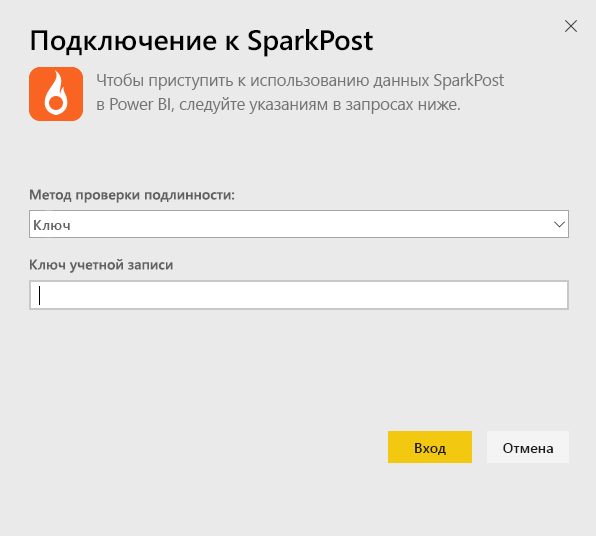
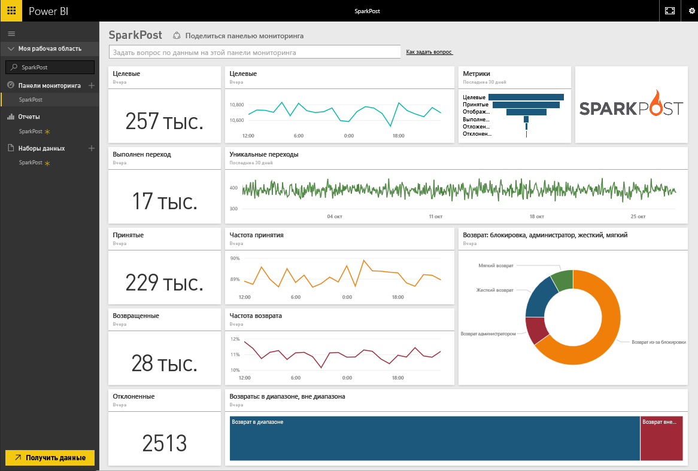
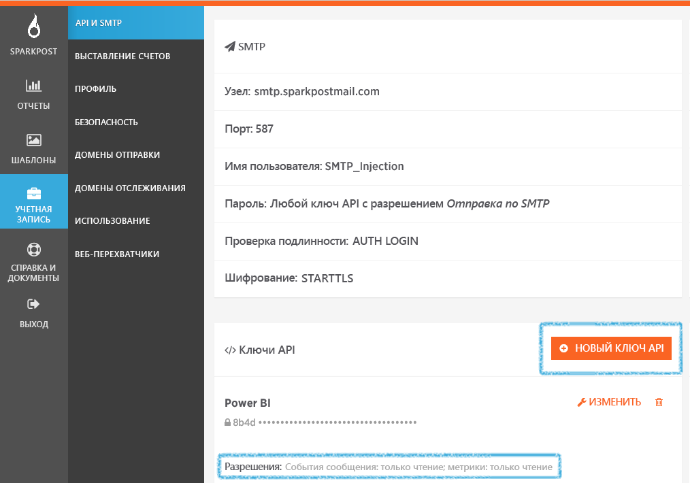

# Подключение к SparkPost с помощью Power BI
Пакет содержимого Power BI для SparkPost позволяет извлекать ценные наборы данных из вашей учетной записи SparkPost в виде одной удобной информационной панели. С помощью пакета содержимого SparkPost можно визуализировать всю вашу статистику по электронной почте, включая домены, кампании и взаимодействие с поставщиком услуг Интернета.

Подключитесь к [пакету содержимого SparkPost для Power BI](https://app.powerbi.com/getdata/services/spark-post).

## Способы подключения
1. Нажмите кнопку **Получить данные** в нижней части левой панели навигации.
   
   
2. В поле **Службы** выберите **Получить**.
   
   
3. Выберите пакет содержимого **SparkPost** и нажмите кнопку **Получить**. 
   
   
4. При появлении запроса укажите свой ключ API SparkPost и выберите "Вход". Сведения о том, как [найти эти параметры](#FindingParams), см. ниже.
   
   
5. Начинается загрузка данных, которая может занять определенное время в зависимости от размера вашей учетной записи. После импорта данных в Power BI в области навигации слева появятся информационная панель по умолчанию, отчет и набор данных, заполненные статистикой по электронной почте за последние 90 дней. Новые элементы отмечены желтой звездочкой \*.
   
   

**Дальнейшие действия**

* Попробуйте [задать вопрос в поле "Вопросы и ответы"](consumer/end-user-q-and-a.md) в верхней части информационной панели.
* [Измените плитки](service-dashboard-edit-tile.md) на информационной панели.
* [Выберите плитку](consumer/end-user-tiles.md), чтобы открыть соответствующий отчет.
* Хотя набор данных будет обновляться ежедневно по расписанию, вы можете изменить график обновлений или попытаться выполнять обновления по запросу с помощью кнопки **Обновить сейчас**

## Содержимое
Пакет содержимого SparkPost для Power BI включает в себя сведения, такие как число уникальных щелчков, число принятых приглашений, показатель "ненужных просмотров", число отложенных просмотров, процент отказов и многое другое.

## Поиск параметров
Пакет содержимого использует ключ API для подключения вашей учетной записи SparkPost к Power BI. Ключ API можно найти в учетной записи в разделе "Учетная запись" \> "API и SMTP" (дополнительные сведения см. [здесь](https://support.sparkpost.com/customer/portal/articles/1933377-create-api-keys)). Мы рекомендуем вам использовать ключ API с разрешениями для `Message Events: Read-only `и `Metrics: Read-only`

