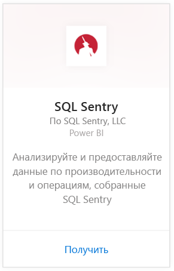
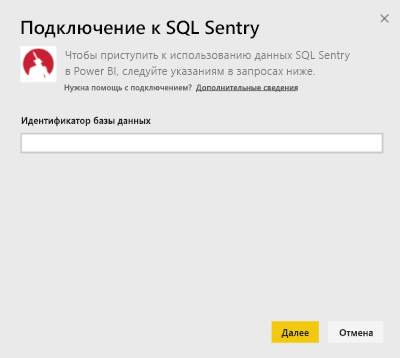
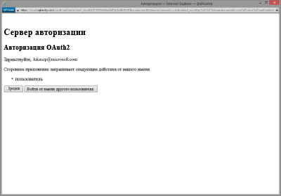
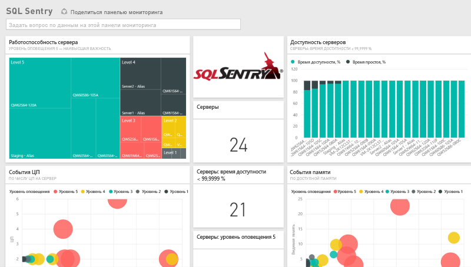
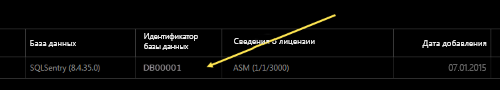
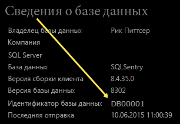

# Подключение к SQL Sentry с помощью Power BI
С помощью Power BI легко проанализировать данные производительности, собранные SQL Sentry. Power BI извлекает данные, а затем создает панель мониторинга по умолчанию и связанные отчеты на основе этих данных.

Подключите [пакет содержимого SQL Sentry](https://app.powerbi.com/groups/me/getdata/services/sql-sentry) для Power BI.

>[!NOTE]
>Для подключения требуется доступ к учетной записи SQL Sentry, которую вы используете для подключения к сайту http://cloud.sqlsentry.com, и идентификатор базы данных, которую вы будете отслеживать.  См. инструкции по поиску ИД базы данных ниже.

## Способы подключения
1. Нажмите кнопку **Получить данные** в нижней части левой панели навигации.
   
   
2. В поле **Службы** выберите **Получить**.
   
    
3. Выберите **SQL Sentry \> Получить**.
   
   
4. Предоставьте **ИД базы данных** , мониторинг которой требуется выполнять в Power BI. Дополнительные сведения о том, как [найти эти данные](#FindingParams), см. ниже.
   
   
5. В качестве метода проверки подлинности выберите **oAuth2 \> Войти**.
   
   При появлении запроса введите учетные данные cloud.sqlsentry.com и выполните процедуру аутентификации SQL Sentry.
   
   
   
   При первом подключении Power BI предлагает разрешить доступ только для чтения к вашей учетной записи. Выберите "Разрешить", чтобы начать процесс импорта.  Процесс импорта может занять несколько минут в зависимости от объема данных в вашей учетной записи.
   
   
6. После импорта данных в Power BI в области навигации слева появятся новая панель мониторинга, отчеты и набора данных. Новые элементы отмечены желтой звездочкой \*.
   
   
7. Выберите панель мониторинга SQL Sentry.
   
   Это панель мониторинга по умолчанию, которую Power BI создает для отображения данных. Вы можете изменить эту панель мониторинга для отображения данных любым нужным образом.
   
   

**Дальнейшие действия**

* Попробуйте [задать вопрос в поле "Вопросы и ответы"](service-q-and-a.md) в верхней части информационной панели.
* [Измените плитки](service-dashboard-edit-tile.md) на информационной панели.
* [Выберите плитку](service-dashboard-tiles.md), чтобы открыть соответствующий отчет.
* Хотя набор данных будет обновляться ежедневно по расписанию, вы можете изменить график обновлений или попытаться выполнять обновления по запросу с помощью кнопки **Обновить сейчас**.

## Содержимое
В Power BI доступны следующие данные из SQL Sentry:

| Имя таблицы | Описание |
| --- | --- |
| Подключение |Эта таблица содержит сведения об определенных вами подключениях SQL Sentry. |
| Даты  |Эта таблица содержит даты с текущей до самой ранней даты, с которой были собраны и сохранены данные о производительности. |
| Время простоя  |Эта таблица содержит сведения о времени простоя и бесперебойной работы каждого отслеживаемого сервера в вашей среде. |
| Использование памяти  |Эта таблица содержит данные об объеме доступной или свободной памяти на каждом из серверов.  |
| Сервер  |Эта таблица содержит записи для каждого сервера в вашей среде. |
| Работоспособность сервера  |Эта таблица содержит данные обо всех событиях, созданных пользовательскими условиями в вашей среде, включая серьезность и их количество. |

## Поиск параметров
**ИД базы данных** можно найти, выполнив вход в систему <https://cloud.sqlsentry.com> в новом окне веб-браузера.  **ИД базы данных** указан на главной обзорной странице:

    

**ИД базы данных** также показан на экране "Сведения о базе данных":

    

## Устранение неполадок
Если данные некоторых приложений не отображаются в Power BI, убедитесь, что указан верный ИД базы данных и что у вас есть разрешения на просмотр этих данных. 

Если вы не являетесь владельцем базы данных SQL Sentry, которая синхронизируется с <https://cloud.sqlsentry.com>, свяжитесь со своим администратором, чтобы убедиться, что у вас есть права на просмотр собранных данных.

## Дальнейшие действия
[Приступая к работе с Power BI](service-get-started.md)

[Получение данных для Power BI](service-get-data.md)

