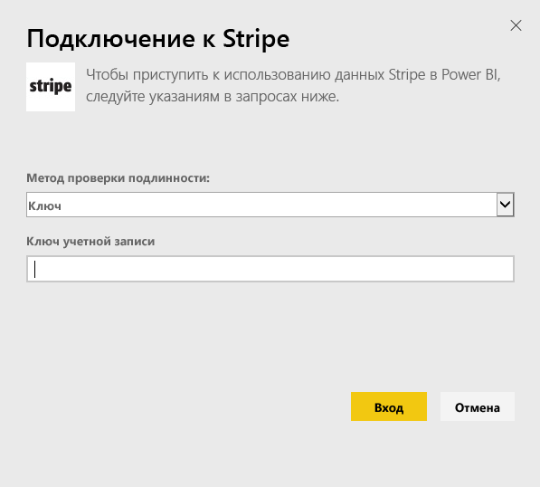
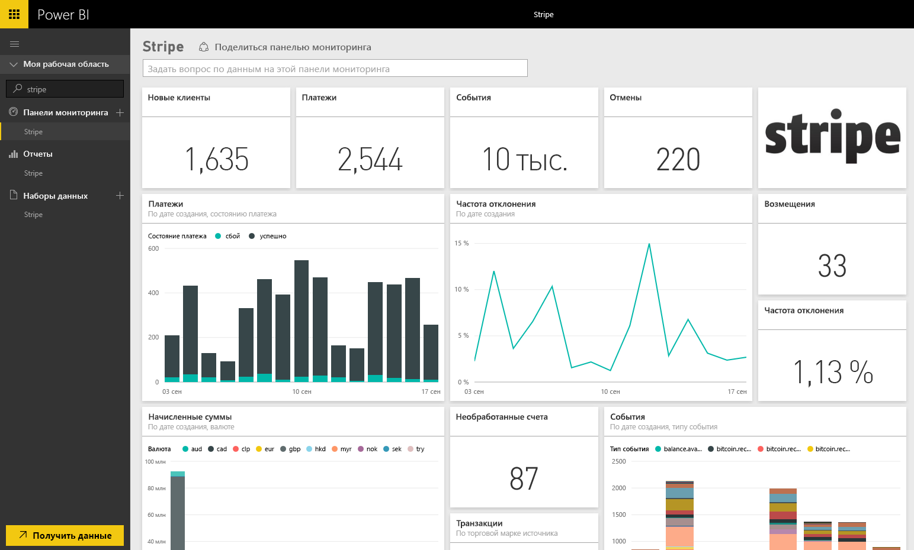

# Подключение к Stripe с помощью Power BI
Визуализация и исследование данных Stripe в Power BI с помощью пакета контента Power BI. Пакет контента Stripe в Power BI извлекает данные о клиентах, накладных расходах, событиях и счетах. Данные содержат последние десять тысяч событий и пять тысяч расходов за последние 30 дней. Контент будет обновляться автоматически один раз в день в указанное вами время. 

Подключите [пакет содержимого Stripe для Power BI](https://app.powerbi.com/getdata/services/stripe).

## Способы подключения
1. Выберите "Получить данные" в нижней части левой панели навигации.  
   
    
2. В поле **Службы** выберите **Получить**.  
   
      
3. Выберите **Stripe** &gt; **Получить**.  
   
      
4. Укажите [API-ключ](https://dashboard.stripe.com/account/apikeys) Stripe для подключения.  
   
    
5. Процесс импорта начнется автоматически. После завершения в области навигации появятся новая панель мониторинга, отчет и модель, отмеченные звездочкой. Выберите панель мониторинга, чтобы просмотреть импортированные данные.
   
    

**Дальнейшие действия**

* Попробуйте [задать вопрос в поле "Вопросы и ответы"](power-bi-q-and-a.md) в верхней части информационной панели.
* [Измените плитки](service-dashboard-edit-tile.md) на информационной панели.
* [Выберите плитку](service-dashboard-tiles.md), чтобы открыть соответствующий отчет.
* Хотя набор данных будет обновляться ежедневно по расписанию, вы можете изменить график обновлений или попытаться выполнять обновления по запросу с помощью кнопки **Обновить сейчас**.

## Дальнейшие действия
[Приступая к работе с Power BI](service-get-started.md)

[Получение данных для Power BI](service-get-data.md)

