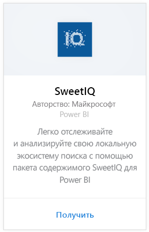
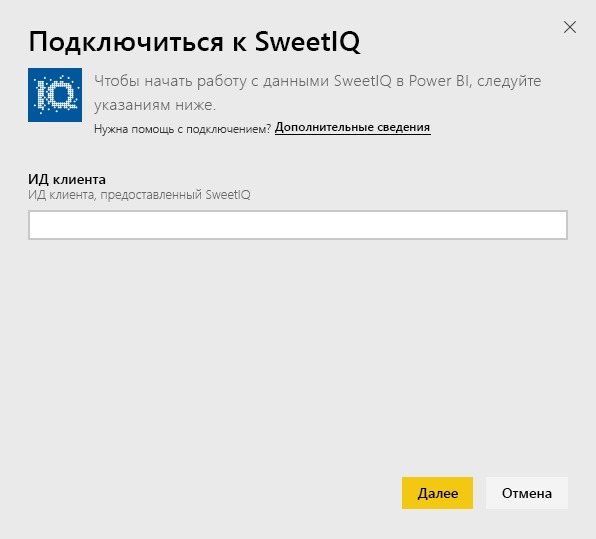
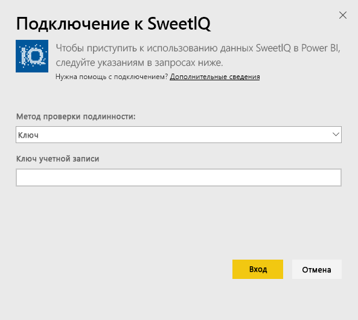
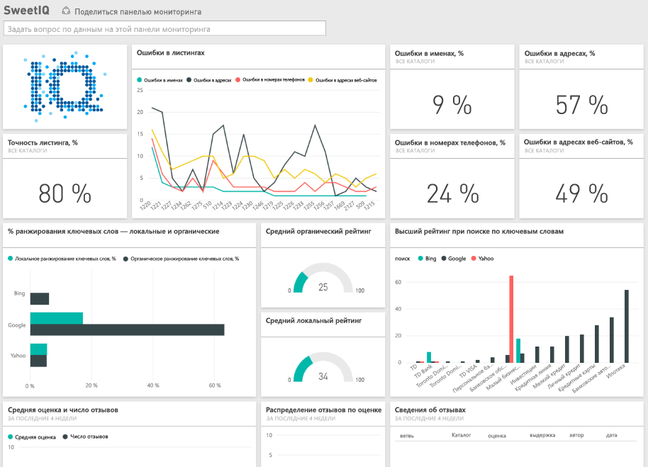

# Подключение к SweetIQ с помощью Power BI
Пакет контента Power BI извлекает данные из учетной записи SweetIQ и создает набор готового содержимого, что позволяет легко изучать данные. Воспользуйтесь пакетом контента SweetIQ, чтобы проанализировать данные о местоположениях, списках, оценках и проверках. Данные обновляются ежедневно, так что вам всегда доступны последние сведения.

Подключите [пакет содержимого SweetIQ](https://app.powerbi.com/groups/me/getdata/services/sweetiq) для Power BI.

## Способы подключения
1. На панели навигации слева щелкните **Получить данные**.
   
    
2. Выберите **SweetIQ** и щелкните **Получить**.
   
    
3. Укажите идентификатор клиента SweetIQ. Обычно это буквенно-цифровое значение. Дополнительные сведения о поиске этого значения см. ниже.
   
    
4. Выберите тип проверки подлинности **Ключ** и укажите свой API-ключ Sweet IQ. Обычно это буквенно-цифровое значение. Дополнительные сведения о поиске этого значения см. ниже.
   
    
5. Power BI начинает загрузку ваших данных, что может занять некоторое время в зависимости от размера данных вашей учетной записи. По окончании загрузки вы увидите новую панель мониторинга, отчет и набор данных в левой области навигации.
   
    

**Дальнейшие действия**

* Попробуйте [задать вопрос в поле "Вопросы и ответы"](power-bi-q-and-a.md) в верхней части информационной панели.
* [Измените плитки](service-dashboard-edit-tile.md) на информационной панели.
* [Выберите плитку](service-dashboard-tiles.md), чтобы открыть соответствующий отчет.
* Хотя набор данных будет обновляться ежедневно по расписанию, вы можете изменить график обновлений или попытаться выполнять обновления по запросу с помощью кнопки **Обновить сейчас**.

## Поиск параметров
ИД клиента и ключ API для этого пакета контента отличается от вашего имени пользователя и пароля SweetIQ.

Выберите ИД клиента для одного из клиентов, к которому у вашей учетной записи имеется доступ. Список клиентов доступен в разделе "Управление клиентами" вашей учетной записи SweetIQ.

Обратитесь к администратору, чтобы получить свой ключ API и, соответственно, доступ к данным для конкретного клиента.

## Дальнейшие действия
[Приступая к работе с Power BI](service-get-started.md)

[Получение данных для Power BI](service-get-data.md)

