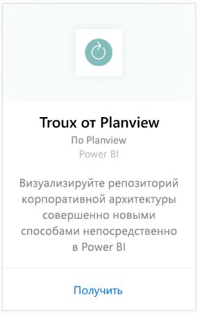
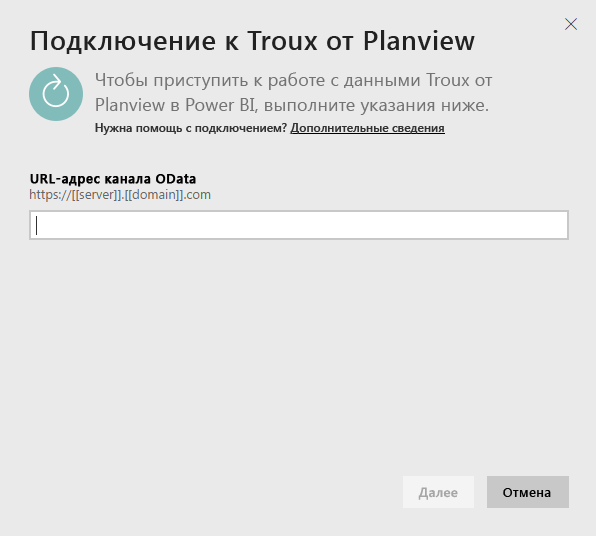
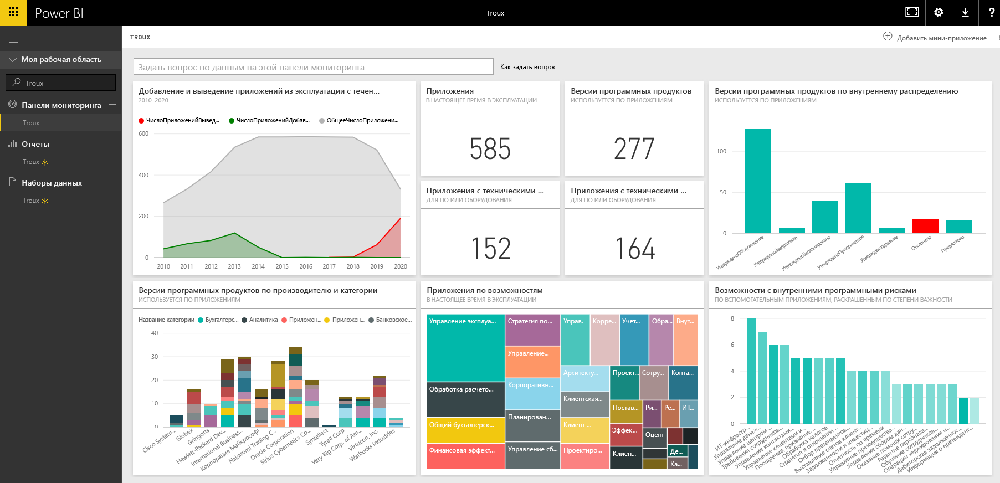

# Подключение к Troux для Power BI
С помощью пакета содержимого Troux вы можете визуализировать репозиторий корпоративной архитектуры совершенно новыми способами непосредственно в Power BI. В пакет содержимого входит набор средств анализа бизнес-возможностей, приложения, которые предоставляют эти возможности, и технологии, которые поддерживают эти приложения, полностью настраиваемые с помощью Power BI.

Подключите [пакет содержимого Troux](https://app.powerbi.com/getdata/services/troux) для Power BI.

## Способы подключения
1. Нажмите кнопку **Получить данные** в нижней части левой панели навигации.
   
   
2. В поле **Службы** выберите **Получить**.
   
   
3. Выберите **Troux** \> **Получить**.
   
   
4. Укажите URL-адрес Troux OData. Сведения о том, как [найти эти параметры](#FindingParams), см. ниже.
   
   
5. В качестве значения параметра **Проверка подлинности**выберите **Обычная** , укажите имя пользователя и пароль (регистр учитывается), а затем щелкните **Вход**.
   
    
6. После утверждения процесс импорта начнется автоматически. После завершения в области навигации появятся новая панель мониторинга, отчет и модель. Выберите панель мониторинга, чтобы просмотреть импортированные данные.
   
     

**Дальнейшие действия**

* Попробуйте [задать вопрос в поле "Вопросы и ответы"](power-bi-q-and-a.md) в верхней части информационной панели.
* [Измените плитки](service-dashboard-edit-tile.md) на информационной панели.
* [Выберите плитку](service-dashboard-tiles.md), чтобы открыть соответствующий отчет.
* Хотя набор данных будет обновляться ежедневно по расписанию, вы можете изменить график обновлений или попытаться выполнять обновления по запросу с помощью кнопки **Обновить сейчас**.

## Требования к системе
Требуется доступ к веб-каналу Troux OData и Troux 9.5.1 или более поздняя версия.

## Поиск параметров
Уникальный URL-адрес веб-канала Troux OData можно получить в службе по работе с клиентами.

## Устранение неполадок
Если после ввода учетных данных возникает ошибка, связанная со временем ожидания, повторите попытку подключения.

## Дальнейшие действия
[Приступая к работе с Power BI](service-get-started.md)

[Получение данных в Power BI](service-get-data.md)

