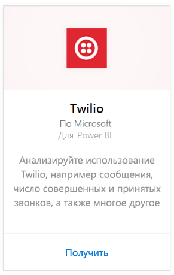
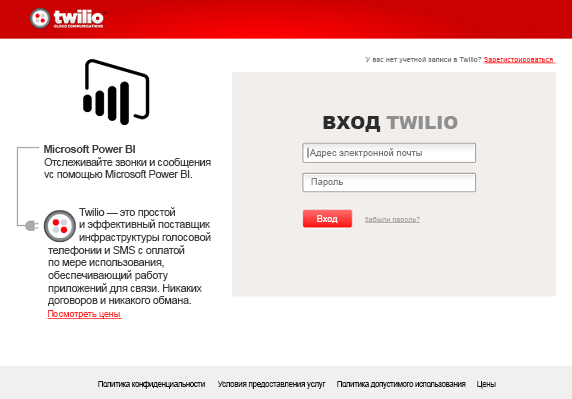
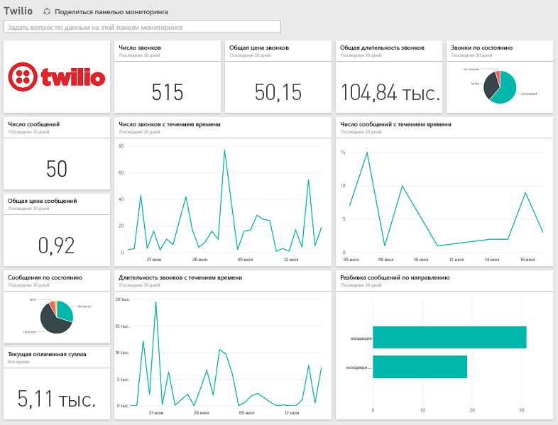

# Подключение к Twilio с помощью Power BI
Пакет содержимого Microsoft Twilio для Power BI позволяет извлекать данные в Power BI, а также создает готовую [панель мониторинга Twilio](https://powerbi.microsoft.com/integrations/twilio) и отчет с ценными сведениями о ваших данных. Вы также можете создавать настраиваемые отчеты и панели мониторинга на основе набора данных, созданного Power BI. Данные будут обновляться раз в день, поэтому вам всегда будут доступны последние сведения.

[!INCLUDE [include-short-name](./includes/service-deprecate-content-packs.md)]

Подключите [пакет содержимого Twilio](https://app.powerbi.com/getdata/services/twilio) для Power BI.

## Способы подключения
1. Нажмите кнопку **Получить данные** в нижней части левой панели навигации.
   
    
2. В поле **Службы** выберите **Получить**.
   
    
3. Выберите **Twilio** \> **Получить**.
   
   
4. В качестве **метода проверки подлинности** выберите **oAuth2** \> "Войти". При появлении запроса введите учетные данные Twilio и разрешите приложению Power BI доступ к вашим данным.
   
   
5. После этого начнется импорт данных из учетной записи Twilio, а панель мониторинга заполнится сведениями об использовании вызовов и сообщений за последние 30 дней. 
   
   

**Дальнейшие действия**

* Попробуйте [задать вопрос в поле "Вопросы и ответы"](consumer/end-user-q-and-a.md) в верхней части информационной панели.
* [Измените плитки](service-dashboard-edit-tile.md) на информационной панели.
* [Выберите плитку](consumer/end-user-tiles.md), чтобы открыть соответствующий отчет.
* Хотя набор данных будет обновляться ежедневно по расписанию, вы можете изменить график обновлений или попытаться выполнять обновления по запросу с помощью кнопки **Обновить сейчас**

## Содержимое
Сведения о всех вызовах и сообщениях за последние 30 дней. Вы можете выполнить все виды анализов и статистической обработки с этими данными.

Набор объединенной статистики, за которым имеет смысл наблюдать. Этот набор включает следующее:

        All Time Calls Count  
        All Time Calls Duration  
        All Time Calls Price  
        All Time Messages Price  
        All Time Messages Count  
        All Time Count of Phone Numbers  
        All Time Price of Phone Numbers  
        All Time Twilio Client Calls Price  
        All Time Twilio Client Calls Duration  
        All Time Twilio Client Calls Count  
        All Time Total Price  
        All Time Inbound Calls Price  
        All Time Inbound Calls Duration  
        All Time Inbound Calls Count  
        All Time Outbound Calls Price  
        All Time Outbound Calls Duration  
        All Time Outbound Calls Count  
        This Month Calls Price  
        This Month Calls Duration  
        This Month Calls Count  
        This Month Messages Count  
        This Month Messages Price  
        This Month Count of Phone Numbers  
        This Month Price of Phone Numbers  
        This Month Twilio Client Calls Price  
        This Month Twilio Client Calls Duration  
        This Month Twilio Client Calls Count  
        This Month Total Price  
        This Month Inbound Calls Price  
        This Month Inbound Calls Duration  
        This Month Inbound Calls Count  
        This Month Outbound Calls Price  
        This Month Outbound Calls Duration  
        This Month Outbound Calls Count  
        This Month Inbound Messages Price  
        This Month Inbound Messages Count  
        This Month Outbound Messages Price  
        This Month Outbound Messages Count

## Устранение неполадок
Если объем данных за последние 30 дней очень большой (сотни тысяч транзакций), получение данных может завершиться ошибкой. Нам известна эта проблемы, и мы работаем над ее устранением. Но если вы столкнулись с этой проблемой, используйте ссылку на службу поддержки в верхней части страницы Power BI, чтобы сообщить нам, и мы свяжемся с вами для дальнейшего исследования.

## Дальнейшие действия
[Приступая к работе с Power BI](service-get-started.md)

[Получение данных в Power BI](service-get-data.md)

