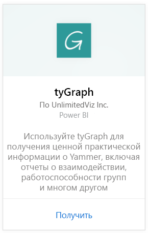
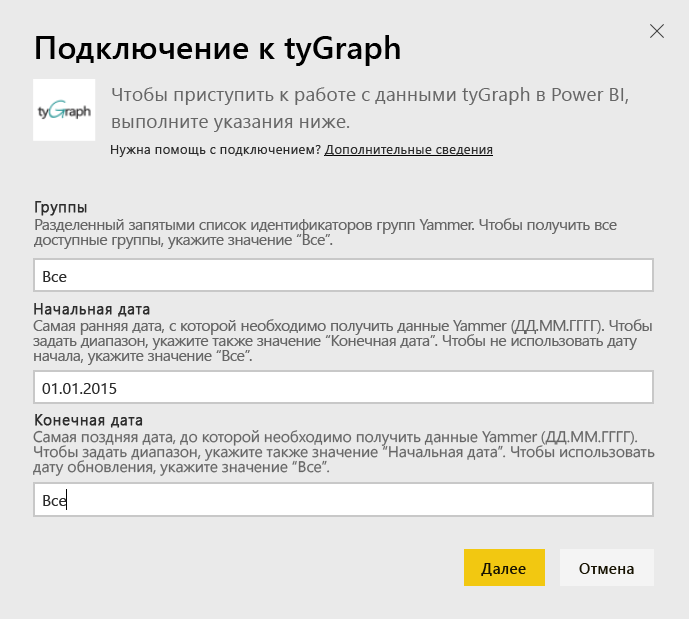
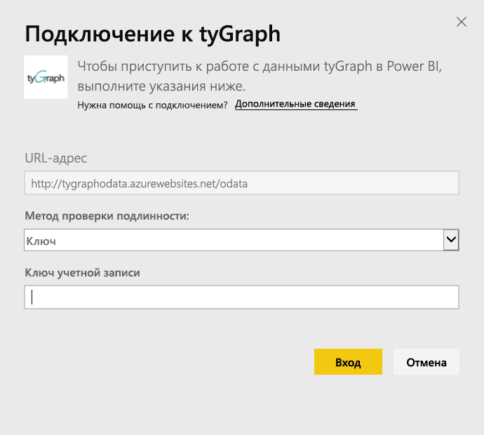
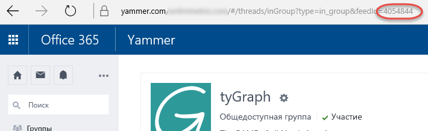

# Подключение к tyGraph с помощью Power BI
Визуализация и исследование данных tyGraph в Power BI с помощью пакета контента Power BI. Начните с подключения к учетной записи tyGraph и загрузки панели мониторинга, отчетов и набора данных. Готовый контент содержит такую информацию, как мера активного участия (оценка MAE) и ведущие участники. Дополнительная настройка контента позволяет выделить наиболее важную для вас информацию.  Данные обновляются автоматически по назначенному вами расписанию.

Подключитесь к [tyGraph для Power BI](https://app.powerbi.com/getdata/services/tygraph).

## Способы подключения
1. Нажмите кнопку **Получить данные** в нижней части левой панели навигации.
   
   
2. В поле **Службы** выберите **Получить**.
   
   
3. Выберите **tyGraph** \> **Получить**.
   
   
4. Укажите группы и желаемый диапазон времени для подключения. В противном случае выберите "Все", чтобы отобразить все данные. Обратите внимание на правильный формат даты: ГГГГ/ММ/ДД. Сведения о том, как [найти эти параметры](#FindingParams), см. ниже.
   
   
5. Укажите ключ tyGraph для подключения. Дополнительные сведения о том, как найти это значение, см. ниже.
   
    **Если вы являетесь проверенным администратором Yammer**  
    Ваш ключ API отправляется вам по электронной почте после успешного создания учетной записи tyGraph. Если вы не может найти ключ, можно запросить новый, отправив сообщение электронной почты по адресу support@unlimitedviz.com. Если у вас еще нет учетной записи tyGraph, воспользуйтесь пробной версией на сайте [http://www.tygraph.com/](http://www.tygraph.com/). 
   
    **Если вы не являетесь проверенным администратором Yammer**
   
    Пакет контента tyGraph требует учетной записи tyGraph, созданной проверенным администратором Yammer. После создания можно выписать дополнительные ключи для пользователей той же организации. Если ваш проверенный администратор еще не создал учетную запись tyGraph, свяжитесь с ним и попросите его сделать это. Если это уже сделано, для запроса ключа можно отправить сообщение электронной почты по адресу <mailto:support@unlimitedviz.com>.
   
    
6. После успешной аутентификации автоматически начинается процедура импорта. После завершения в области навигации появятся новая панель мониторинга, отчет и модель. Выберите панель мониторинга, чтобы просмотреть импортированные данные.
   
    

**Дальнейшие действия**

* Попробуйте [задать вопрос в поле "Вопросы и ответы"](power-bi-q-and-a.md) в верхней части информационной панели.
* [Измените плитки](service-dashboard-edit-tile.md) на информационной панели.
* [Выберите плитку](service-dashboard-tiles.md), чтобы открыть соответствующий отчет.
* Хотя набор данных будет обновляться ежедневно по расписанию, вы можете изменить график обновлений или попытаться выполнять обновления по запросу с помощью кнопки **Обновить сейчас**.

## Поиск параметров
Можно отобразить данные по всем группам, к которым у вас есть доступ, или указать подмножество. Кроме того, можно создать подмножество данных по дате. Можно создать несколько панелей мониторинга tyGraph для отслеживания конкретных наборов групп и(или) дат. Сведения об этих параметрах приведены ниже.

**Группы**

API tyGraph может фильтровать данные по ИД группы. Они предназначены для пакета контента в качестве списка с разделением запятыми. 

    Example: 2427647,946595,1154464

Можно определить идентификатор группы для определенной группы в Yammer, перейдя к каналу для группы и проверив соответствующий URL-адрес.

В приведенном выше примере используется следующий идентификатор группы Yammer: 4054844

**Начальная дата**

Начальная дата позволяет ограничить период возвращаемых данных, указав самое раннее значение. Только данные, созданные не ранее этой даты, будут загружаться в пакет контента. Формат начальной даты: ГГГГ/ММ/ДД. 

    Example: 2013/10/29

В приведенном выше примере в пакет контента будут загружены все данные с 29 октября 2013 года включительно. 

**Конечная дата** позволяет ограничить период возвращаемых данных, указав самое позднее значение. Этот параметр можно использовать вместе с параметром "Начальная дата" для загрузки данных из диапазона дат. Только данные, созданные не позднее этой даты, будут загружаться в пакет контента. Формат конечной даты: ГГГГ/ММ/ДД. 

    Example: 2014/10/20

В приведенном выше примере в пакет контента будут загружены все данные до 20 октября 2014 года включительно. 

## Дальнейшие действия
[Приступая к работе с Power BI](service-get-started.md)

[Получение данных в Power BI](service-get-data.md)

