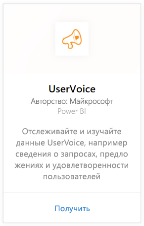
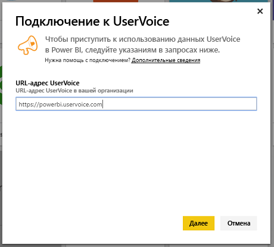
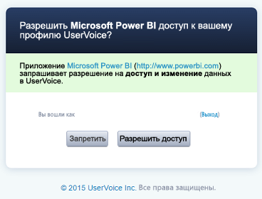
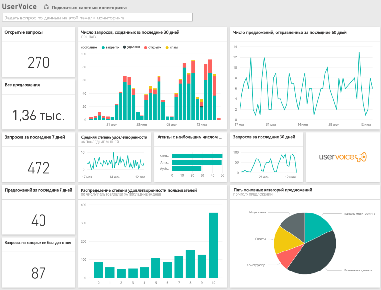

# Подключение к UserVoice с помощью Power BI
Отслеживание и исследование данных UserVoice упрощается благодаря Power BI и пакету контента UserVoice. Power BI извлекает данные, включая заявки, предложения и оценки удовлетворенности, а затем создает на основе этих данных готовые панели мониторинга и отчеты.

Подключите [пакет содержимого UserVoice](https://app.powerbi.com/getdata/services/uservoice) для Power BI.

>[!NOTE]
>Для подключения к пакету содержимого Power BI требуется учетная запись администратора. Пакет содержимого также использует API UserVoice и передает данные об использовании для UserVoice. Дополнительные сведения см. ниже.

## Способы подключения
1. Нажмите кнопку **Получить данные** в нижней части левой панели навигации.
   
   
2. В поле **Службы** выберите **Получить**.
   
    
3. Выберите **UserVoice**, а затем **Получить**.
   
   
4. В ответ на соответствующий запрос введите URL-адрес UserVoice. URL-адрес должен точно соответствовать шаблону `https://fabrikam.uservoice.com`, где "fabrikam" нужно заменить названием продукта или услуги.
   
   >[!NOTE]
   >Обратите внимание, что косая черта в конце отсутствует, а подключение выполняется по протоколу HTTP**s**.
   
   
5. В ответ на соответствующий запрос введите учетные данные UserVoice и выполните процедуру аутентификации UserVoice. Если вы уже выполнил вход в UserVoice в браузере, возможно, учетные данные не будут запрошены. Предоставьте приложению Power BI доступ к данным, нажав кнопку "Разрешить доступ".
   
   >[!NOTE]
   >Необходимы учетные данные администратора для учетной записи UserVoice.
   
   
6. Power BI извлечет данные UserVoice и создаст готовые к использованию панель мониторинга и отчет. Power BI извлечет следующие данные: все предложения, все открытые заявки, все заявки, созданные за последние 30 дней, включая закрытые, а также все оценки клиентской удовлетворенности.
   
   

**Дальнейшие действия**

* Попробуйте [задать вопрос в поле "Вопросы и ответы"](consumer/end-user-q-and-a.md) в верхней части информационной панели.
* [Измените плитки](service-dashboard-edit-tile.md) на информационной панели.
* [Выберите плитку](consumer/end-user-tiles.md), чтобы открыть соответствующий отчет.
* Хотя набор данных будет обновляться ежедневно по расписанию, вы можете изменить график обновлений или попытаться выполнять обновления по запросу с помощью кнопки **Обновить сейчас**

## Устранение неполадок
**"Сбой проверки параметров. Убедитесь, что все параметры допустимы"**

Если данная ошибка возникает после ввода URL-адреса UserVoice, убедитесь, что выполнены следующие требования:

* URL-адрес точно соответствует шаблону "`https://fabrikam.uservoice.com`", где fabrikam — это корректно указанный префикс вашего URL-адреса UserVoice.
* Убедитесь, что используются только буквы нижнего регистра.
* Убедитесь, что для URL-адреса указан протокол HTTP**S**.
* Убедитесь, что в конце URL-адреса отсутствует завершающая косая черта.

**"Сбой при входе"**

Если ошибка "Ошибка входа" возникает после того, как для входа используются учетные данные UserVoice, у используемой учетной записи отсутствуют разрешения на извлечение данных UserVoice из вашей учетной записи. Убедитесь, что это учетная запись администратора, и повторите попытку.

"**Упс! Что-то пошло не так**"

Если указанное сообщение об ошибке появляется во время загрузки данных, убедитесь, что не превышена месячная квота использования API для вашей учетной записи UserVoice. Если все в порядке, попытайтесь выполнить подключение еще раз. Если проблема повторится, обратитесь в службу поддержки Power BI по адресу [https://community.powerbi.com](https://community.powerbi.com/).

**Другое**  

Пакет контента UserVoice в Power BI использует для извлечения данных API UserVoice. Не забывайте контролировать использование API, чтобы не превысить лимит. Если учетная запись UserVoice содержит много данных, для того чтобы уменьшить воздействие на объем использования API, можно изменить текущую периодичность обновления по умолчанию (один раз в день), указав нужное значение, например только в рабочие дни или через день. Кроме того, можно попросить одного из администраторов создать пакет содержимого и предоставить общий доступ к нему остальным членам команды. Если каждый администратор организации будет создавать собственный пакет содержимого, это увеличит ненужную нагрузку на API.

## Дальнейшие действия
[Приступая к работе с Power BI](service-get-started.md)

[Получение данных в Power BI](service-get-data.md)

