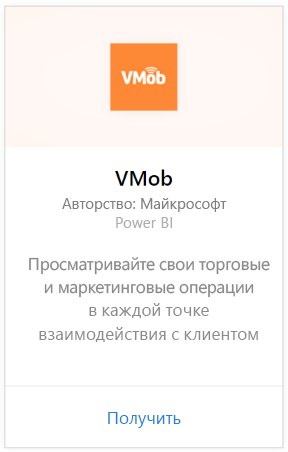
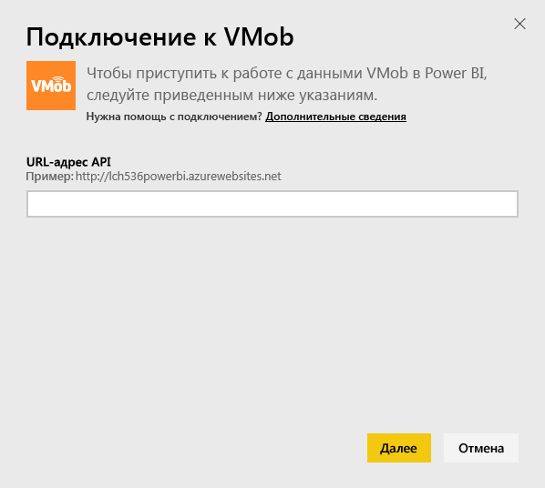
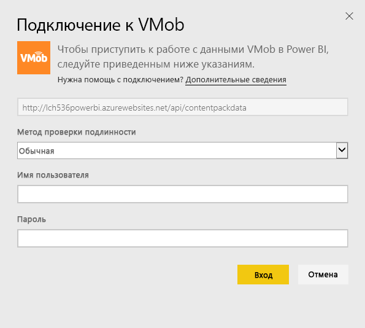
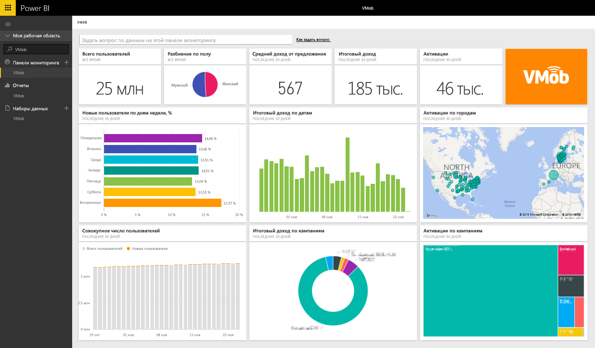

# Подключение к VMob с помощью Power BI
Отслеживание и исследование данных VMob упрощается благодаря Power BI и пакету содержимого VMob. Power BI извлекает следующие данные: статистика пользователей за весь период и за последние 30 дней, а также ключевые показатели эффективности розничных продаж и эффективность кампании за последние 30 дней.

Подключите [пакет содержимого VMob](https://app.powerbi.com/getdata/services/vmob) для Power BI.

## Способы подключения
1. Нажмите кнопку **Получить данные** в нижней части левой панели навигации.
   
    
2. В поле **Службы** выберите **Получить**.
   
   
3. Выберите **VMob** \> **Получить**.
   
   
4. При появлении запроса введите URL-адрес VMob и нажмите кнопку "Далее". VMob предоставляет этот URL-адрес отдельно.
   
    
5. Выберите параметр **Базовый** в раскрывающемся списке методов проверки подлинности, введите свое имя пользователя и пароль в VMob и нажмите кнопку **Вход** .
   
    
6. Процедура импорта начнется автоматически, а Power BI извлечет ваши данные VMob для создания готовой к использованию панели мониторинга и соответствующего отчета.
   
   

**Дальнейшие действия**

* Попробуйте [задать вопрос в поле "Вопросы и ответы"](power-bi-q-and-a.md) в верхней части информационной панели.
* [Измените плитки](service-dashboard-edit-tile.md) на информационной панели.
* [Выберите плитку](service-dashboard-tiles.md), чтобы открыть соответствующий отчет.
* Хотя набор данных будет обновляться ежедневно по расписанию, вы можете изменить график обновлений или попытаться выполнять обновления по запросу с помощью кнопки **Обновить сейчас**.

## Дальнейшие действия
[Приступая к работе с Power BI](service-get-started.md)

[Получение данных в Power BI](service-get-data.md)

