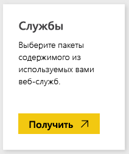
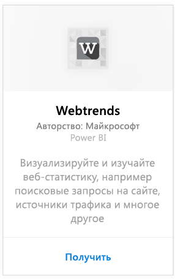
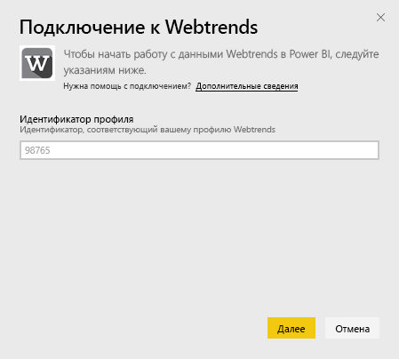
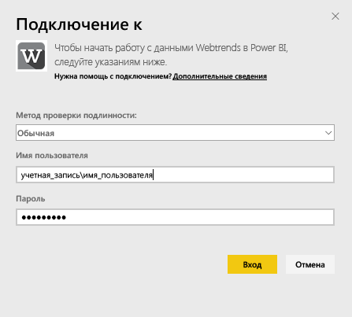
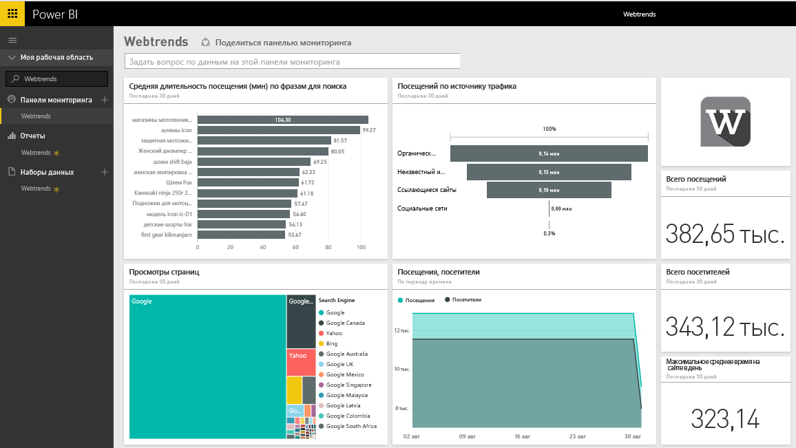
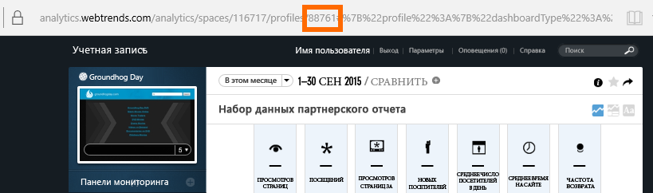
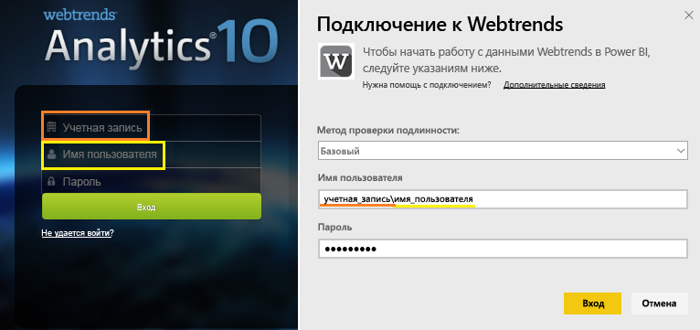

# Подключение к Webtrends с помощью Power BI
Пакет контента Webtrends для Power BI включает множество готовых метрик, в том числе общее число просмотров страницы и посещений по источнику трафика. Визуализация ваших данных Webtrends в Power BI начинается с подключения к вашей учетной записи Webtrends. Используйте стандартные панели мониторинга и отчеты или настройте их так, чтобы выделить информацию, которая наиболее важна для вас.  Данные автоматически обновляются раз в день.

Подключитесь к [пакету содержимого Webtrends для Power BI.](https://app.powerbi.com/getdata/services/webtrends)

## Способы подключения
1. Нажмите кнопку **Получить данные** в нижней части левой панели навигации.
   
   
2. В поле **Службы** выберите **Получить**.
   
   
3. Выберите **Webtrends** \> **Получить**.
   
   
4. Пакет контента подключается к определенному ИД профиля Webtrends. Сведения о том, как [найти этот параметр](#FindingParams), см. ниже.
   
   
5. Укажите учетные данные Webtrends для подключения. Обратите внимание, что в поле имени пользователя следует указать вашу учетную запись и имя пользователя. [Дополнительные сведения](#FindingParams) см. ниже.
   
   
6. После утверждения процесс импорта начнется автоматически. После завершения в области навигации появятся новая панель мониторинга, отчет и модель. Выберите панель мониторинга, чтобы просмотреть импортированные данные.
   
   

**Дальнейшие действия**

* Попробуйте [задать вопрос в поле "Вопросы и ответы"](power-bi-q-and-a.md) в верхней части информационной панели.
* [Измените плитки](service-dashboard-edit-tile.md) на информационной панели.
* [Выберите плитку](service-dashboard-tiles.md), чтобы открыть соответствующий отчет.
* Хотя набор данных будет обновляться ежедневно по расписанию, вы можете изменить график обновлений или попытаться выполнять обновления по запросу с помощью кнопки **Обновить сейчас**.

## Содержимое

Пакет содержимого Webtrends извлекает данные из следующих отчетов.  

| Имя отчета | Идентификатор отчета |
| --- | --- |
| Основные метрики | |
| On-Site Searches |34awBVEP0P6 |
| Exit Pages |7FshY8eP0P6 |
| Next Pages |CTd5rpeP0P6 |
| Previous Pages |aSdOeaUgnP6 |
| Site Pages |oOEWQj3sUo6 |
| Onsite Ads Clickthroughs |41df19b6d9f |
| Cities |aUuHskcP0P6 |
| Страны |JHWXJNcP0P6 |
| Visitors |xPcmTDDP0P6 |
| Visit Duration |U5KAyqdP0P6 |
| Search Phrases |IKYEDxIP0P6 |
| Traffic Sources |JmttAoIP0P6 |
| Search Engines |yGz3gAGP0P6 |
| Entry Pages |i6LrkNVRUo6 |

>[!NOTE]
>Для профилей SharePoint имена метрик могут немного отличаться от тех, которые отображаются в пользовательском интерфейсе Webtrends. Следующее сопоставление выполняется для поддержания согласованности между SharePoint и веб-профилями.   

    - Sessions = Visits  
    - New Users = New Visitors  
    - Views per Session = Page Views per Visit  
    - Avg Daily User Duration = Avg Time on Site per Visitor  

## Требования к системе
Для пакета содержимого требуется доступ к профилю Webtrends с включенным [правильным набором отчетов](#Included).

## Поиск параметров
Ваш ИД профиля Webtrends можно найти по URL-адресу после выбора профиля:

Ваши учетные данные совпадают с введенными при входе в Webtrends, однако учетную запись и имя пользователя следует ввести в одной строке с разделением обратной косой чертой.

## Устранение неполадок
Вы можете столкнуться с ошибкой во время загрузки пакета содержимого после ввода своих учетных данных. Если во время загрузки отображается сообщение "Ошибка", просмотрите представленные ниже предложения по устранению неполадок. Если проблемы продолжают возникать, отправьте запрос в службу поддержки по адресу https://support.powerbi.com.

1. Используется правильный идентификатор профиля (дополнительные сведения см. в. разделе [Поиск параметров](#FindingParams)).
2. Пользователь имеет доступ к отчетам, перечисленным в разделе ["Содержимое"](#Included).

## Дальнейшие действия
[Приступая к работе с Power BI](service-get-started.md)

[Power BI — основные понятия](service-basic-concepts.md)

