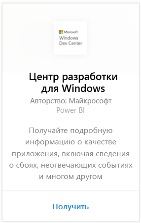
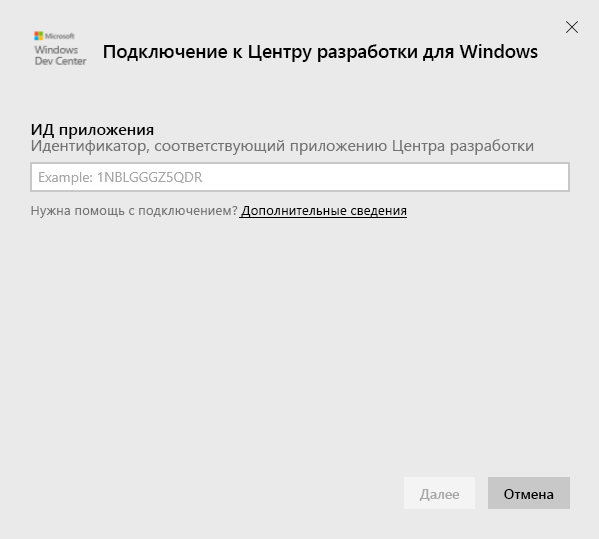
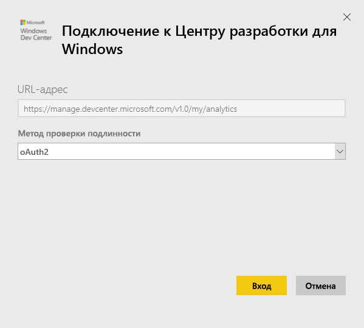
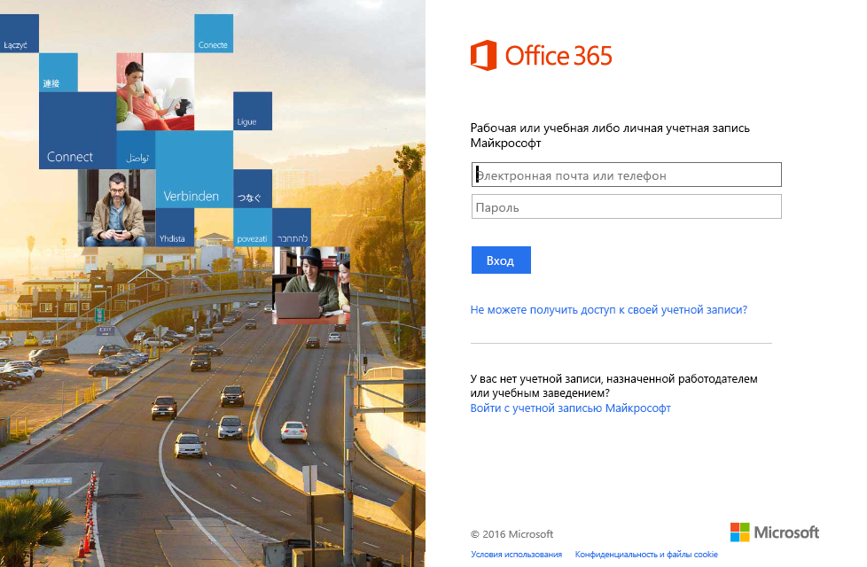
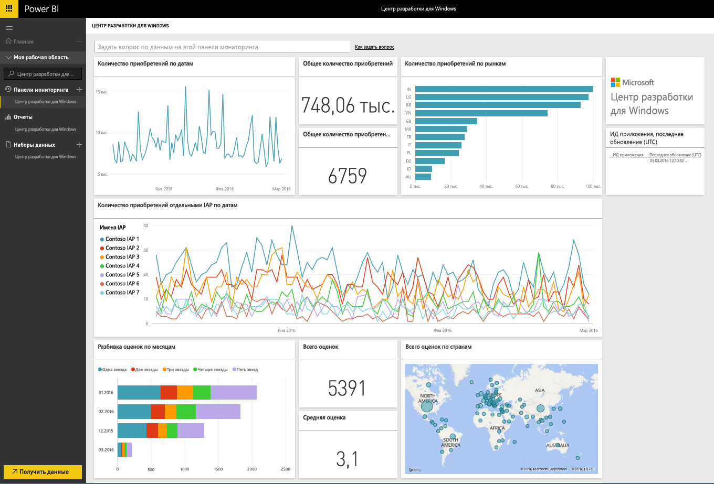
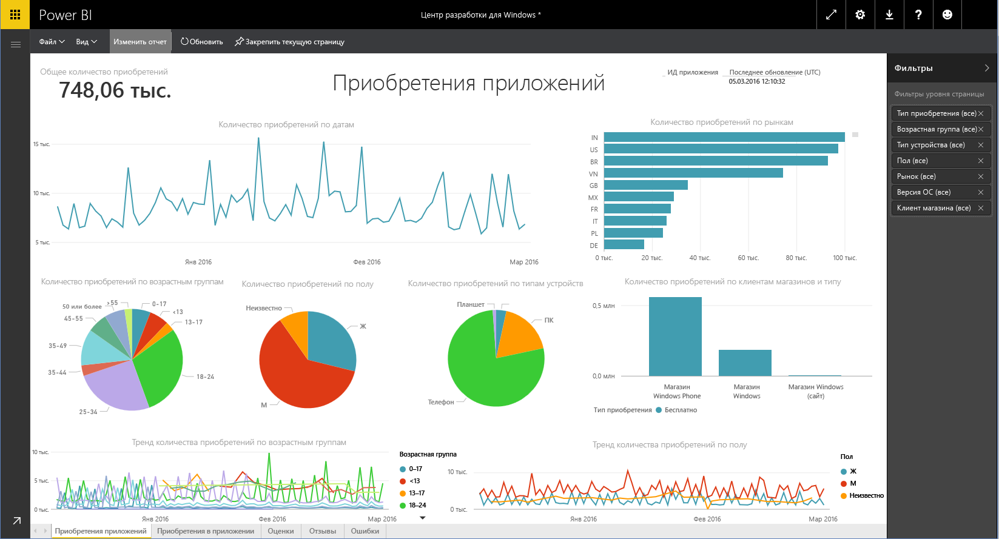

# Подключение к Центру разработки для Windows с помощью Power BI
С помощью этого пакета содержимого для Power BI вы сможете просматривать и отслеживать аналитические данные приложения Центра разработки для Windows в службе Power BI. Данные автоматически обновляются раз в день.

Подключите [пакет содержимого Центра разработки для Windows](https://app.powerbi.com/getdata/services/devcenter) для Power BI.

## Способы подключения
1. Нажмите кнопку **Получить данные** в нижней части левой панели навигации.
   
   
2. В поле **Службы** выберите **Получить**.
   
   
3. Выберите **Центр разработки для Windows** \> **Получить**.
   
   
4. Введите идентификатор приложения, которое вам принадлежит, и нажмите кнопку «Далее». Сведения о том, как [найти эти параметры](#FindingParams), см. ниже.
   
   
5. В качестве **метода проверки подлинности** выберите **oAuth2** \> **Войти**. Когда будет предложено, введите свои учетные данные Azure Active Directory, связанные с вашей учетной записью Центра разработки для Windows (дополнительные сведения см. в [требованиях к системе](#Requirements)).
   
    
   
    
6. После утверждения процесс импорта начнется автоматически. После завершения в области навигации появятся новая панель мониторинга, отчет и модель. Чтобы просмотреть импортированные данные, выберите панель мониторинга. Чтобы перейти к соответствующим отчетам, выберите плитку.
   
    
   
    

**Дальнейшие действия**

* Попробуйте [задать вопрос в поле "Вопросы и ответы"](power-bi-q-and-a.md) в верхней части информационной панели.
* [Измените плитки](service-dashboard-edit-tile.md) на информационной панели.
* [Выберите плитку](service-dashboard-tiles.md), чтобы открыть соответствующий отчет.
* Хотя набор данных будет обновляться ежедневно по расписанию, вы можете изменить график обновлений или попытаться выполнять обновления по запросу с помощью кнопки **Обновить сейчас**.

## Содержимое
Пакет содержимого Центра разработки для Windows для Power BI обеспечивает доступ к аналитическим данным для приложения, сведениям о его работоспособности, покупках в приложении, оценках и отзывах. Данные доступны за последние три месяца, причем этот диапазон является динамическим (то есть содержимое обновляется по мере обновления набора данных).

## Требования к системе
Для работы с этим пакетом содержимого у вас должно быть опубликовано хотя бы одно приложение в Магазине Windows, а также необходима учетная запись в Центре разработки для Windows (дополнительные сведения приведены [здесь](https://msdn.microsoft.com/windows/uwp/publish/manage-account-users)).

## Поиск параметров
Чтобы найти идентификатор своего приложения, зайдите на страницу удостоверения приложения (раздел управления приложениями).

Идентификатор указан в конце URL-адреса для Магазина Windows 10: https://www.microsoft.com/store/apps/**{ИД_приложения}**

## Дальнейшие действия
[Приступая к работе с Power BI](service-get-started.md)

[Получение данных в Power BI](service-get-data.md)

