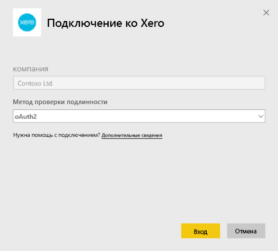
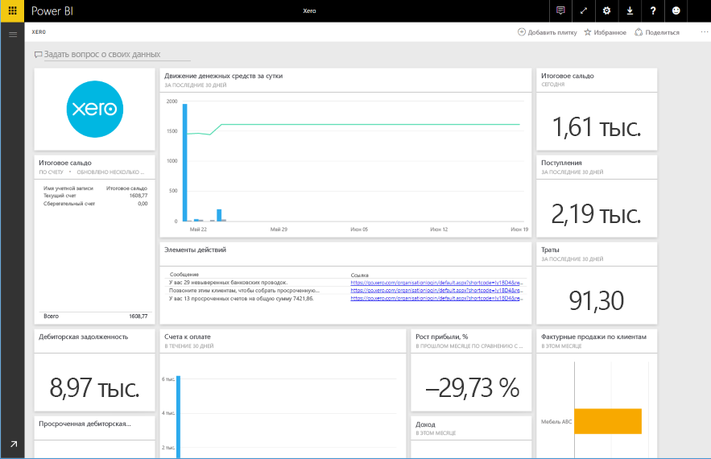

# Подключение к Xero с помощью Power BI
Xero — простое и удобное программное обеспечение для онлайн-бухгалтерии, предназначенное специально для небольших предприятий. Пакет содержимого Xero для Power BI позволит вам создавать интересные визуализации на основе своих финансовых данных. Панель мониторинга по умолчанию содержит множество метрик, характерных для малого бизнеса. Они предназначены для отслеживания таких показателей, как состояние денежной наличности, доходы и расходы, динамика доходов и расходов, срок покрытия дебиторской задолженности и рентабельность инвестиций.

Подключитесь к [пакету содержимого Xero](https://app.powerbi.com/getdata/services/xero) для Power BI или ознакомьтесь с дополнительными сведениями об интеграции [Xero с Power BI](https://help.xero.com/Power-BI).

## Способы подключения
1. Нажмите кнопку **Получить данные** в нижней части левой панели навигации.
   
   
2. В поле **Службы** выберите **Получить**.
   
   
3. Выберите **Xero** \> **Получить**.
   
   
4. Введите псевдоним для организации, связанной с вашей учетной записью Xero. Вы можете ввести любое значение (это название предназначено главным образом для пользователей, которые с помощью Xero управляют несколькими организациями). Дополнительные сведения см. [ниже](#FindingParams).
   
   
5. В качестве **способа проверки подлинности** выберите **OAuth**, войдите в свою учетную запись Xero, когда будет предложено, и выберите организацию, к данным которой хотите подключиться. После завершения входа выберите **Войти**, чтобы начать загрузку.
   
    
   
    
6. После утверждения процесс импорта начнется автоматически. После завершения в области навигации появятся новая панель мониторинга, отчет и модель. Выберите панель мониторинга, чтобы просмотреть импортированные данные.
   
     

**Дальнейшие действия**

* Попробуйте [задать вопрос в поле "Вопросы и ответы"](power-bi-q-and-a.md) в верхней части информационной панели.
* [Измените плитки](service-dashboard-edit-tile.md) на информационной панели.
* [Выберите плитку](service-dashboard-tiles.md), чтобы открыть соответствующий отчет.
* Хотя набор данных будет обновляться ежедневно по расписанию, вы можете изменить график обновлений или попытаться выполнять обновления по запросу с помощью кнопки **Обновить сейчас**.

## Содержимое
На панели мониторинга данного пакета содержимого представлены плитки и метрики для различных сфер деятельности, которым соответствуют отчеты.  

| Область | Плитки панели мониторинга | Отчет |
| --- | --- | --- |
| Наличность |Движение денежных средств за сутки  Поступления  Траты  Итоговое сальдо по счету  Итоговое сальдо сегодня |Банковские счета |
| Клиент |Фактурные продажи  Фактурные продажи по клиентам  Динамика роста фактурных продаж  Счета к оплате  Дебиторская задолженность  Просроченная дебиторская задолженность |Клиент  Запас |
| Поставщик |Покупки, по которым выставлен счет  Покупки, по которым выставлен счет, по поставщикам  Динамика роста покупок, по которым выставлен счет   Просроченные счета  Кредиторская задолженность  Просроченная кредиторская задолженность |Поставщики  Запас |
| Запас |Сумма продаж за месяц по товарам |Запас |
| Прибыль и убытки |Прибыль и убытки за месяц  Чистая прибыль за текущий фискальный год  Чистая прибыль за текущий месяц  Основные счета по расходам |Прибыль и убытки |
| Сводный баланс |Суммарные активы  Суммарные обязательства  Собственный капитал |Сводный баланс |
| Здоровье |Текущее соотношение  Доля валовой прибыли   Доходность суммарных активов  Отношение суммарных обязательств к собственному капиталу |Здоровье  Глоссарий и технические примечания |

Этот набор данных также содержит перечисленные ниже таблицы для настройки отчетов и панелей мониторинга.  

* Адреса  
* Оповещения  
* Ежедневный баланс по банковской выписке  
* Банковские выписки  
* Контакты  
* Заявки на компенсацию расходов  
* Позиции в счете-фактуре  
* Счета-фактуры  
* Позиции  
* Конец месяца  
* Организация  
* Предварительный баланс  
* Счета Xero

## Требования к системе
Для доступа к пакету содержимого Xero необходимы следующие роли: "Стандартная + Отчеты" или "Консультант".

## Поиск параметров
Укажите название организации, данные которой хотите отслеживать в Power BI. Так вы можете подключаться к данным нескольких организаций. Обратите внимание, что подключиться к данным одной организации несколько раз нельзя, так как это затронет автоматическое обновление.   

## Устранение неполадок
* Для доступа к пакету содержимого Xero для Power BI пользователям Xero необходимы следующие роли: "Стандартная + Отчеты" или "Консультант". Для доступа к данным для отчетов через Power BI пакет содержимого применяет систему разрешений пользователей.  
* Если после загрузки в течение некоторого времени появляется сообщение об ошибке, определите, сколько времени прошло до появления такого сообщения. Обратите внимание, что маркер доступа, предоставленный Xero, действителен только в течение 30 мин. Поэтому для учетных записей с объемом данных большим, чем можно загрузить в течение этого времени, будет возвращаться сообщение об ошибке. Мы активно работаем над улучшением данной функции.
* Во время загрузки плитки на панели мониторинга будут в состоянии универсальной загрузки. Это состояние не будет изменяться до завершения полной загрузки. Если отобразится уведомление о завершении загрузки, но плитки будут продолжать загружаться, попробуйте обновить плитки панели мониторинга с помощью элемента "..." в верхней правой части панели мониторинга.
* Если пакет не обновляется, убедитесь, что вы не подключились в Power BI к данным одной организации несколько раз. Xero позволяет использовать только по одному активному соединению с каждой организацией, и при попытке подключиться еще раз может появиться сообщение о неправильных учетных данных.  
* В случае возникновения проблем при подключении к пакету содержимого Xero из Power BI (например, сообщений об ошибках или слишком медленной загрузке) сначала очистите кэш, удалите файлы cookie и перезапустите браузер, а затем снова подключитесь к Power BI.  

Если у вас возникнут другие проблемы и вам не удастся от них избавиться, отправьте запрос на сайте http://support.powerbi.com.

## Дальнейшие действия
[Приступая к работе с Power BI](service-get-started.md)

[Получение данных в Power BI](service-get-data.md)

