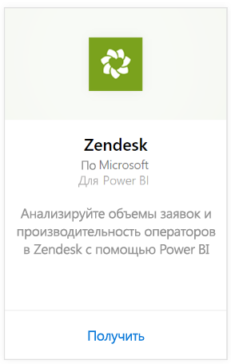
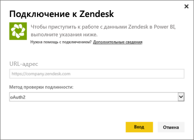
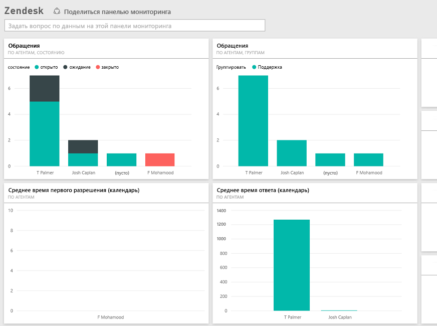

# Подключение к Zendesk с помощью Power BI
Пакет содержимого Zendesk включает панель мониторинга Power BI с отчетами, с помощью которых можно получить представление об объемах заявок и производительности операторов. Используйте стандартные панели мониторинга и отчеты или настройте их так, чтобы выделить информацию, которая наиболее важна для вас.  Данные автоматически обновляются раз в день. 

Подключитесь к [пакету содержимого Zendesk](https://app.powerbi.com/getdata/services/zendesk) или прочтите дополнительные сведения об [интеграции Zendesk](https://powerbi.microsoft.com/integrations/zendesk) с Power BI.

>[!NOTE]
>Для подключения требуется учетная запись администратора Zendesk. Дополнительные сведения о [требованиях](#Requirements) см. ниже.

## Способы подключения
1. Нажмите кнопку **Получить данные** в нижней части левой панели навигации.
   
   
2. В поле **Службы** выберите **Получить**.
   
    
3. Выберите **Zendesk** \> **Получить**.
   
   
4. Укажите URL-адрес, связанный с вашей учетной записью. Он будет в формате **https://company.zendesk.com**. Сведения о том, как [найти эти параметры](#FindingParams), см. ниже.
   
   
5. При появлении запроса введите учетные данные Zendesk.  Выберите механизм проверки подлинности **oAuth 2** и нажмите **Войти**. Следуйте инструкциям проверки подлинности Zendesk. (Если вы уже выполнил вход в Zendesk в браузере, учетные данные могут не запрашиваться.)
   
   > [!NOTE]
   > Для этого пакета содержимого необходимо подключиться с помощью учетной записи администратора Zendesk. 
   > 
   > 
   
   
6. Нажмите кнопку **Разрешить** , чтобы предоставить Power BI доступ к данным Zendesk.
   
   
7. Нажмите кнопку **Подключить** , чтобы начать импорт. После импорта данных в Power BI в области навигации слева появятся новая панель мониторинга, отчет и набор данных. Новые элементы отмечены желтой звездочкой \*.
   
   

**Дальнейшие действия**

* Попробуйте [задать вопрос в поле "Вопросы и ответы"](consumer/end-user-q-and-a.md) в верхней части информационной панели.
* [Измените плитки](service-dashboard-edit-tile.md) на информационной панели.
* [Выберите плитку](consumer/end-user-tiles.md), чтобы открыть соответствующий отчет.
* Хотя набор данных будет обновляться ежедневно по расписанию, вы можете изменить график обновлений или попытаться выполнять обновления по запросу с помощью кнопки **Обновить сейчас**

## Содержимое
Пакет содержимого Power BI включает в себя данные из следующих таблиц.  

* Пользователи (конечные пользователи и агенты)  
* Организации  
* Группы  
* Обращения  

Существует также набор мер, таких как среднее время ожидания и решенные обращения за последние семь дней. Полный список указан в пакете содержимого.

## Требования к системе
Для доступа к пакету содержимого Zendesk требуется учетная запись администратора Zendesk. Если вы являетесь агентом или конечным пользователем и хотите просмотреть данные Zendesk, добавьте предложение и проверьте соединитель Zendesk в [Power BI Desktop](desktop-connect-to-data.md).

## Поиск параметров
URL-адрес Zendesk будет совпадать с URL-адресом, который используется для входа в учетную запись Zendesk. Если вы не знаете URL-адрес Zendesk, можно использовать [справку по входу](https://www.zendesk.com/login/) Zendesk.

## Устранение неполадок
Если у вас возникли проблемы с подключением, проверьте URL-адрес Zendesk и убедитесь, что вы используете учетную запись администратора Zendesk.

## Дальнейшие действия
* [Что такое Power BI?](power-bi-overview.md)
* [Получение данных](service-get-data.md)

