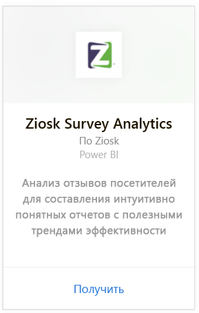
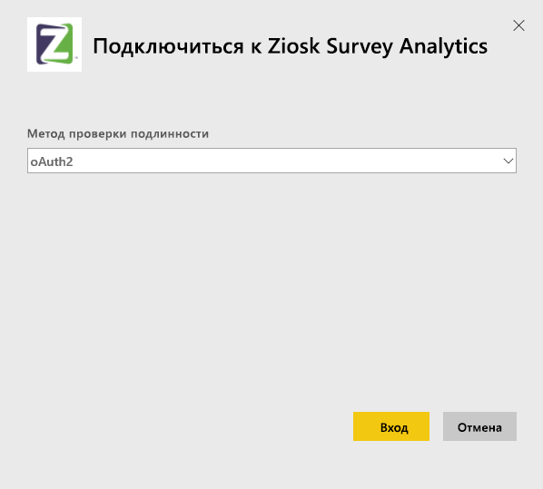
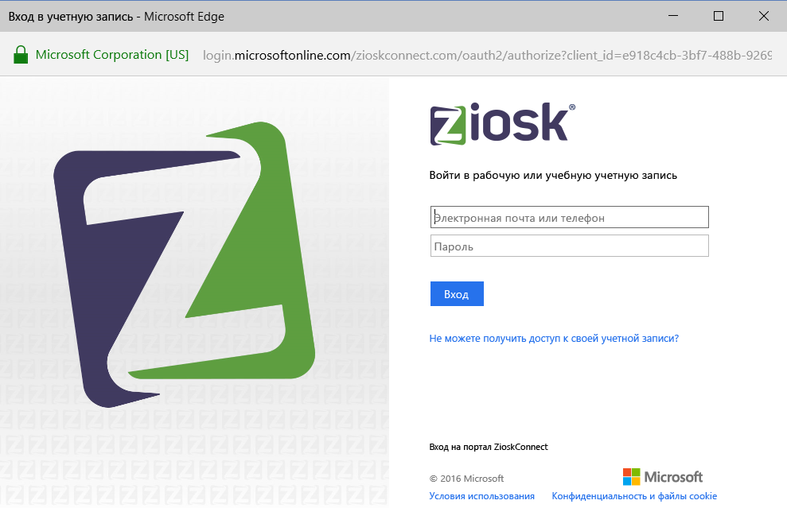
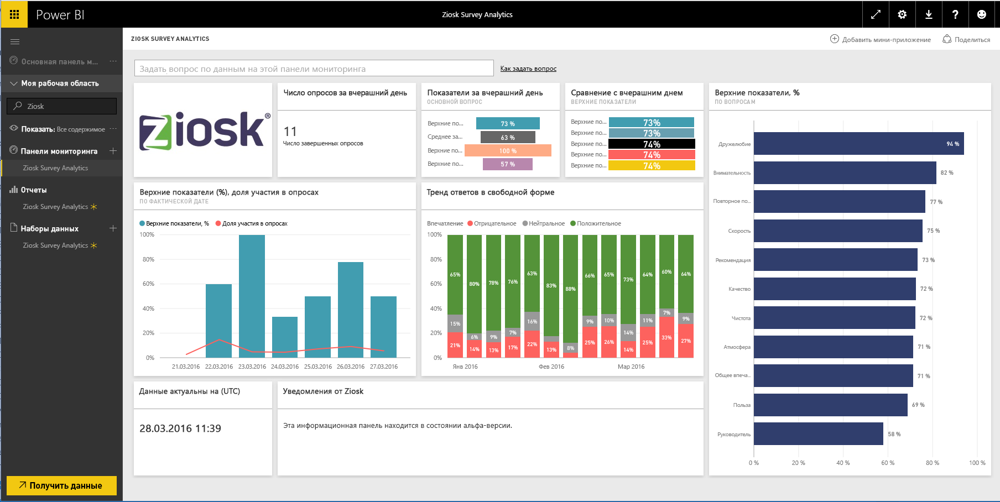

# Подключение к Ziosk Survey Analytics с помощью Power BI
Пакет содержимого Ziosk Survey Analytics для Power BI предлагает перечень ресторанов, где предоставляется уникальный доступ посредством планшетов Ziosk к аналитике, основанной на данных опросов Ziosk. Эти данные включают в себя сегментацию по дням, местоположение, сотрудников и многое другое.

Подключитесь к [пакету содержимого Ziosk Survey Analytics](https://app.powerbi.com/getdata/services/ziosk-survey-analytics) для Power BI.

## Способы подключения
1. Нажмите кнопку **Получить данные** в нижней части левой панели навигации.  
   
    
2. В поле **Службы** выберите **Получить**.  
   
    
3. Выберите **Ziosk Survey Analytics**, а затем нажмите кнопку **Получить**.  
   
    
4. Выберите **OAuth 2**, и затем нажмите **Войти**. При появлении запроса введите учетные данные Ziosk.
   
    
   
    
5. После подключения автоматически загрузятся информационная панель, отчет и набор данных. После завершения плитки обновятся в соответствии с данными из вашей учетной записи Ziosk.
   
    

**Дальнейшие действия**

* Попробуйте [задать вопрос в поле "Вопросы и ответы"](consumer/end-user-q-and-a.md) в верхней части информационной панели.
* [Измените плитки](service-dashboard-edit-tile.md) на информационной панели.
* [Выберите плитку](consumer/end-user-tiles.md), чтобы открыть соответствующий отчет.
* Хотя набор данных будет обновляться ежедневно по расписанию, вы можете изменить график обновлений или попытаться выполнять обновления по запросу с помощью кнопки **Обновить сейчас**

## Содержимое
Пакет содержимого включает в себя данные из следующих таблиц.  

    - "Категория алкоголя"  
    - "Категория закусок"  
    - "Объяснение ключевых слов"  
    - Даты  
    - "Время суток"  
    - "Категория десертов"  
    - "Свободный"  
    - "Детская категория"  
    - "Сообщения"  
    - "Категория премиум-контента"  
    - "Вопросы"  
    - "Хранилище"  
    - "Опросы"  
    - "День недели"  

## Требования к системе
Чтобы создать этот пакет содержимого, требуется учетная запись Ziosk с разрешениями для вышеперечисленных таблиц.

## Дальнейшие действия
[Что такое Power BI?](power-bi-overview.md)

[Power BI — основные понятия](consumer/end-user-basic-concepts.md)

