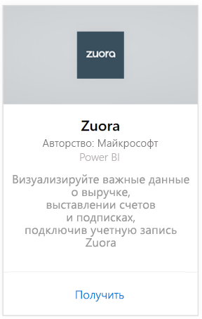
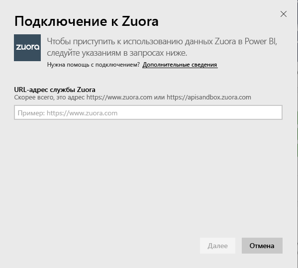
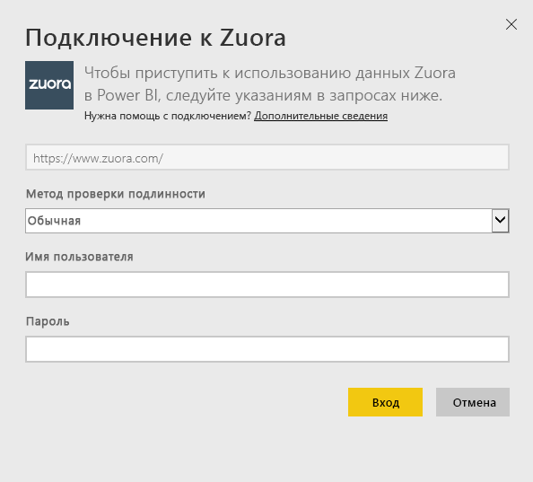
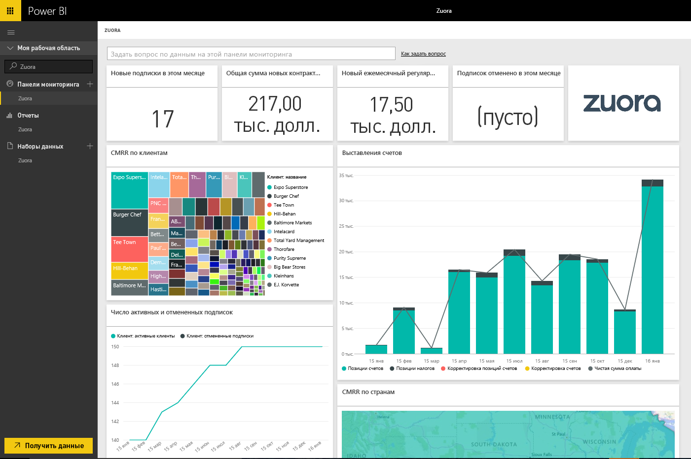

# Подключение к Zuora с помощью Power BI
Zuora для Power BI позволяет визуализировать важные данные о доходах, выставлении счетов и подписках. Используйте панель мониторинга и отчеты по умолчанию для анализа тенденций использования, отслеживания отчетов и выплат, а также мониторинга постоянных доходов или их настройки в соответствии с уникальными требованиями к панели мониторинга и отчетам.

Подключитесь к [Zuora](https://app.powerbi.com/getdata/services/Zuora) для Power BI.

## Способы подключения
1. Нажмите кнопку **Получить данные** в нижней части левой панели навигации.

   
2. В поле **Службы** выберите **Получить**.

   
3. Выберите **Zuora** \> **Подключить**.

   
4. Укажите URL-адрес Zuora. Обычно это "<https://www.zuora.com>". Сведения о том, как [найти эти параметры](#FindingParams), см. ниже.

   
5. В качестве значения параметра **Проверка подлинности**выберите **Обычная** , укажите имя пользователя и пароль (регистр учитывается), а затем щелкните **Вход**.

    
6. После утверждения процесс импорта начнется автоматически. После завершения в области навигации появятся новая панель мониторинга, отчет и модель. Выберите панель мониторинга, чтобы просмотреть импортированные данные.

     

**Дальнейшие действия**

* Попробуйте [задать вопрос в поле "Вопросы и ответы"](power-bi-q-and-a.md) в верхней части информационной панели.
* [Измените плитки](service-dashboard-edit-tile.md) на информационной панели.
* [Выберите плитку](service-dashboard-tiles.md), чтобы открыть соответствующий отчет.
* Хотя набор данных будет обновляться ежедневно по расписанию, вы можете изменить график обновлений или попытаться выполнять обновления по запросу с помощью кнопки **Обновить сейчас**.

## Содержимое
Пакет содержимого использует интерфейс API Zuora AQUA для извлечения следующих таблиц.

| Таблицы |  |  |
| --- | --- | --- |
| Account |InvoiceItemAdjustment |Refund |
| AccountingCode |Payment |RevenueSchedule |
| AccountingPeriod |PaymentMethod |RevenueScheduleItem |
| BillTo |Product |Subscription |
| DateDim |ProductRatePlan |TaxationItem |
| Invoice |ProductRatePlanCharge |Usage |
| InvoiceAdjustment |RatePlan | |
| InvoiceItem |RatePlanCharge | |

Он также включает в себя такие вычисляемые меры:

| Мера | Описание | Pseudo-Calculation |
| --- | --- | --- |
| Account: Payments |Общие суммы платежей за период времени, основанные на фактических датах платежей. |SUM (Payment.Amount)  WHERE Payment.EffectiveDate =< TimePeriod.EndDate AND    Payment.EffectiveDate >= TimePeriod.StartDate |
| Account: Refunds |Общие суммы возмещений за период времени, основанные на датах возмещений. Сумма указывается как отрицательное число. |-1*SUM(Refund.Amount) WHERE Refund.RefundDate =< TimePeriod.EndDate AND    Refund.RefundDate >= TimePeriod.StartDate |
| Account: Net Payments |Платежи учетной записи плюс возмещения учетной записи за период времени. |Account.Payments + Account.Refunds |
| Account: Active Accounts |Количество учетных записей, которые были активными за период времени. Подписки должны начаться до или непосредственно в дату начала периода времени. |COUNT (Account.AccountNumber) WHERE     Subscription.Status != "Expired" AND    Subscription.Status != "Draft" AND    Subscription.SubscriptionStartDate <= TimePeriod.StartDate AND    (Subscription.SubscriptionEndDate > TimePeriod.StartDate OR Subscription.SubscriptionEndDate = null) –evergreen subscription |
| Account: Average Recurring Revenue |Валовый MRR на активную учетную запись за период времени. |Gross MRR / Account.ActiveAccounts |
| Account: Cancelled Subscriptions |Число учетных записей, которые отменили подписку за период времени. |COUNT (Account.AccountNumber) WHERE Subscription.Status = "Cancelled" AND    Subscription.SubscriptionStartDate <= TimePeriod.StartDate AND    Subscription.CancelledDate >= TimePeriod.StartDate |
| Account: Payment Errors |Общее значение ошибок платежей. |SUM (Payment.Amount) WHERE Payment.Status = "Error" |
| Revenue Schedule Item: Recognized Revenue |Общий признанный доход за отчетный период. |SUM (RevenueScheduleItem.Amount) WHERE AccountingPeriod.StartDate = TimePeriod.StartDate |
| Subscription: New Subscriptions |Число новых подписок за период времени. |COUNT (Subscription.ID) WHERE Subscription.Version = "1" AND    Subscription.CreatedDate <= TimePeriod.EndDate AND    Subscription.CreatedDate >= TimePeriod.StartDate |
| Invoice: Invoice Items |Общие суммы по позициям выставленных счетов за период времени. |SUM (InvoiceItem.ChargeAmount) WHERE     Invoice.Status = "Posted" AND    Invoice.InvoiceDate <= TimePeriod.EndDate AND    Invoice.InvoiceDate >= TimePeriod.StartDate |
| Invoice: Taxation Items |Общие суммы налогов по позициям налогообложения за период времени. |SUM (TaxationItem.TaxAmount) WHERE Invoice.Status = "Posted" AND    Invoice.InvoiceDate <= TimePeriod.EndDate AND    Invoice.InvoiceDate >= TimePeriod.StartDate |
| Invoice: Invoice Item Adjustments |Общие суммы корректировки по позициям счетов за период времени. |SUM (InvoiceItemAdjustment.Amount)  WHERE     Invoice.Status = "Posted" AND    InvoiceItemAdjustment.AdjustmentDate <= TimePeriod.EndDate AND    InvoiceItemAdjustment.AdjustmentDate >= TimePeriod.StartDate |
| Invoice: Invoice Adjustments |Общие суммы корректировки счетов за период времени. |SUM (InvoiceAdjustment.Amount)  WHERE     Invoice.Status = "Posted" AND    InvoiceAdjustment.AdjustmentDate <= TimePeriod.EndDate AND    InvoiceAdjustment.AdjustmentDate >= TimePeriod.StartDate |
| Invoice: Net Billings |Сумма позиций счетов, позиций налогообложения, корректировок по позициям счетов и корректировок счетов за период времени. |Invoice.InvoiceItems + Invoice.TaxationItems + Invoice.InvoiceItemAdjustments + Invoice.InvoiceAdjustments |
| Invoice: Invoice Aging Balance |Сумма балансов по учтенным счетам. |SUM (Invoice.Balance)  WHERE     Invoice.Status = "Posted" |
| Invoice: Gross Billings |Сумма значений по позициям выставленных счетов для учтенных счетов за период времени. |SUM (InvoiceItem.ChargeAmount)  WHERE     Invoice.Status = "Posted" AND    Invoice.InvoiceDate <= TimePeriod.EndDate AND    Invoice.InvoiceDate >= TimePeriod.StartDate |
| Invoice: Total Adjustments |Сумма обработанных корректировок счетов и корректировок по позициям счетов, связанных с учтенными счетами. |SUM (InvoiceAdjustment.Amount)  WHERE     Invoice.Status = "Posted" AND    InvoiceAdjustment.Status = "Processed" + SUM (InvoiceItemAdjustment.Amount)  WHERE     Invoice.Status = "Posted" AND    invoiceItemAdjustment.Status = "Processed" |
| Rate Plan Charge: Gross MRR |Сумма ежемесячных постоянных доходов от подписок за период времени. |SUM (RatePlanCharge.MRR)  WHERE     Subscription.Status != "Expired" AND    Subscription.Status != "Draft" AND    RatePlanCharge.EffectiveStartDate <= TimePeriod.StartDate AND        RatePlanCharge.EffectiveEndDate > TimePeriod.StartDate     OR    RatePlanCharge.EffectiveEndDate = null --evergreen subscription |

## Требования к системе
Требуется доступ к API Zuora.

## Поиск параметров
Укажите URL-адрес, который вы обычно используете для доступа к данным Zuora. Допустимые значения:  

* https://www.zuora.com  
* https://www.apisandbox.zuora.com  
* URL-адрес, соответствующий вашему экземпляру службы  

## Устранение неполадок
Пакет содержимого Zuora извлекает множество аспектов учетной записи Zuora. Если вы не используете определенные функции, соответствующие плитки или отчеты будут пустыми. Если у вас возникли проблемы при загрузке, обратитесь в службу поддержки Power BI.

## Дальнейшие действия
[Приступая к работе с Power BI](service-get-started.md)

[Получение данных в Power BI](service-get-data.md)
