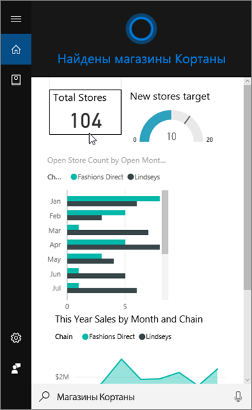
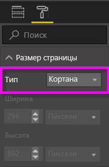
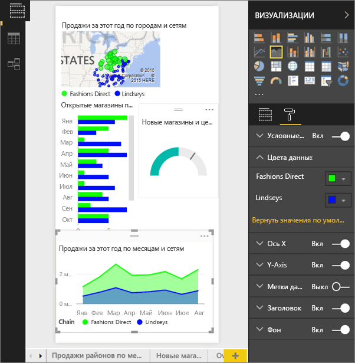
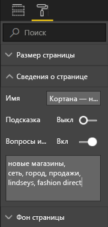
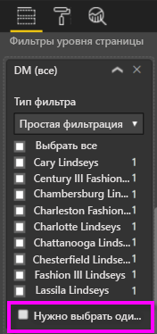

# Создание пользовательской страницы ответов для Кортаны в службе Power BI или Power BI Desktop
Используйте все возможности Power BI для создания специальных страниц отчета — *страниц ответов Кортаны* (иногда их называют *картами ответов Кортаны*), предназначенных для поиска ответов на вопросы Кортаны.

> [!IMPORTANT]
> Если вы используете предварительную версию интерфейса Кортаны для поиска **панелей мониторинга** Power BI, остальные разделы этой статьи можно пропустить. Предварительная настройка Кортаны для поиска панелей мониторинга Power BI не требуется.
> 
> 

## Подготовка
Вам доступно четыре документа по настройке и использованию Кортаны для Power BI. Рекомендуем начать с первой статьи, если вы еще не ознакомились с ней. Вторая статья особенно важна, так как в ней описаны некоторые действия, которые необходимо выполнить, прежде чем использовать страницы ответов Кортаны.

**Статья 1.** [Общие сведения о совместной работе Кортаны и Power BI](service-cortana-intro.md)

**Статья 2.** [Включение Cortana для Power BI](service-cortana-enable.md).

**Статья 3.** Эта статья.

**Статья 4**: [Устранение неполадок Кортаны для Power BI](service-cortana-troubleshoot.md).

## Создание страницы ответов, предназначенной для Кортаны
Размер *страницы ответов Кортаны* в отчете настраивается специально для Кортаны. Так Кортана может отображать ее на экране как ответ на вопрос. Чтобы создать страницу ответов Кортаны, сделайте следующее:

1. Рекомендуем начать с [пустой страницы отчета](power-bi-report-add-page.md).
2. В области **Визуализации** выберите значок валика, а затем щелкните **Размер страницы** > **Тип** > **Кортана**.
   
    
3. Создание визуального элемента или набор визуальных элементов, которые должны отображаться в Cortana, в ответ на определенный вопрос (или набор вопросов).

> [!NOTE]
> Страницы ответов Кортаны сейчас не поддерживают показ статических изображений. Вы можете включать визуальные элементы таблиц или матриц изображения, извлекаемые динамически по URL-адресу в данных. 
> 
> 

4. Убедитесь, что все визуальные элементы входят в пределы страницы. При необходимости измените параметры отображения, метки данных, цвета и фон.  
   
    
5. Присвойте странице имя и добавьте альтернативные имена. Cortana будет использовать их при поиске результатов. В области **Визуализации** выберите значок кисти, а затем — **Сведения о странице**. Включите вопросы и ответы для этого визуального элемента, переместив ползунок в положение **Вкл**.
   
    
   
   > [!TIP]
   > Для получения лучших результатов не используйте слова, которые также являются именами столбцов.
   > 
   > 
6. Если ответ содержит фильтры уровня страницы, можно также выбрать параметр **Нужно выбрать один элемент**. Cortana отображает этот отчет в качестве ответа, если в вопросе указан один и только один из фильтруемых элементов. Параметр **Нужно выбрать один элемент** находится в нижней части панели **Фильтры**.
   
   > [!NOTE]
   > Нет необходимости настраивать параметр **Нужно выбрать один элемент**, чтобы попросить Cortana отображать отчет с помощью фильтров уровня страницы. Например, на запрос "показать продажи Шарлотты Линдси" будет отображена страница ответов независимо от значения параметра "Нужно выбрать один элемент".
   > 
   > 
   
     
   
      Например, если попросить Cortana:
   
   * "покажи продажи по названию магазина", эта страница ответов не отобразится, так как вы не включили в необходимый фильтр уровня страниц ни один элемент;
   * "покажи продажи Кэри Линдси и Шарлотты Линдси", эта страница ответов не отобразится, так как вы включили в необходимый фильтр уровня страниц несколько элементов;
   * "покажи продажи Шарлотты Линдси", эта страница ответов отобразится;
     
     = "покажи продажи", эта страница ответов не отобразится, так как вы не включили в необходимый фильтр уровня страниц ни один элемент.

> [!IMPORTANT]
> Чтобы страница ответов была доступна для Кортаны, необходимо [включить для нее набор данных](service-cortana-enable.md).
> 
> 

## Каким образом Cortana упорядочивает результаты?
Результаты с максимальной оценкой (например, полное совпадение заданного имени страницы) отображаются в Кортане первыми как *наилучшие соответствия*. Если в Power BI есть несколько страниц ответов, отображаются несколько лучших соответствий. Ответы со средней или низкой оценкой (например, ответы, не связанные с именем страницы ответов, или вопросы со словами, не распознанными Power BI), перечисляются в виде ссылок под лучшими соответствиями в Кортане.

> [!NOTE]
> Когда вы добавляете новый набор данных или пользовательскую карту ответа Кортаны в Power BI и включаете их в поиск Кортаны, отображение результатов Кортаны может занять до 30 минут. При входе в Windows 10 или выходе из системы, а также при любом перезапуске процесса Кортаны в Windows 10 отображается новое содержимое.
> 
> 

## Дальнейшие действия
[Использование Cortana в Power BI](service-cortana-intro.md)

По-прежнему не удается настроить Кортану для работы с Power BI?  Ознакомьтесь со сведениями, указанными в статье [Устранение неполадок Кортаны для Power BI](service-cortana-troubleshoot.md).

Появились дополнительные вопросы? [Ответы на них см. в сообществе Power BI.](http://community.powerbi.com/)

