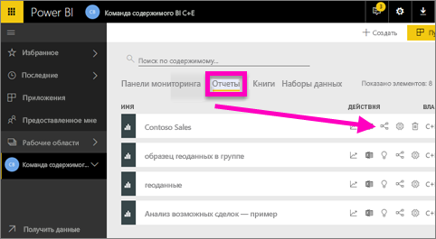
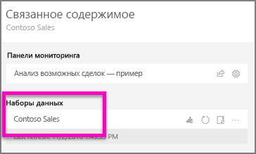
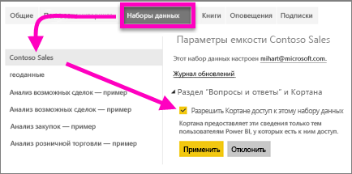
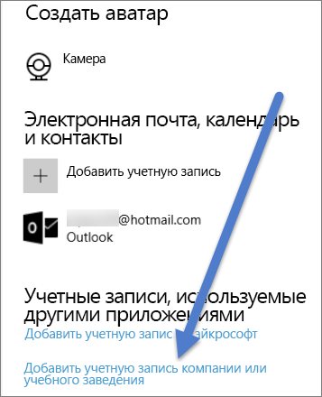

# Предоставление Кортане доступа к отчетам Power BI (и базовым наборам данных)
Вы ознакомились со статьей [Общие сведения о Cortana для Power BI](service-cortana-intro.md) (прежде чем приступать к работе, прочтите эту статью) и теперь хотите сделать то же самое.  Прежде чем задавать вопросы на естественном языке в Кортане и находить ответы в данных, хранящихся в ***отчетах*** Power BI, нужно выполнить ряд требований. В частности нужно сделать следующее.

> [!NOTE]
> Если вы используете предварительную версию интерфейса Кортаны для поиска ***панелей мониторинга*** Power BI, остальные разделы этой статьи можно пропустить. Предварительная настройка Кортаны для поиска панелей мониторинга Power BI не требуется.
> 
> 

В службе Power BI

* Включите один или несколько наборов данных для Кортаны (отчеты создаются на основе наборов данных, поэтому Кортане требуется доступ к этим наборам данных).

В Microsoft Windows

* убедитесь, что используется Windows 10 версии 1511 или более поздней.
* Убедитесь, что Power BI и Windows могут взаимодействовать. Для этого нужно подключить учетную запись к Windows.

## Предоставление Кортане доступа к страницам отчетов в Power BI с помощью службы Power BI
Предоставить Кортане доступ к отчетам в Power BI очень просто.  Нужно всего лишь включить основной набор данных отчета, щелкнув "Предоставить Кортане доступ к этому набору данных". После этого любой пользователь, получивший доступ к набору данных в Power BI (с помощью таких стандартных функций, как совместный доступ к Power BI, приложения и пакеты содержимого), сможет получить ответы из отчета в Кортане в Windows 10.

Войдите в службу Power BI (не в Power BI Desktop) и выполните эти действия с каждым набором данных, к которому у Кортаны должен быть доступ.

1. Выберите наборы данных, которые необходимо включить. В списке содержимого отчетов укажите отчет, к которому Кортане необходимо предоставить доступ, и выберите значок  (**Просмотреть похожие**).
   
    
2. С этим отчетом связан набор данных **Contoso Sales** (Продажи Contoso).
   
    
3. Справа от имени набора данных щелкните **многоточие (...) > Параметры**.  
   
    
4. Выберите **Q&A and Cortana** (Вопросы, ответы и Кортана)  >  **Разрешить Кортане доступ к этому набору данных**  >  **Применить**.
   
   
   
   В этом примере мы предоставляем Кортане доступ к набору данных "Contoso Sales".
   
   > [!NOTE]
   > Если в Power BI добавить и активировать новый набор данных или карту ответов Кортаны, результаты могут отобразиться через 30 минут. При входе в Windows 10 или выходе из системы, а также при любом перезапуске процесса Cortana в Windows 10 отображается новое содержимое.
   > 
   > Если вы активировали набор данных для Кортаны, который является частью вашего пакета содержимого или приложения, вам нужно опубликовать такой набор повторно. Только после этого ваши коллеги смогут использовать его в Кортане.
   > 
   > 

## Добавление учетных данных Power BI в Windows
Необходимо использовать Windows 10 версии 1511 или более поздней.

1. Определите, какая версия Windows 10 используется. Откройте **Параметры**.
    

    Выберите **Система > Сведения**. В нижней части экрана вы увидите **Характеристики Windows > Версия**.

   * Если у вас установлена ОС Windows 10, начиная с версии 1511 (обновление для Windows 10 за ноябрь 2015 г.) и заканчивая версией 1607, добавьте свою рабочую или учебную учетную запись, а также учетную запись Майкрософт (выполните указанные ниже шаги 2 и 3).
   * Если у вас установлена ОС Windows 10 версии 1607 (обновление для Windows 10 за июль 2016 г.) или более поздней версии, добавьте только рабочую или учебную учетную запись (выполните только шаг 2).
1. Добавьте свою рабочую или учебную учетную запись для Кортаны.
   
   * Откройте **Параметры** > **Учетные записи**.
     
       
   * Прокрутите вниз и выберите пункт **Добавить учетную запись компании или учебного заведения**. Или на странице **Учетные записи** щелкните **Доступ к рабочей или учетной записи > Подключиться**.
     
     

Cortana будет использовать эту рабочую или учебную учетную запись для поиска в Power BI возможных ответов на вопросы, заданные в Cortana.

## Дальнейшие действия
[Создание пользовательской *страницы ответов* для Cortana в Power BI](service-cortana-answer-cards.md)

[Устранение неполадок Кортаны для Power BI](service-cortana-troubleshoot.md)

Появились дополнительные вопросы? [Ответы на них см. в сообществе Power BI.](http://community.powerbi.com/)

