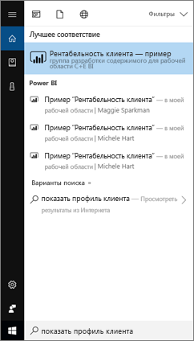
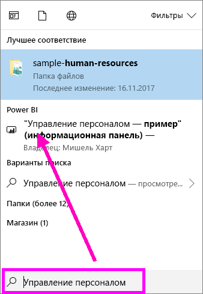
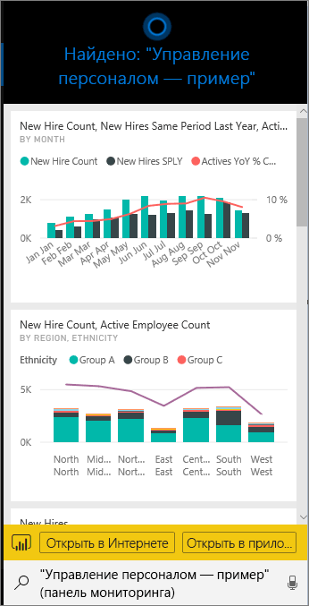
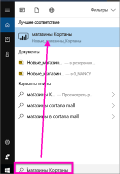
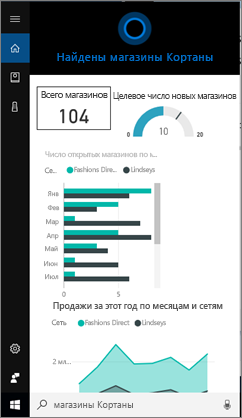
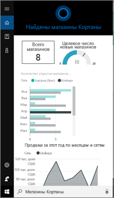
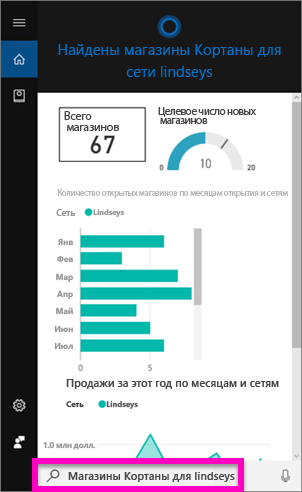
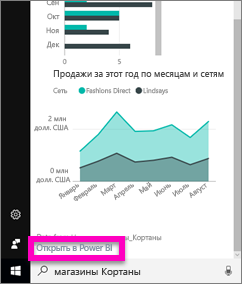
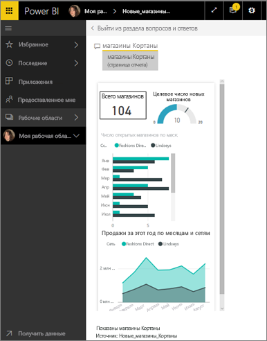

# Быстрый поиск и просмотр данных Power BI с помощью Кортаны для Power BI
Используйте Кортану на устройствах с Windows 10, чтобы мгновенно получать ответы на вопросы вашей организации. Благодаря интеграции с Power BI Кортана может получать важные сведения непосредственно из панелей мониторинга и отчетов Power BI. Для работы вам нужна версия Windows 10 (ноябрь 2015 г.) или более поздняя, Кортана, Power BI и доступ минимум к одному набору данных.

## Предварительная версия нового интерфейса Кортаны для поиска *панелей мониторинга* в Windows 10
С недавних пор вы уже можете [использовать Кортану для получения определенных типов страниц отчетов](service-cortana-answer-cards.md). Теперь мы добавили **новую функцию** — возможность получать панели мониторинга. Попробуйте ее в деле и [поделитесь с нами впечатлениями](mailto:pbicortanasg@microsoft.com). В перспективе *новый интерфейс* Кортаны также будет поддерживать поиск отчетов.  Одно из основных преимуществ нового интерфейса заключается в том, что для его настройки не нужно что-то специально делать, — например, включать Кортану или настраивать Windows 10. Интерфейс уже работает.

> [!NOTE]
> В противном случае см. справочную информацию по [устранению неполадок](service-cortana-troubleshoot.md).
> 
> 

Это решение основывается на механизме [службы "Поиск Azure" корпорации Майкрософт](https://docs.microsoft.com/azure/search/). Служба предоставляет такие дополнительные возможности, как интеллектуальное ранжирование, исправление ошибок и автозаполнение.

Оба интерфейса Кортаны будут работать параллельно.

## Документация по Кортане для Power BI
Вам доступно четыре документа по настройке и использованию Кортаны для Power BI. Ниже приведено описание статей в этой серии.

**Статья 1** (эта статья): общие сведения о том, как Кортана и Power BI работают вместе.

**Статья 2.** [Включение Cortana для Power BI](service-cortana-enable.md).

**Статья 3.** [Создание пользовательской *страницы ответов для Кортаны* в Power BI](service-cortana-answer-cards.md)

**Статья 4**: [Устранение неполадок Кортаны для Power BI](service-cortana-troubleshoot.md).

## Каким образом Cortana и Power BI работают вместе?
Power BI может быть одним из мест для поиска ответов на вопросы, задаваемые в Кортане. В Power BI Кортана может найти подробные ответы на основе данных из отчетов (которые содержат специальную страницу — *Карта ответа Кортаны*) и панелей мониторинга Power BI.

Когда Кортана находит совпадение, имя панели мониторинга или страницы отчета отображается непосредственно на экране Кортаны. Панель мониторинга или страницу отчета можно открыть в Power BI. Страницы отчета также можно просматривать непосредственно в Кортане — они интерактивные.

### Кортана и панели мониторинга (*новый интерфейс*)
Кортана может искать ответы как на ваших панелях мониторинга, так и на тех, к которым вам предоставлен общий доступ. Задавайте Кортане вопросы, используя заголовки, ключевые слова, имена владельцев, рабочих областей, приложений и другие сведения.

Чтобы Кортана могла найти ответ, ваш вопрос должен содержать не менее двух слов. Таким образом, если вы ищете панель мониторинга с именем, состоящим из одного слова (например, "Marketing"), добавьте в вопрос слово "show", "Power BI" или имя владельца панели, например "show Marketing" или "michele hart sample". 

Панель мониторинга с именем, состоящим из нескольких слов, отобразится в результатах поиска Кортаны, если с поисковым запросом совпадают два и более слова в ее названии или одно слово в имени владельца. Для панели мониторинга с именем "Customer Profitability Sample" (Рентабельность клиента — пример): 

* при запросе "show me customer" панель мониторинга Power BI *не* отобразится;   
* при запросах "show me customer profitability", "customer p", "customer s", "profitability sample", "michele hart sample", "show customer profitability sample" и "show me customer p" результат Power BI *будет* отображаться;
* слово "powerbi" считается одним из двух обязательных слов, поэтому при запросе "powerbi sample" результат Power BI *будет* отображаться. 
  
    

### Кортана и отчеты
 Кортана может находить ответы в отчетах со [страницами, разработанными специально для отображения в Кортане](service-cortana-answer-cards.md). Просто задайте вопрос, используя заголовок или ключевые слова, которые есть на одной из этих специальных страниц отчета.  

Это решение основывается на функции [вопросов и ответов Microsoft Power BI](consumer/end-user-q-and-a.md).

Если вы задаете вопрос в Кортане, ответы Power BI поступают со страниц отчетов, предназначенных специально для Кортаны. Кортана определяет возможные ответы в режиме реального времени непосредственно на основе *карт ответов*, уже созданных в Power BI.  Чтобы глубже изучить ответ, откройте полученный результат в Power BI.

> [!NOTE]
> Чтобы Кортана могла искать ответы на вопросы в отчетах Power BI, необходимо [включить этот компонент в службе Power BI и настроить обмен данными между Power BI и Windows](service-cortana-enable.md).  
> 
> 

## Использование Кортаны для получения ответов из Power BI
1. Запустите Кортану. *Открыть* Кортану можно несколькими способами: выбрать значок Кортаны на панели задач (на изображении ниже), использовать голосовые команды или коснуться значка поиска на мобильном устройстве Windows.
   
     
2. Как только Кортана будет готова к работе, введите свой вопрос в ее строке поиска или произнесите его вслух. В Кортане отобразятся доступные результаты. Если в Power BI есть панель мониторинга, соответствующая вашему запросу, она появится в разделе **Лучшее соответствие** или **Power BI**.
   
     
   
   > [!NOTE]
   > Сейчас функция поддерживается только на английском языке.
   > 
   > 
3. Выберите панель мониторинга, чтобы открыть ее в Cortana.

    

    Можно изменить макет, [изменив *представление телефона* панели мониторинга](service-create-dashboard-mobile-phone-view.md). 

1. Из Кортаны также можно открыть панель мониторинга в службе Power BI или Power BI Mobile. Чтобы открыть панель мониторинга в службе Power BI, выберите **Открыть в Интернете**. 
   
      
4. Теперь давайте воспользуемся Кортаной для поиска отчета. См. сведения об [отчетах, содержащих страницу с картой ответа Кортаны](service-cortana-answer-cards.md). В этом примере в отчете с именем "Cortana-New-Stores" есть страница ответов Кортаны с именем "cortana stores" (хранилища кортаны).  
   
     Введите свой вопрос в строке поиска Кортаны или произнесите его вслух. В Кортане отобразятся доступные результаты. Если в Power BI есть страница отчета, соответствующая вашему запросу, она появится в разделе **Лучшее соответствие** или **Power BI**. В этом примере PBIX-файл (и резервная копия), используемый для создания карт ответов, также отобразится в разделе **Документы**.
   
      
5. Щелкните страницу отчета **Cortana stores** (Хранилища Кортаны), чтобы открыть ее в окне Кортаны.
   
       
   
    Помните, что *карта ответа* — это специальный тип страницы отчета Power BI, создаваемой владельцем набора данных.  Дополнительные сведения см. в статье [Создание пользовательской страницы ответов для Кортаны в Power BI](service-cortana-answer-cards.md).
6. Но это еще не все возможности. В Кортане можно взаимодействовать с визуализациями на карте ответов, прямо как в Power BI.
   
   * Например, выберите элемент в одной визуализации для перекрестной фильтрации, чтобы выделить другие визуализации в карте ответов.
     
     
   * Можно также ввести обычное условие для фильтрации результатов.  Например, введите в качестве условия для фильтрации "Cortana stores for Lindseys" (Хранилища Кортаны для Lindseys). После этого будут отображаться данные только для сети Lindseys.
     
     
7. Продолжаем изучение. Прокрутите до нижней части окна Кортаны и выберите **Открыть в Power BI**.
   
     
8. Страница отчета откроется в Power BI.    
     

## Рекомендации и устранение неполадок
* Кортана не может получить доступ к картам Кортаны, которые не были [включены для Power BI](service-cortana-enable.md).
* По-прежнему не удается настроить Кортану для работы с Power BI?  Ознакомьтесь со сведениями, указанными в статье [Устранение неполадок Кортаны для Power BI](service-cortana-troubleshoot.md).
* Cortana для Power BI пока поддерживает только английский язык.
* Кортана для Power BI доступна только для мобильных устройств Windows.

Появились дополнительные вопросы? [Ответы на них см. в сообществе Power BI.](http://community.powerbi.com/)

## Дальнейшие действия
[Включение Cortana для Power BI](service-cortana-enable.md).

