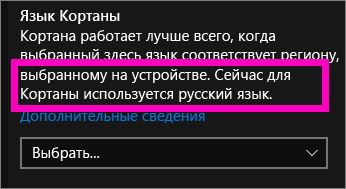
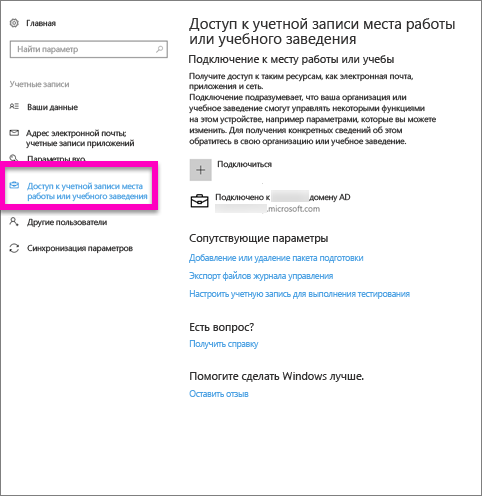
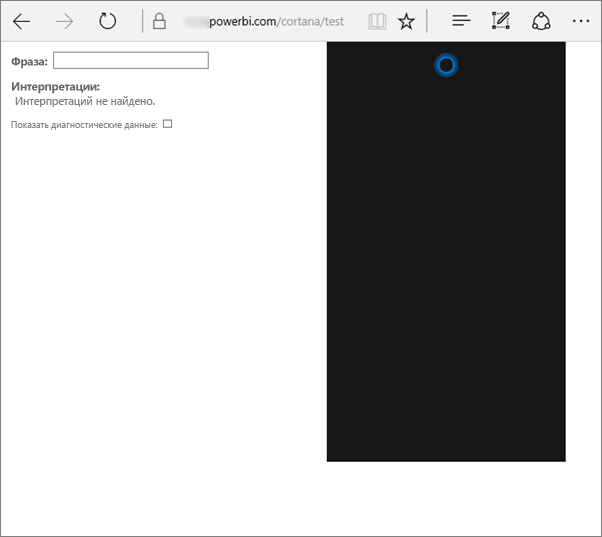
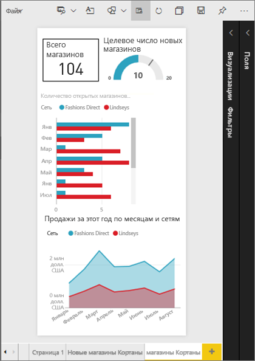
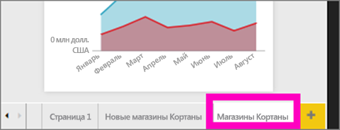
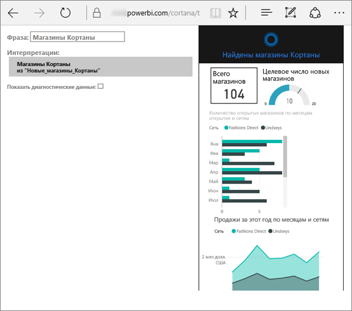
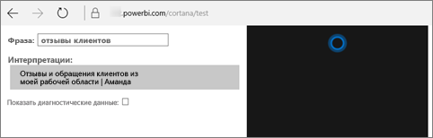

# Устранение неполадок Кортаны для Power BI
Эта статья входит в серию статей. 

> [!IMPORTANT]
> Интеграция Кортаны признана нерекомендуемой в Power BI. Начиная с 11 июня Кортана перестанет работать для панелей мониторинга и отчетов.

Если у вас возникают проблемы с интеграцией Кортаны и Power BI, эта статья именно для вас. Выполните следующие действия, чтобы определить и устранить проблему.

## Почему Кортана не находит ответы из моих отчетов и панелей мониторинга Power BI?
1. У вас есть учетная запись в Power BI?  Если нет, [зарегистрируйтесь для получения бесплатной пробной версии](https://powerbi.microsoft.com/get-started/).
2. Кортана работает?  Виден ли значок Кортаны на панели задач?

    

    Когда вы выбираете его, открывается ли Кортана с полем для ввода?
3. Вводите ли вы не менее двух слов в поле поиска? Чтобы Кортана смогла найти ответы в Power BI, нужно вводить фразы, состоящие минимум из двух слов. Попробуйте добавить слово "show" в начало вопроса.
4. Панель мониторинга с именем из нескольких слов отобразится в результатах поиска Кортаны, только если как минимум два слова в ее названии совпадают с поисковым запросом. Для панели мониторинга "Sales FY16" (Продажи за 2016 финансовый год):

   * при запросе "show sales" результат Power BI *не будет* отображаться;   
   * при запросах "show me sales fy16", "sales fy16", "show sales fy16" и "show me sales f" результат Power BI *будет* отображаться;    
   * "powerbi" считается одним из двух требуемых слов, поэтому при запросе "powerbi sales" результат Power BI *будет* отображаться.
5. Есть ли у вас разрешение на доступ к отчетам и панелям мониторинга или на их изменение? Для отчетов: убедитесь, что для искомого содержимого есть [карта ответа](service-cortana-answer-cards.md).  Для панелей мониторинга: убедитесь, что искомое содержимое есть в рабочей области приложения **Мне предоставлен доступ** или **Моя рабочая область**. Чтобы определить проблему, [используйте средство устранения неполадок](#try-the-cortana-troubleshooting-tool).
6. Вы пользуетесь мобильным устройством?  Сейчас интеграция Кортаны и Power BI поддерживается только на мобильных устройствах Windows.
7. Кортана настроена для использования английского языка?  Текущая интеграция Кортаны и Power BI поддерживает только английский язык. Откройте Кортану и выберите значок шестеренки для отображения параметров. Прокрутите вниз до пункта меню **Cortana language** (Язык Кортаны) и установите один из вариантов английского.

   
8. Охватывает ли поиск Кортаны более 100 отчетов?  Кортана производит поиск максимум в 100 наборах данных.  Чтобы включить отчет в поиск, переместите или скопируйте его в **свою рабочую область**, так как Кортана сначала выполняет поиск там.
9. Для этого может потребоваться некоторое время. При первом вводе запроса модель может *зависнуть*. Подождите несколько секунд, пока данные загрузятся в память, и повторите попытку.
10. Для панелей мониторинга: их включение в поиск Кортаны может занять до 24 часов.    
11. Для отчетов: когда вы добавляете новый набор данных или пользовательскую карту ответа Кортаны в Power BI и включаете их в поиск Кортаны, отображение результатов Кортаны может занять до 30 минут. Когда вы входите в Windows 10 или выходите из системы либо перезапускаете процесс Кортаны в Windows 10, новое содержимое отчета отображается незамедлительно.  
12. Администратор Power BI мог отключить эту функцию. Обратитесь к администратору, чтобы узнать, так ли это.

## Только для отчетов: почему Кортана не находит ответы из моих отчетов Power BI?
1. Существуют ли **карты ответов** Кортаны для отчетов, ответы в которых необходимо найти? Карты ответов — это единственный способ для Кортаны найти ответы в отчетах Power BI.  Чтобы узнать, как создать карту ответов, см. статью [Создание пользовательской страницы ответов для Кортаны в Power BI](service-cortana-answer-cards.md).
2. Вы используете Windows 1511 или более позднюю версию?  Узнайте это, открыв параметры Windows и выбрав **Система > О системе**. В противном случае обновите версию Windows.
3. Подключены ли учетные записи Windows и Power BI? Это может сбить с толку. См. инструкции в статье [Включение Cortana для Power BI](service-cortana-enable.md#add-your-power-bi-credentials-to-windows).
4. Включены ли базовые наборы данных для Кортаны? Возможно, коллега предоставил доступ к набору данных, уже включенному в Кортану. В противном случае ознакомьтесь со статьей [Включение Кортаны для Power BI](service-cortana-enable.md). Это быстро и просто.

## Только для панелей мониторинга: почему Кортана не находит ответы в моих панелях мониторинга Power BI?
1. Убедитесь, что вы подключены к своей рабочей учетной записи. В Power BI это подключение требуется для проверки прав доступа к данным. Чтобы проверить, подключена ли учетная запись (или подключить ее, если нет), воспользуйтесь полем службы поиска Windows для перехода к разделу "Подключение к месту работы или учебы".  

    
2. У вас есть доступ к Кортане? Щелкните поле службы поиска Windows и предоставьте Кортане права доступа к вашим сведениям.

## Использование средства устранения неполадок Кортаны
По-прежнему есть проблемы?  Теперь попробуйте запустить средство устранения неполадок Кортаны, чтобы сузить поиск возможных проблем.

### Не удается получить ответы из отчета?
1. Прежде чем запустить средство устранения неполадок для отчетов, убедитесь что для фильтров **уровня страницы** в картах ответов Кортаны установлен параметр **Нужно выбрать один элемент**. Описание этой задачи см. в статье [Создание пользовательской страницы ответов для Кортаны в Power BI](service-cortana-answer-cards.md).
2. Откройте средство устранения неполадок, добавив /cortana/test в конец URL-адреса службы Power BI. Адрес должен выглядеть следующим образом:

   app.powerbi.com/cortana/test

   
3. Чтобы устранить неполадки в отчетах, в поле **Utterance** (Реплика) введите имя карты ответа Кортаны ***так же, как оно отображается на вкладке Power BI***.

   

    

   
4. В некоторых случаях при первом вводе данных в поле **Utterance** (Реплика) ничего не происходит. Это своего рода подготовка системы и сигнал о необходимости запуска средства устранения неполадок. Вырежьте и вставьте или заново введите данные в поле **Utterance** (Реплика). В этом примере — это имя нашей карты ответов **Cortana stores**. Вставьте или введите текст **Cortana stores** в средство. В результате отобразится поле **Interpretations** (Интерпретации). Щелкните, чтобы просмотреть карту ответа в окне Кортаны. В нашем примере это карта **Cortana stores**.

   

   В результате мы убедились, что Кортана **включена** в Power BI. Это указывает на проблему со стороны Windows, настроек языка Кортаны или на превышение максимального количества наборов данных (более 100).

### Не удается получить ответы из панели мониторинга?
Ищете панель мониторинга, к которой вам предоставлен общий доступ?  В Power BI щелкните **Мне предоставлен доступ** и найдите имя панели мониторинга.  Затем введите это имя в поле **Utterances** (Реплика).

#### Известные проблемы средства устранения неполадок
* Если средство не извлекает результаты с первого раза, вставьте запрос в текстовое поле "Utterance" (Реплика).
* Запрос должен состоять как минимум из двух слов.  Если запрос слишком короткий, добавьте слово "показать".
* Некоторые строки запроса с предлогами могут не работать (например, продажи по категориям). Попробуйте сделать запрос осмысленным и уникальным, а также не используйте предлоги.

Появились дополнительные вопросы? [Ответы на них см. в сообществе Power BI.](http://community.powerbi.com/)
