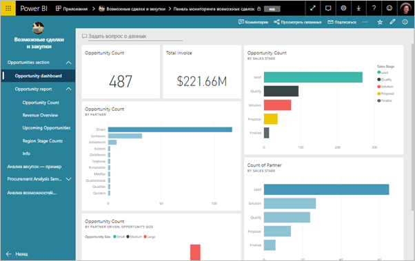
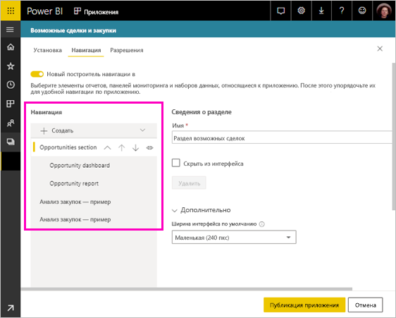
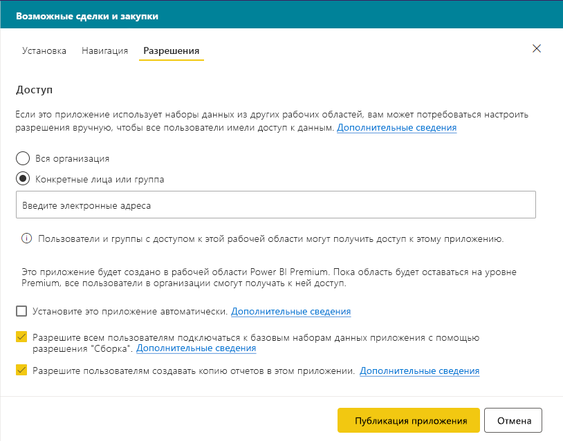
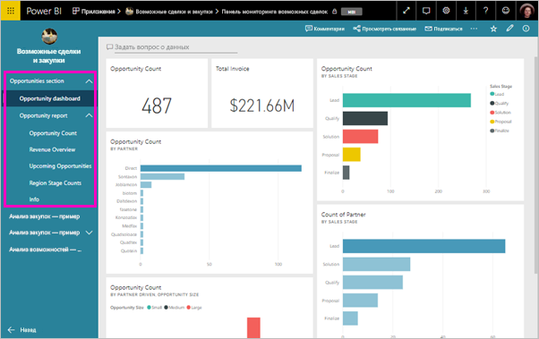

# Публикация приложения в Power BI

В Power BI можно создать официальное упакованное содержимое, а затем распространить его для широкой аудитории в виде *приложения*. Создавайте приложения в *рабочих областях приложений*, где вы можете вместе с коллегами работать над содержимым Power BI. Затем вы можете опубликовать готовые приложения для больших групп сотрудников в вашей организации. 

При работе бизнес-пользователям часто требуется несколько панелей мониторинга и отчетов Power BI. С помощью приложений Power BI можно создавать коллекции информационных панелей и отчетов и публиковать эти приложения во всей организации или среди конкретных пользователей и групп. Для администратора или создателя отчетов приложения упрощают управление разрешениями для этих коллекций.

Бизнес-пользователи могут получить ваши приложения несколькими способами.

- Они могут найти и установить приложения в Microsoft AppSource.
- Вы можете отправить им прямую ссылку.
- С разрешения администратора Power BI его можно установить автоматически в учетных записях Power BI коллег.

Вы можете создать приложение со своей встроенной навигацией, чтобы пользователям было проще перемещаться по содержимому. Пользователи не могут изменять содержимое приложения. Они могут взаимодействовать с ним в службе Power BI или непосредственно в мобильных приложениях, используя параметры фильтрации, выделения и сортировки данных. Кроме того, эти приложения автоматически получают обновления, и вы можете управлять частотой обновления данных. Дополнительные сведения об этом см. в статье [Что из себя представляют приложения в Power BI?](consumer/end-user-apps.md).

## Лицензии для приложений
Чтобы создать или обновить приложение, требуется лицензия Power BI Pro. Для *потребителей* приложения доступны два варианта.

* Вариант 1. Всем бизнес-пользователям требуется лицензия **Power BI Pro** для просмотра вашего приложения. 
* Вариант 2. Пользователи с бесплатной лицензией в организации могут просмотреть содержимое приложения, если рабочая область вашего приложения находится в емкости Power BI Premium. Дополнительные сведения см. в статье [Что такое Power BI Premium?](service-premium.md)

## Публикация приложения
Когда панели мониторинга и отчеты в рабочей области будут готовы, выберите панели мониторинга и отчеты, которые необходимо опубликовать, а затем опубликуйте их как приложение. 

1. В представлении списка рабочих областей выберите панели мониторинга и отчеты, которые требуется **включить в приложение**.

     

     Если вы решили не включать отчет, имеющий связанную панель мониторинга, рядом с ним отображается предупреждение. Приложение можно опубликовать, но в связанной панели мониторинга не будет плиток из отчета.

     

2. Нажмите кнопку **Публикация приложения** в правом верхнем углу, чтобы запустить процесс создания и публикации приложения из рабочей области.
   
     

3. На вкладке **Настройка** введите имя и описание, которые помогут пользователям найти приложение. Можно задать цвет темы. Можно также добавить ссылку на сайт поддержки.
   
     

4. В области **Навигация** выберите содержимое, публикуемое в составе приложения. После этого добавьте навигацию приложения, чтобы упорядочить содержимое по разделам. Дополнительные сведения см. в разделе [Проектирование навигации для приложения](#design-the-navigation-experience-for-your-app) этой статьи.
   
     

5. В области **Разрешения** решите, у кого есть доступ к приложению и что они могут делать. 
    - В [классических рабочих областях](service-create-workspaces.md): все сотрудники организации, определенные пользователи или группы безопасности Azure Active Directory (AAD).
    - В [новом интерфейсе рабочих областей](service-create-the-new-workspaces.md): отдельные пользователи, группы безопасности AAD, списки рассылки, группы Office 365. Все пользователи рабочей области автоматически получают доступ к приложению для этой рабочей области.
    - Вы можете разрешить пользователям приложения подключаться к базовым наборам данных приложения с помощью разрешения "Сборка". Эти наборы данных будут отображаться в интерфейсе поиска наборов данных.
    - Вы можете разрешить пользователям скопировать отчеты в этом приложении в их раздел "Моя рабочая область". 
    
    >[!IMPORTANT]
    >Если ваше приложение основано на наборах данных из других рабочих областей, именно вы обязаны убедиться, что все пользователи приложения имеют доступ к базовым наборам данных.
> 
>     

6. Вы можете автоматически установить приложение для получателей, если администратор Power BI включил для вас соответствующий параметр на портале администрирования Power BI. Дополнительные сведения см. в [описании автоматической установки приложения](#automatically-install-apps-for-end-users) в этой статье.

     

7. Если выбрать **Публикация приложения**, появится сообщение с подтверждением готовности к публикации. В диалоговом окне **Поделиться приложением** можно скопировать прямую ссылку на это приложение.
   
     

Эту прямую ссылку можно отправить пользователям, с которыми вы поделились, или они могут найти приложение на вкладке "Приложения", перейдя по ссылке **Найти и скачать другие приложения из AppSource**. Дополнительные сведения об этом см. в статье [Что из себя представляют приложения в Power BI?](consumer/end-user-apps.md).

## Изменение опубликованного приложения
Возможно, после публикации приложения вы захотите изменить или обновить его. Администратор или участник новой рабочей области приложения может легко обновить это приложение. 

1. Откройте соответствующую рабочую область приложения. 
   
     

2. Внесите необходимые изменения в панели мониторинга или отчеты.
 
     Рабочая область приложения — это промежуточная область хранения, поэтому изменения не применяются до повторной публикации приложения. Это позволяет вносить изменения, не влияя на опубликованные приложения.  
 
    > [!IMPORTANT]
    > При удалении отчета и обновлении приложения, даже если вы добавляете отчет обратно в приложение, потребители приложения теряют все настройки, например закладки, комментарии и т. д.  
 
3. Вернитесь в список рабочих областей приложений и нажмите кнопку **Обновить приложение** в правом верхнем углу.
   
1. При необходимости обновите сведения в областях **Настройка**, **Навигация** и **Разрешения**, а затем выберите **Обновить приложение**.
   
Пользователи, для которых опубликовано приложение, увидят его обновленную версию. 

## Проектирование навигации для приложения
Параметр **Новый построитель навигации** позволяет создать настраиваемую навигацию для приложения. Настраиваемая навигация упрощает пользователям поиск и использование содержимого в приложении. Для существующих приложений этот параметр отключен, а для новых приложений по умолчанию включен.

Когда этот параметр отключен, вы можете выбрать **Определенное содержимое** для параметра **Целевая страница приложения**, например панель мониторинга или отчета, или выбрать **Нет**, чтобы показать базовый список содержимого для пользователя.

Включив параметр **Новый построитель навигации**, вы можете проектировать настраиваемую навигацию. По умолчанию все отчеты, панели мониторинга и книги Excel, включенные в приложение, отображаются в виде плоского списка. 

Вы можете дополнительно настроить навигацию приложения следующим образом.
* Изменение порядка элементов с помощью стрелок вверх/вниз. 
* Переименование элементов в областях **Сведения об отчете**, **Сведения о панели мониторинга** и **Сведения о книге**.
* Скрытие определенных элементов из навигации.
* Использование параметра **Создать**, чтобы добавить **разделы** в связанное с группой содержимое.
* Использование параметра **Создать**, чтобы добавить **ссылку** на внешний ресурс в левую область навигации. 

При добавлении **ссылки** в области **Сведения о ссылке** можно выбрать, где ссылка открывается. По умолчанию для открытия ссылки используется **Текущая вкладка**, но вы можете выбрать значение **Новая вкладка** или **Область контента**. 

### Рекомендации по использованию параметра "Новый построитель навигации"
При использовании нового построителя навигации нужно учитывать следующие аспекты.
* Страницы отчета отображаются в области навигации приложения в виде развертываемого раздела.
* Если отключить новый построитель навигации и затем опубликовать или обновить приложение, вы потеряете внесенные изменения. Например, будут потеряны разделы, упорядочение, ссылки и пользовательские имена для элементов навигации.

При добавлении ссылок в навигацию приложения и выборе параметра "Область контента" выполните следующее.
* Убедитесь, что ссылка может быть внедрена. Некоторые службы блокируют внедрение их содержимого на сайтах сторонних производителей, таких как Power BI.
* Внедрение содержимого службы Power BI, например отчетов и панелей мониторинга, в другие рабочие области не поддерживается. 
* Вы можете внедрить содержимое сервера отчетов Power BI содержимого с помощью его собственного URL-адреса внедрения из локального развертывания. Следуйте инструкциям по [созданию URL-адреса сервера отчетов Power BI](https://docs.microsoft.com/power-bi/report-server/quickstart-embed#creating-the-power-bi-report-server-report-url), чтобы получить URL-адрес. Имейте в виду, что применяются правила регулярной проверки подлинности, поэтому для просмотра содержимого требуется VPN-подключение к локальному серверу. 
* Предупреждение системы безопасности отображается в верхней части внедренного содержимого, чтобы указать, что содержимое находится не в Power BI.

## Автоматическая установка приложений для конечных пользователей
Если администратор предоставляет вам разрешения, можно установить приложения автоматически, *принудительно отправляя* их конечным пользователям. Эта функция принудительной отправки упрощает распространение подходящих приложений среди соответствующих пользователей или групп. Ваше приложение автоматически появится в списке содержимого "Приложения" для конечных пользователей. Им не придется искать его в Microsoft AppSource или использовать ссылку для установки. Сведения о том, как администраторы включают [принудительную отправку приложений конечным пользователям](service-admin-portal.md#push-apps-to-end-users), см. в статье о портале администрирования Power BI.

### Автоматическая принудительная отправка приложения конечным пользователям
Когда администратор назначит вам разрешения, у вас будет новый вариант для выбора — **установить приложение автоматически**. Если вы установили этот флажок и нажали кнопку **Публикация приложения** (или **Обновить приложение**), то приложение автоматически принудительно отправляется всем пользователям и группам, заданным в разделе **Разрешения** приложения на вкладке **Доступ**.

### Как пользователи получают приложения, которые вы принудительно им отправляете
После принудительной отправки приложения оно автоматически отображается в списке приложений. Так можно специально отбирать приложения, которые должны быть в распоряжении определенного пользователя или должности в вашей организации.

### Рекомендации по автоматической установке приложений
При принудительной отправке приложений конечным пользователям необходимо учитывать следующие аспекты:

* Автоматическая установка приложения для пользователей может занимать некоторое время. Большинство приложений устанавливается для пользователей немедленно, но на принудительную отправку приложений может потребоваться время.  Это зависит от количества элементов в приложении и количества пользователей, которым предоставляется доступ. Рекомендуется отправлять приложения в нерабочее время, чтобы оставалось достаточно времени до того момента, когда пользователям потребуются эти приложения. Прежде чем отправлять широкое сообщение о доступности приложений, выполните проверку с несколькими пользователями.

* Обновите страницу в браузере. Пользователю может потребоваться обновить или закрыть и снова открыть свой браузер, прежде чем отправленное приложение появится в списке приложений.

* Если приложение не появилось сразу в списке приложений, пользователь должен обновить или закрыть и снова открыть свой браузер.

* Старайтесь не перегружать пользователей. Будьте внимательны и не отправляйте слишком много приложений, чтобы пользователи успели оценить полезность предварительно установленных приложений. Рекомендуется контролировать, кто может отправлять приложения конечным пользователям, для координации времени. Установите точку контакта для получения в вашей организации приложений, отправленных конечным пользователям.

* У гостевых пользователей, которые не приняли приглашение, приложение не устанавливается автоматически.  

## Разрешение на подключение к базовым наборам данных приложения для пользователей
Если задать этот параметр, чтобы разрешить всем пользователям подключаться к базовым наборам данных приложения, пользователи приложения получат разрешение "Сборка" для базового набора данных. Это позволяет пользователям [использовать наборы данных приложения в разных рабочих областях](service-datasets-across-workspaces.md), чтобы искать эти наборы данных в Power BI Desktop и интерфейсы получения данных службы, а также создавать отчеты и панели мониторинга с помощью этих наборов данных. 

Если этот флажок снят, новые пользователи, добавляемые вами в приложение, не получают разрешение "Сборка". Однако существующие разрешения для базового набора данных не меняются. С помощью предоставленного пользовательского интерфейса вы можете вручную удалять разрешение "Сборка" у пользователей приложения, которым оно больше не нужно. См. дополнительные сведения о [разрешении на сборку](service-datasets-build-permissions.md#build-permissions-for-shared-datasets).

## Разрешение на создание копии отчетов в приложении для пользователей
Установив флажок **Разрешить пользователям создавать копии отчетов в этом приложении**, вы разрешите пользователям сохранить любой из отчетов в приложении в их раздел "Моя рабочая область". Они могут настроить отчеты под свои потребности. Для использования этого параметра должен быть включен параметр **Разрешить всем пользователям подключаться к базовым наборам данных с использованием разрешения "Сборка"** . Эта возможность работает аналогично новой возможности [копирования отчетов из других рабочих областей ](service-datasets-copy-reports.md).

## Отмена публикации приложения
Любой участник рабочей области приложения может отменить публикацию приложения.

>[!IMPORTANT]
>Когда вы отмените публикацию приложения, пользователи приложения потеряют свои настройки. Они потеряют все личные закладки, комментарии или подписки, связанные с содержимым в приложении. Отменяйте публикацию приложения, только если хотите удалить его.
> 
> 

* В рабочей области приложения нажмите кнопку с многоточием ( **...** ) в правом верхнем углу и щелкните **Отменить публикацию приложения**.
  
     

При этом приложение удаляется для всех назначенных пользователей без возможности дальнейшего доступа к нему. Рабочая область приложения или ее содержимое удалены не будут.

## Просмотр опубликованного приложения

Когда потребитель вашего приложения откроет его, он увидит созданную вами систему навигации вместо стандартной левой области навигации Power BI. В области навигации приложения перечислены отчеты и панели мониторинга, упорядоченные по заданным вами разделам. Там также перечислены отдельные страницы в каждом отчете, а не просто имя отчета.

## Дальнейшие действия
* [Создание рабочей области приложения](service-create-workspaces.md)
* [Установка и использование приложений с информационными панелями и отчетами в Power BI](consumer/end-user-apps.md)
* [Приложения Power BI для внешних служб](service-connect-to-services.md)
* [Портал администрирования Power BI](https://docs.microsoft.com/power-bi/service-admin-portal)
* У вас появились вопросы? [Попробуйте задать вопрос в сообществе Power BI.](http://community.powerbi.com/)
