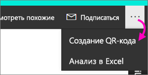

# Создание QR-кода для отчета в Power BI для использования в мобильных приложениях
QR-коды в Power BI могут связывать любой физический предмет с соответствующей информацией BI &#151; навигация или поиск не требуются.

QR-код можно создавать в службе Power BI для любого отчета, даже для недоступного для редактирования. Созданный QR-код необходимо поместить в ключевое расположение. Например, его можно вставить в сообщение электронной почты либо распечатать и вставить в определенное место. 

Коллеги, которым вы предоставили доступ к отчету, могут просканировать QR-код и получить доступ к отчету прямо [с мобильного устройства](mobile-apps-qr-code.md). Для этого можно использовать сканер QR-кодов в приложении Power BI или любой другой установленный на устройстве QR-сканер.

## Создание QR-кода для отчета
1. Откройте отчет в службе Power BI.
2. Щелкните кнопку с многоточием (...) в правом верхнем углу и выберите **Создать QR-код**. 
   
    
3. Откроется диалоговое окно с QR-кодом. 
   
    
4. Здесь можно отсканировать QR-код либо загрузить его, сохранить, а затем: 
   
   * вставить в сообщение электронной почты или другой документ; либо 
   * распечатать и поместить в определенное место. 

## Печать QR-кода
Power BI создает QR-код в виде JPG-файла, готового к печати. 

1. Выберите **Загрузить**, а затем откройте JPG-файл на компьютере, подключенном к принтеру.  
   
   > [!TIP]
   > Имя JPG-файла совпадает с именем плитки. например, "Sales and Marketing Sample.jpg".
   > 
   > 
2. Распечатайте файл в 100%-ном, или фактическом, размере.  
3. Вырежьте рамку с QR-кодом и приклейте ее в соответствующее отчету место. 

## Дальнейшие действия
* [Подключение к данным Power BI из реального мира](mobile-apps-data-in-real-world-context.md) с помощью мобильных приложений
* [Сканирование QR-кода Power BI из iPhone](mobile-apps-qr-code.md)
* [Создание QR-кода для плитки в службе Power BI](service-create-qr-code-for-tile.md)
* У вас появились вопросы? [Попробуйте задать вопрос в сообществе Power BI.](http://community.powerbi.com/)

