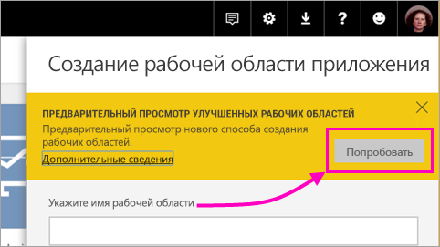
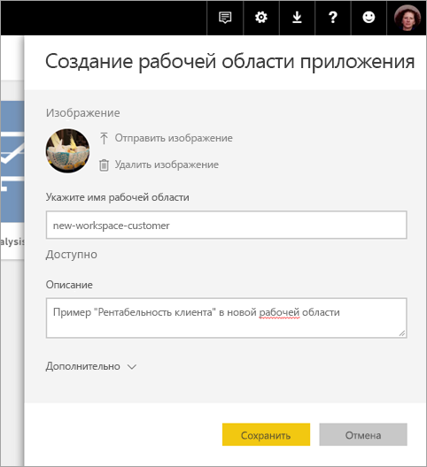
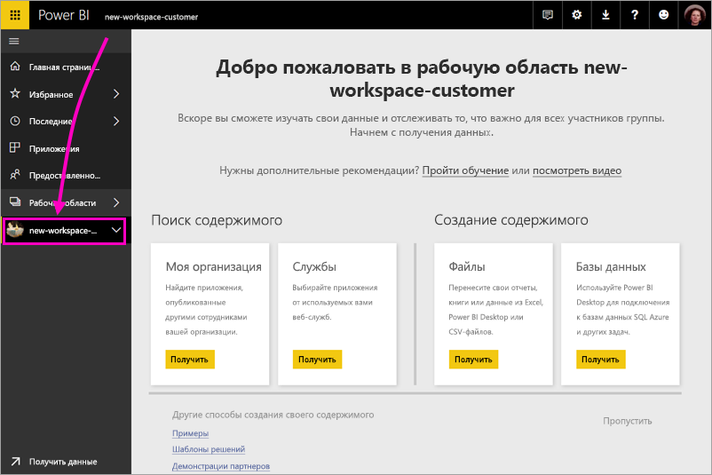
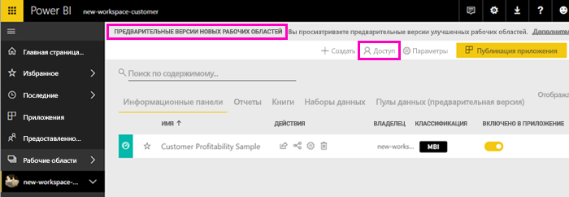
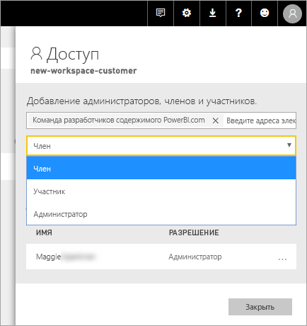
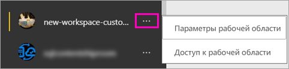

# Создание рабочих областей (предварительная версия) в Power BI

В Power BI представлена предварительная версия нового интерфейса рабочей области. Рабочие области по-прежнему подходят для совместной работы над созданием коллекций панелей мониторинга и отчетов, которые можно объединять в *приложения* и распространять по всей организации или среди отдельных пользователей и групп. 

Возможности новой предварительной версии рабочих областей.

- Назначение ролей рабочей области для групп пользователей: группы безопасности, списки рассылки, группы Office 365 и отдельные пользователи.
- Создание рабочей области в Power BI без создания группы Office 365.
- Используйте более детализированные роли рабочих областей для более гибкого управления разрешениями в рабочей области.
 
При создании новой рабочей области вы не создаете соответствующую базовую группу Office 365. Все действия по администрированию рабочей области выполняются в Power BI, не в Office 365. Группы Office 365 по-прежнему можно добавлять в рабочие области, чтобы управлять доступом пользователей к содержимому с помощью групп Office 365. Но вы также можете использовать группы безопасности и списки рассылки и добавлять пользователей напрямую в Power BI для удобного управления доступом к рабочей области. Так как администрирование рабочих областей теперь выполняется в Power BI, администраторы Power BI принимают решения о том, кто в организации может создавать рабочие области. Дополнительные сведения см. в разделе [Портал администрирования Power BI —> Параметры рабочей области](service-admin-portal.md#workspace-settings). 

В новые рабочие области группы и отдельных пользователей можно добавлять как членов, участников или администраторов. Каждый из пользователей в группе получает определенную вами роль. Если пользователь входит в несколько групп пользователей, он получает наивысший уровень разрешений, предоставляемых ролью.  См. объяснение разных ролей в разделе [Роли в новых рабочих областях](#roles-in-the-new-workspaces) далее в этой статье.

Каждый член рабочей области приложения должен иметь лицензию Power BI Pro. Рабочая область позволяет этим пользователям совместно работать над панелями мониторинга и отчетами, которые вы планируете опубликовать для более широкой аудитории или даже для всей организации. Если вы хотите распространить содержимое для других пользователей в вашей организации, можно назначить им лицензии Power BI Pro или поместить рабочую область в емкость Power BI Premium.

В новых рабочих областях мы изменяем некоторые функции. См. раздел [Добавление содержимого в рабочую область приложения](#app-workspace-features-that-work-differently) далее в этой статье, чтобы ознакомиться с изменениями, которые будут сохранены. Так как это предварительная версия функции, существуют некоторые ограничения. См. раздел [Известные проблемы](#known-issues) далее в этой статье, чтобы ознакомиться с текущими ограничениями. 

## Развертывание новых рабочих областей приложений

На этапе предварительной версии старые и новые рабочие области могут сосуществовать, и вы можете создать любой вариант. Когда новые рабочие области будут выпущены в качестве общедоступной версии, старые рабочие области по-прежнему будут существовать некоторое время. Вы не сможете их создавать, и вам необходимо подготовиться к переносу рабочих областей в новую инфраструктуру рабочих областей. Не волнуйтесь, у вас будет несколько месяцев на перенос.

## Создание новой рабочей области приложения

1. Начнем с создания рабочей области приложения. Выберите **Рабочие области** > **Создать рабочую область приложения**.
   
     

2. В разделе **Предварительная версия улучшенных рабочих областей** выберите **Попробовать**.
   
     

2. Присвойте рабочей области имя. Если это имя занято, укажите другое, чтобы оно было уникальным.
   
     Приложение будет иметь то же имя, что и рабочая область.
   
1. Добавьте изображение, если хотите. Размер файла не должен превышать 45 КБ.
 
    

1. Нажмите кнопку **Сохранить**.

    Здесь на экране **Приветствия** для новой рабочей области вы можете добавить данные. 

    

1. Например, выберите **Примеры** > **Рентабельность клиента — пример**.

    Теперь в списке содержимого рабочих областей отображается **Предварительная версия новых рабочих областей**. Поскольку вы являетесь администратором, вы также увидите новое действие — **Доступ**.

    

1. Выберите **Доступ**.

1. Добавьте группы безопасности, списки рассылки, группы Office 365 или отдельных пользователей в эти рабочие области в качестве членов, участников или администраторов. См. объяснение разных ролей в разделе [Роли в новых рабочих областях](#roles-in-the-new-workspaces) далее в этой статье.

    

9. Нажмите **Добавить** > **Закрыть**.

1. После этого служба Power BI создаст рабочую область и откроет ее. Она отображается в списке рабочих областей, в которые вы входите. Администратор может щелкнуть многоточие (…), чтобы вернуться и внести изменения в параметры рабочей области, например добавить новых участников или изменить разрешения.

     

## Добавление содержимого в рабочую область приложения

После создания рабочей области приложения в новом стиле необходимо добавить в нее содержимое. Добавление содержимого аналогично в рабочих областях нового и старого стиля, за одним исключением. В любой рабочей области приложения вы можете отправлять файлы или подключаться к ним так же, как в разделе "Моя рабочая область". В новых рабочих областях вы не можете подключиться к пакетам содержимого организации или сторонним пакетам содержимого, например Microsoft Dynamics CRM, Salesforce или Google Analytics. В существующих рабочих областях можно подключаться к пакетам содержимого.

При просмотре содержимого в списке содержимого в рабочей области приложения в качестве владельца указано имя рабочей области приложения.

### Подключения к сторонним службам в новых рабочих областях (предварительная версия)

В новом интерфейсе рабочих областей мы смещаем акцент на приложения. Приложения для сторонних служб позволяют пользователям легко получать данные от используемых служб, например Microsoft Dynamics CRM, Salesforce или Google Analytics.
Приложения организации предоставляют пользователям нужные данные организации. Мы планируем расширить возможности приложений организации, чтобы пользователи могли настраивать содержимое в приложениях. При этом пакеты содержимого станут не нужны. 

Нельзя создавать или использовать пакеты содержимого организации в предварительной версии новых рабочих областей. Вместо этого можно использовать предоставленные приложения, чтобы подключиться к сторонним службам, или попросить коллег предоставить приложения для пакетов содержимого, которые вы используете. 

## Роли в новых рабочих областях

Роли позволяют управлять разрешениями в рабочих областях для удобной совместной работы. В новых рабочих областях можно назначать роли пользователям и группам пользователей: группам безопасности, группам Office 365 и спискам рассылки. 

При назначении ролей группе пользователей у всех пользователей в группе будет доступ к содержимому. Если группа пользователей имеет вложения, разрешение получат все пользователи во вложенных группах. Если пользователь находится в нескольких группах пользователей с разными ролями, он получает самый высокий уровень разрешения. 

В новых рабочих областях есть три роли: администратор, член и участник.

**Администраторы могут:**

- Обновлять и удалять рабочую область. 
- Добавлять и удалять пользователей, включая других администраторов.
- Выполнять все действия, доступные членам.

**Члены могут:** 

- Добавлять членов или других пользователей с разрешениями более низкого уровня.
- Публиковать и обновлять приложение.
- Предоставлять общий доступ к элементу или приложению.
- Разрешать другим пользователям повторно предоставлять совместный доступ к элементам.
- Выполнять все действия, доступные участникам.

**Участники могут:** 

- Создавать, редактировать и удалять содержимое в рабочей области. 
- Публиковать отчеты в рабочей области, удалять содержимое.
- Не могут предоставлять новым пользователям доступ к содержимому; не могут предоставлять совместный доступ к новому содержимому, но могут делиться с пользователями, которым уже предоставлен совместный доступ к рабочей области, элементу или приложению. 
- Не могут менять членов группы.
 
Мы создаем рабочие процессы запроса на доступ по всей службе, поэтому пользователи могут запросить доступ, если у них его нет. Рабочие процессы запроса доступа в настоящее время существуют для панелей мониторинга, отчетов и приложений.

## Распространение приложения

Когда содержимое будет готово, выберите панели мониторинга и отчеты для публикации, а затем опубликуйте их в виде *приложения*. В каждой рабочей области можно создать одно приложение. Ваши коллеги могут получить ваше приложение несколькими способами. С разрешения администратора Power BI его можно установить автоматически в учетных записях Power BI коллег. В противном случае они могут найти и установить ваше приложение из Microsoft AppSource. Кроме того, вы можете отправить им прямую ссылку. Кроме того, эти приложения автоматически получают обновления, и вы можете управлять частотой обновления данных. Дополнительные сведения см. в разделе [Публикация приложений с панелями мониторинга и отчетами в Power BI](service-create-distribute-apps.md).

## Преобразование старых рабочих областей приложений в новые

На этапе предварительной версии нельзя автоматически преобразовать старые рабочие области приложений в новые. Но вы можете создать новую рабочую область приложения и опубликовать содержимое в новом месте. 

Когда выйдет общедоступная версия новых рабочих областей, вы сможете включить автоматический перенос старых рабочих областей. Через некоторое время после выхода общедоступной версии вам придется перенести рабочие области.

## Часто задаваемые вопросы о приложениях Power BI

### Чем отличаются новые рабочие области приложений от существующих?
* При создании рабочих областей приложений соответствующие сущности в Office 365 создаваться не будут, как это происходит в существующих рабочих областях. (Вы по-прежнему можете добавить группу Office 365 в рабочую область, назначив ей роль). 
* В существующих рабочих областях в список администраторов или членов можно добавлять только отдельных пользователей. В новых рабочих областях приложений вы можете добавлять несколько групп безопасности AD, списков рассылки или групп Office 365 в эти списки для удобного управления пользователями. 
- Можно создать пакет содержимого организации в существующей рабочей области приложения. Нельзя создать такой пакет в новых рабочих областях приложений.
- Можно использовать пакет содержимого организации в существующей рабочей области приложения. Нельзя использовать такой пакет в новых рабочих областях приложений.
- На этапе предварительной версии некоторые возможности еще не включены для новых рабочих областей приложения. Дополнительные сведения см. в следующем разделе — [Другие запланированные возможности новых рабочих областей](service-create-the-new-workspaces.md#other-planned-new-app-workspace-preview-features).

## Запланированные возможности предварительной версии новых рабочих областей приложений

Некоторые возможности предварительной версии новых рабочих областей приложений по-прежнему разрабатываются, но пока не доступны при запуске предварительной версии.

- Нет кнопки **Выход из рабочей области**.
- Метрики использования пока не поддерживаются.
- Как работает уровень Premium. Вы можете назначать и создавать рабочие области в емкости Premium, но для перемещения рабочей области между емкостями перейдите к параметрам рабочей области.
- Внедрение веб-части SharePoint пока не поддерживается.
- Нет кнопки **OneDrive** для групп Office 365 в разделе получения данных и файлов.

## Функции рабочих областей приложений, которые работают иначе

Некоторые функции работают по-разному в существующих и новых рабочих областях приложений. Эти отличия являются намеренными, основаны на отзывах от клиентов и предоставляют более универсальный подход к совместной работе в рабочих областях.

- Члены, которым можно или нельзя повторно делиться: заменено ролью участника.
- Рабочие области только для чтения: вместо предоставления пользователям доступа к рабочей области только для чтения вы сможете назначать пользователям готовящуюся к выходу роль читателя с аналогичными правами на чтение содержимого в рабочей области.

## Известные проблемы

Ниже перечислены известные проблемы, исправления находятся в стадии разработки.

- Пользователи или группы пользователей с бесплатной лицензией, добавленные в качестве получателей в подписке на сообщения, могут не получать сообщения, хотя должны. Эта проблема возникает, если новая рабочая область находится в емкости Premium, но "Моя рабочая область" подписавшегося пользователя не находится в емкости Premium. Если "Моя рабочая область" находится в емкости Premium, пользователи и группы пользователей с бесплатной лицензией будут получать сообщения.
- После перемещения рабочей области из емкости Premium в общую емкость в некоторых случаях пользователи и группы пользователей с бесплатной лицензией будут продолжать получать сообщения, хотя не должны. Эта проблема возникает, когда "Моя рабочая область" подписавшегося пользователя находится в емкости Premium.

## Дальнейшие действия
* [Создание текущих рабочих областей](service-create-workspaces.md)
* [Установка и использование приложений с информационными панелями и отчетами в Power BI](service-create-distribute-apps.md)
* У вас появились вопросы? [Попробуйте задать вопрос в сообществе Power BI.](http://community.powerbi.com/)
