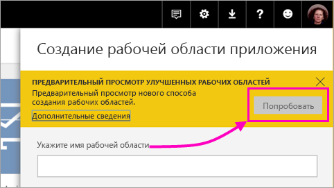
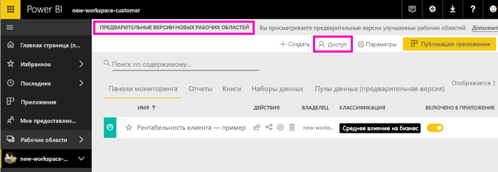
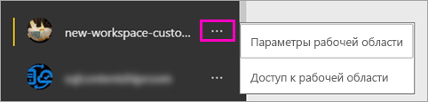

# Создание рабочих областей (предварительная версия) в Power BI

В Power BI представлена предварительная версия нового интерфейса рабочей области. Рабочие области по-прежнему подходят для совместной работы над созданием коллекций панелей мониторинга и отчетов, которые можно объединять в *приложения* и распространять по всей организации или среди отдельных пользователей и групп. 

Возможности новой предварительной версии рабочих областей:

- Назначение ролей рабочей области для групп пользователей: группы безопасности, списки рассылки, группы Office 365 и отдельные пользователи.
- Создание рабочей области в Power BI без создания группы Office 365.
- Используйте более детализированные роли рабочих областей для более гибкого управления разрешениями в рабочей области.

Дополнительные сведения см. в статье о [новых рабочих областях (предварительная версия)](service-new-workspaces.md).

## Создание новой рабочей области приложения

1. Начнем с создания рабочей области приложения. Выберите **Рабочие области** > **Создать рабочую область приложения**.
   
     

2. В разделе **Предварительная версия улучшенных рабочих областей** выберите **Попробовать**.
   
     

2. Присвойте рабочей области имя. Если это имя занято, укажите другое, чтобы оно было уникальным.
   
     Приложение будет иметь то же имя, что и рабочая область.
   
1. Добавьте изображение, если хотите. Размер файла не должен превышать 45 КБ.
 
    

1. Нажмите кнопку **Сохранить**.

    Здесь на экране **Приветствия** для новой рабочей области вы можете добавить данные. 

    

1. Например, выберите **Примеры** > **Рентабельность клиента — пример**.

    Теперь в списке содержимого рабочих областей отображается **Предварительная версия новых рабочих областей**. Поскольку вы являетесь администратором, вы также увидите новое действие — **Доступ**.

    

1. Выберите **Доступ**.

1. Добавьте группы безопасности, списки рассылки, группы Office 365 или отдельных пользователей в эти рабочие области в качестве членов, участников или администраторов. См. объяснение разных ролей в разделе [Роли в новых рабочих областях](#roles-in-the-new-workspaces) далее в этой статье.

    

9. Нажмите **Добавить** > **Закрыть**.

1. После этого служба Power BI создаст рабочую область и откроет ее. Она отображается в списке рабочих областей, в которые вы входите. Администратор может щелкнуть многоточие (…), чтобы вернуться и внести изменения в параметры рабочей области, например добавить новых участников или изменить разрешения.

     

## Добавление содержимого в рабочую область приложения

После создания рабочей области приложения в новом стиле необходимо добавить в нее содержимое. Добавление содержимого аналогично в рабочих областях нового и старого стиля, за одним исключением. В любой рабочей области приложения вы можете отправлять файлы или подключаться к ним так же, как в разделе "Моя рабочая область". В новых рабочих областях вы не можете подключиться к пакетам содержимого организации или сторонним пакетам содержимого, например Microsoft Dynamics CRM, Salesforce или Google Analytics. В существующих рабочих областях можно подключаться к пакетам содержимого.

При просмотре содержимого в списке содержимого в рабочей области приложения в качестве владельца указано имя рабочей области приложения.

### Подключения к сторонним службам в новых рабочих областях (предварительная версия)

В новом интерфейсе рабочих областей мы смещаем акцент на *приложения*. Приложения для сторонних служб позволяют пользователям легко получать данные от используемых служб, например Microsoft Dynamics CRM, Salesforce или Google Analytics.
Приложения организации предоставляют пользователям нужные данные организации. Мы планируем расширить возможности приложений организации, чтобы пользователи могли настраивать содержимое в приложениях. При этом пакеты содержимого станут не нужны. 

Нельзя создавать или использовать пакеты содержимого организации в предварительной версии новых рабочих областей. Вместо этого можно использовать предоставленные приложения, чтобы подключиться к сторонним службам, или попросить коллег предоставить приложения для пакетов содержимого, которые вы используете. 

## Распространение приложения

Когда содержимое будет готово, выберите панели мониторинга и отчеты для публикации, а затем опубликуйте их в виде *приложения*. В каждой рабочей области можно создать одно приложение. Ваши коллеги могут получить ваше приложение несколькими способами. С разрешения администратора Power BI его можно установить автоматически в учетных записях Power BI коллег. В противном случае они могут найти и установить ваше приложение из Microsoft AppSource. Кроме того, вы можете отправить им прямую ссылку. Кроме того, эти приложения автоматически получают обновления, и вы можете управлять частотой обновления данных. Дополнительные сведения см. в разделе [Публикация приложений с панелями мониторинга и отчетами в Power BI](service-create-distribute-apps.md).

## Преобразование старых рабочих областей приложений в новые

На этапе предварительной версии нельзя автоматически преобразовать старые рабочие области приложений в новые. Но вы можете создать новую рабочую область приложения и опубликовать содержимое в новом месте. 

Когда выйдет общедоступная версия новых рабочих областей, вы сможете включить автоматический перенос старых рабочих областей. Через некоторое время после выхода общедоступной версии вам придется перенести рабочие области.

## Дальнейшие действия
* Ознакомьтесь со сведениями об [организации работы в новых рабочих областях (предварительная версия) в Power BI](service-new-workspaces.md).
* [Создание текущих рабочих областей](service-create-workspaces.md)
* [Установка и использование приложений с информационными панелями и отчетами в Power BI](service-create-distribute-apps.md)
* У вас появились вопросы? [Попробуйте задать вопрос в сообществе Power BI.](http://community.powerbi.com/)
