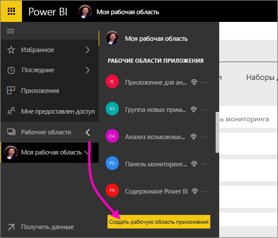
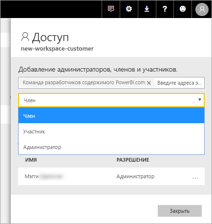

# Создание новых рабочих областей в Power BI

Power BI предоставляет новые возможности рабочей области. Рабочие области по-прежнему — здесь можно работать совместно с коллегами для создания коллекции панелей мониторинга, отчеты и отчеты с разбивкой на страницы. Затем можно объединить эту коллекцию в *приложение* и его распространение в рамках всей организации или среди конкретных пользователей и групп. 

Вот в чем отличается. В новых рабочих областей вы можете:

- Назначение ролей рабочей области для групп пользователей: группы безопасности, списки рассылки, группы Office 365 и отдельные пользователи.
- Создание рабочей области в Power BI без создания группы Office 365.
- Используйте более детализированные роли рабочих областей для более гибкого управления разрешениями в рабочей области.

> [!NOTE]
> Чтобы принудительно использовать безопасность на уровне строк (RLS) для пользователей Power BI Pro, просмотра содержимого в рабочей области, продолжают использовать [классической рабочие области](service-create-workspaces.md). Выберите **участники могут только просматривать содержимое Power BI** параметр. Кроме того публикация приложений Power BI для этих пользователей или совместно использующих распространения содержимого. Готовящегося роль наблюдателя будет реализовать этот сценарий в будущем, в новые рабочие области качества рабочей области.

Дополнительные сведения см. в разделе [новые рабочие области](service-new-workspaces.md) статьи.

## Создание новой рабочей области приложения

1. Начнем с создания рабочей области приложения. Выберите **Рабочие области** > **Создать рабочую область приложения**.
   
     

2. Вы автоматически создаете обновленной рабочей области, пока не будет выбран для **вернуться к классической**.
   
     
     
     При выборе **вернуться к классической**, создать рабочую область на основе группы Office 365. Используйте этот параметр, если требуется **участники могут только просматривать содержимое Power BI** параметр, чтобы принудительно использовать безопасность на уровне строк (RLS) для участников рабочей области.

2. Присвойте рабочей области имя. Если имя не поддерживается, измените его, чтобы придумать уникальное имя.
   
     В приложении для рабочей области будет иметь одно и то же имя и значок, что и рабочая область.
   
1. Ниже приведены некоторые необязательные элементы, которые можно задать для рабочей области.

    Отправка **изображение рабочей области**. Файлы могут иметь формат PNG или JPG. Размер файла должен быть меньше 45 КБ.
    
    [Добавить **список контактов**](#workspace-contact-list). По умолчанию администраторы рабочей области, контакты. 
    
    [Укажите **OneDrive рабочей области** ](#workspace-onedrive) , введя просто имя существующей группы Office 365, не URL-адрес. Теперь этой рабочей области можно использовать место хранения в файловой группе Office 365. 

    

    Чтобы назначить рабочую область, чтобы **выделенную емкость**на **уровня "премиум"** вкладке выберите **выделенную емкость**.
     
    

1. Нажмите кнопку **Сохранить**.

    После этого служба Power BI создаст рабочую область и откроет ее. Она отображается в списке рабочих областей, в которые вы входите. 

## Список контактов в рабочей области

Новый список контактов в рабочей области можно указать, какие пользователи получают уведомление о возникающих в рабочей области. По умолчанию любой пользователь или группа, определенные как рабочую область администратор получает уведомление, но его можно настроить. Пользователи или группы, перечисленные в списке контактов будет отображаться в интерфейсе пользователя (UI), чтобы помочь это пользователи получить помощь, относящиеся к рабочей области.

1. Доступ к новой **список контактов** параметр в одной из двух способов:

    В **создать рабочую область** панели при его создании.

    В левой области навигации, щелкните стрелку рядом с полем **рабочие области**, нажмите кнопку с многоточием (...) рядом с именем рабочей области > **параметры рабочей области**. **Параметры** откроется область.

    

2. В разделе **Дополнительно** > **список контактов**, примите имя по умолчанию **администраторы рабочей области**, или добавить собственный список **конкретным пользователям или группам**. 
3. Нажмите кнопку **Сохранить**.

## OneDrive для рабочей области

Рабочая область OneDrive позволяет настроить группу Office 365, чье хранилище файл библиотеки документов SharePoint доступно для пользователей рабочей области. Сначала создайте группу за пределами Power BI. 

Power BI не будет синхронизировать разрешения пользователей или группы, которые имеют доступ к рабочей области с помощью членства в группах Office 365. Рекомендуется предоставить ту же группу Office 365, которого хранилище файлов, можно настроить в данной группы параметров Office 365, [доступ к рабочей области](#give-access-to-your-workspace). Управлять доступом рабочей области путем управления членством в группе Office 365. 

1. Доступ к новой **OneDrive рабочей области** параметр в одной из двух способов:

    В **создать рабочую область** панели при его создании.

    В левой области навигации, щелкните стрелку рядом с полем **рабочие области**, нажмите кнопку с многоточием (...) рядом с именем рабочей области > **параметры рабочей области**. **Параметры** откроется область.

    

2. В разделе **Дополнительно** > **OneDrive рабочей области**, введите имя группы Office 365, который был создан ранее. Power BI автоматически выбирает OneDrive для группы.

    

3. Нажмите кнопку **Сохранить**.

### Доступ к OneDrive расположение рабочей области

После настройки OneDrive расположение, к нему можно получить из нескольких разных местах в рабочей области:

- Выберите **рабочие области** > *имя рабочей области* > кнопку с многоточием ( **...** ) меню > **файлы**. 

    

- Нажмите кнопку с многоточием ( **...** ) меню в правом верхнем углу рабочей области > **файлы**.

    
    
- В **получить данные** > **файлы** столкнуться. **OneDrive — бизнес** запись является OneDrive для бизнеса. Второй OneDrive — это то, что вы добавили.

    

## Добавление содержимого в рабочую область приложения

После создания новой рабочей области качества рабочей области, пришло время для добавления содержимого к нему. В рабочих областях новыми и классическими аналогично Добавление содержимого. Используйте кнопку Создать или получить данные для добавления содержимого в рабочей области.

1. В **приветствия** экрана для новой рабочей области, можно добавить содержимое. 

    

1. Например, выберите **Примеры** > **Рентабельность клиента — пример**.

> [!NOTE]
> В новых рабочих областей не могут использовать пакеты содержимого организации, или сторонние пакеты содержимого. Приложения доступны все стороннее содержимое пакетов вы ранее использовали. Использование классического рабочих областей в том случае, если необходимо продолжить использование пакетов содержимого. Пакеты содержимого являются устаревшими, поэтому его рекомендуется использовать вместо этого приложения.

При просмотре содержимого в списке содержимого в рабочей области приложения в качестве владельца указано имя рабочей области приложения.

### Подключения к службам сторонних в новых рабочих областей

В новом интерфейсе рабочих областей мы смещаем акцент на *приложения*. Приложения для сторонних служб позволяют пользователям легко получать данные от используемых служб, например Microsoft Dynamics CRM, Salesforce или Google Analytics.

В новом интерфейсе рабочей области невозможно создать или использовать пакеты содержимого организации. Вместо этого можно использовать предоставленные приложения, чтобы подключиться к сторонним службам, или попросить коллег предоставить приложения для пакетов содержимого, которые вы используете. 

## Предоставить доступ к рабочей области

1. В списке содержимого рабочей области, так как вы являетесь администратором появится новое действие, **доступа**.

    

1. Выберите **Доступ**.

1. Добавьте группы безопасности, списки рассылки, группы Office 365 или отдельных пользователей в эти рабочие области в качестве членов, участников или администраторов. См. объяснение разных ролей в разделе [Роли в новых рабочих областях](service-new-workspaces.md#roles-in-the-new-workspaces).

    

9. Нажмите **Добавить** > **Закрыть**.

## Распространение приложения

Если вы хотите распределить официальный содержимого большой аудитории в вашей организации, вы можете опубликовать приложение из рабочей области.  Когда содержимое будет готово, выбрать, какие панели мониторинга и отчеты, необходимо опубликовать и затем опубликовать его как *приложения*. В каждой рабочей области можно создать одно приложение.

Узнайте о [публикации приложения из новых рабочих областей](service-create-distribute-apps.md)

## Дальнейшие действия
* Узнайте о [организации работы в новом интерфейсе рабочие области в Power BI](service-new-workspaces.md)
* [Создание классической рабочих областей](service-create-workspaces.md)
* [Публикация приложения из новых рабочих областей в Power BI](service-create-distribute-apps.md)
* У вас появились вопросы? [Попробуйте задать вопрос в сообществе Power BI.](http://community.powerbi.com/)
