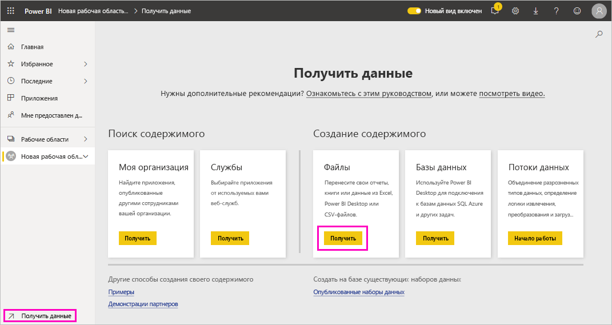
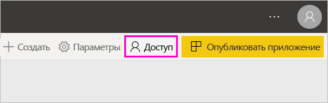

# Создание новых рабочих областей в Power BI

В Power BI представлен новый интерфейс рабочей области. Рабочие области по-прежнему являются местом для совместной работы с коллегами по созданию коллекций панелей мониторинга, простых отчетов и отчетов с разбивкой на страницы. Затем эту коллекцию можно объединить в *приложение*, которое можно распространять в рамках всей организации или передавать конкретным пользователям или группам. 

Вот в чем отличие. Возможности новой версии рабочих областей:

- Назначение ролей рабочей области для групп пользователей: группы безопасности, списки рассылки, группы Office 365 и отдельные пользователи.
- Создание рабочей области в Power BI без создания группы Office 365.
- Используйте более детализированные роли рабочих областей для более гибкого управления разрешениями в рабочей области.

> [!NOTE]
> Чтобы включить безопасность на уровне строк (RLS) для пользователей Power BI Pro, просматривающих содержимое в рабочей области, назначьте им роль зрителя.

Дополнительные сведения см. в статье о [новых рабочих областях](service-new-workspaces.md).

## Создание новой рабочей области

1. Начнем с создания рабочей области. Выберите **Рабочие области** > **Создать рабочую область**.
   
     

2. Вы автоматически создаете обновленную рабочую область, если не хотите **Вернуться к классической версии**.
   
     
     
     При выборе варианта **Вернуться к классической версии** создается [рабочая область на основе группы Office 365](service-create-workspaces.md). 

2. Присвойте рабочей области имя. Если это имя занято, укажите другое, чтобы оно было уникальным.
   
     Приложение для рабочей области будет иметь те же имя и значок, что и рабочая область.
   
1. Ниже приведены некоторые необязательные элементы, которые можно задать для рабочей области:

    Загрузите **образ рабочей области**. Файлы могут иметь формат .PNG или .JPG. Размер файла не должен превышать 45 КБ.
    
    [Добавьте **Список контактов**](#workspace-contact-list). По умолчанию администраторами рабочей области являются контакты. 
    
    [Укажите **Workspace OneDrive**](#workspace-onedrive), введя только имя существующей группы Office 365, а не URL-адрес. Теперь эта рабочая область может использовать это расположение хранилища файлов группы Office 365. 

    

    Чтобы назначить рабочей области **Выделенное место**, на вкладке **Премиум** выберите **Выделенное место**.
     
    

1. Нажмите кнопку **Сохранить**.

    После этого служба Power BI создаст рабочую область и откроет ее. Она отображается в списке рабочих областей, в которые вы входите. 

## Список контактов рабочей области

Вы можете указать, какие пользователи будут получать уведомления о проблемах, возникающих в рабочей области. По умолчанию уведомление отправляется любому пользователю или группе, указанным в качестве администратора рабочей области, но вы можете настроить список, заполнив *список контактов*. Пользователи или группы в списке контактов будут отображаться в пользовательском интерфейсе, чтобы пользователи могли обратиться к ним за помощью, связанной с рабочей областью.

1. Получить доступ к новому параметру **Список контактов** можно одним из двух способов:

    В панели **Создание рабочей области** при изначальном ее создании.

    В области навигации нажмите на стрелку рядом с пунктом **Рабочие области**, выберите **Дополнительно** (…) рядом с именем рабочей области, а затем выберите **Параметры рабочей области**. Откроется панель **Параметры**.

    

2. В **Расширенный** > **Список контактов**, примите по умолчанию **Администраторы рабочей области** или добавьте свой собственный список **Конкретные пользователи или группы**. 

    

3. Нажмите кнопку **Сохранить**.

## Рабочая область OneDrive

Функция OneDrive для рабочей области позволяет настроить группу Office 365, хранилище файлов библиотеки документов SharePoint которой доступно для пользователей рабочей области. Сначала группа создается вне Power BI. 

Power BI не синхронизирует разрешения пользователей или групп, для которых настроен доступ к рабочей области с членством в группе Office 365. Рекомендуется предоставить этой же группе Office 365, хранилище файлов которой вы настраиваете в этом параметре группы Office 365, [доступ к рабочей области](#give-access-to-your-workspace). Затем управляйте доступом к рабочей области, управляя членством в группе Office 365. 

1. Доступ к новому параметру **Рабочая область OneDrive** можно получить одним из двух способов:

    В панели **Создание рабочей области** при изначальном ее создании.

    В области навигации нажмите на стрелку рядом с пунктом **Рабочие области**, выберите **Дополнительно** (…) рядом с именем рабочей области, а затем выберите **Параметры рабочей области**. Откроется панель **Параметры**.

    

2. В **Расширенный** > **Рабочая область OneDrive** введите имя группы Office 365, которую вы создали ранее. Power BI автоматически выбирает OneDrive для группы.

    

3. Нажмите кнопку **Сохранить**.

### Доступ к рабочей области OneDrive

Настроив расположение OneDrive, вы получаете доступ к нему так же, как и к другим источникам данных в службе Power BI.

1. В области навигации выберите **Получить данные**, а затем в поле **Файлы** выберите **Получить**.

    

1.  Запись **OneDrive — Бизнес** является вашим собственным OneDrive для бизнеса. Второй OneDrive — это тот, который вы добавили.

    

### Подключение к сторонним службам в новых рабочих областях

В новом интерфейсе рабочих областей мы смещаем акцент на *приложения*. Приложения для сторонних служб позволяют пользователям легко получать данные от используемых служб, например Microsoft Dynamics CRM, Salesforce или Google Analytics.

В новой рабочей области нельзя создавать или использовать пакеты содержимого организации. Вместо этого можно использовать предоставленные приложения, чтобы подключиться к сторонним службам, или попросить коллег предоставить приложения для пакетов содержимого, которые вы используете. 

## Предоставление доступа к вашей рабочей области

1. В списке содержимого рабочей области, поскольку вы являетесь администратором, вы видите новое действие **Доступ**.

    

1. Добавьте группы безопасности, списки рассылки, группы Office 365 или отдельных пользователей в эти рабочие области в качестве членов, участников или администраторов. См. объяснение разных ролей в разделе [Роли в новых рабочих областях](service-new-workspaces.md#roles-in-the-new-workspaces).

    

9. Нажмите **Добавить** > **Закрыть**.

## Распространение приложения

Если вы хотите распространить официальное содержимое для широкого круга сотрудников в организации, вы можете опубликовать приложение из своей рабочей области.  Когда содержимое будет готово, выберите панели мониторинга и отчеты для публикации, а затем опубликуйте их в виде *приложения*. В каждой рабочей области можно создать одно приложение.

Дополнительные сведения о [публикации приложения в новых рабочих областях](service-create-distribute-apps.md)

## Дальнейшие действия
* Дополнительные сведения о [организации работы в новых рабочих областях в Power BI](service-new-workspaces.md)
* [Создание классических рабочих областей](service-create-workspaces.md)
* [Публикация приложения из новых рабочих областей в Power BI](service-create-distribute-apps.md)
* У вас появились вопросы? [Попробуйте задать вопрос в сообществе Power BI.](https://community.powerbi.com/)
