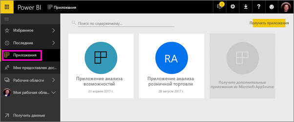

# Создание рабочих областей с коллегами в Power BI

В Power BI вы можете создавать *рабочие области*, где вы будете вместе с коллегами создавать и редактировать коллекции панелей мониторинга и отчетов. Затем их можно объединить в *приложение*, которое можно распространить в рамках всей организации или передать конкретным пользователям или группам. 

При создании рабочей области вы создаете соответствующую базовую группу Office 365. Все действия по администрированию рабочей области выполняются в Office 365. В эти рабочие области можно добавить коллег в качестве участников или администраторов. В рабочей области вы все можете совместно работать над панелями мониторинга, отчетами и другими статьями, которые планируете опубликовать для более широкой аудитории. Каждый член рабочей области приложения должен иметь лицензию Power BI Pro. 

**Знаете ли вы?** В Power BI доступна предварительная версия нового интерфейса рабочей области. Ознакомьтесь со статьей [Создание новых рабочих областей (предварительная версия)](service-create-the-new-workspaces.md) и узнайте, как рабочие области изменятся в будущем. 

## Видео. Приложения и рабочие области приложений
<iframe width="640" height="360" src="https://www.youtube.com/embed/Ey5pyrr7Lk8?showinfo=0" frameborder="0" allowfullscreen></iframe>

## Создание рабочей области приложения на основе группы Office 365

Вы создаете рабочую область приложения на основе группы Office 365.

[!INCLUDE [powerbi-service-create-app-workspace](./includes/powerbi-service-create-app-workspace.md)]

При первом создании для распространения рабочей области в Office 365 понадобится около часа. 

### Добавление изображения в рабочую область приложения Office 365 (необязательно)
По умолчанию служба Power BI создает небольшой цветной кружок с кратким названием приложения. Но вы можете добавить изображение. Чтобы добавить изображение, требуется лицензия Exchange Online.

1. Выберите **Рабочие области**, щелкните многоточие (...) рядом с именем рабочей области, а затем выберите **Members** (Элементы). 
   
     
   
    После этого в новом окне браузера откроется учетная запись Office 365 Outlook рабочей области.
2. При наведении указателя мыши на цветной круг в верхнем левом углу появится значок с изображением карандаша. Выберите его.
   
     
3. Щелкните значок с изображением карандаша еще раз и найдите необходимое изображение.
   
     

4. Нажмите кнопку **Сохранить**.
   
     
   
    В окне Office 365 Outlook вместо цветного кружка появится выбранное изображение. 
   
     
   
    Через несколько минут оно также появится в приложении в Power BI.
   
     

## Добавление содержимого в рабочую область приложения

После создания рабочей области приложения необходимо добавить в нее содержимое. Этот процесс напоминает добавление содержимого в раздел "Моя рабочая область". Разница заключается в том, что другие пользователи рабочей области могут видеть содержимое и работать над ним. Значительное различие заключается в том, что после завершения вы сможете опубликовать содержимое как приложение. При просмотре содержимого в списке содержимого в рабочей области приложения в качестве владельца указано имя рабочей области приложения.

### Подключение к сторонним службам в рабочих областях приложений

Приложения предоставляются для всех сторонних служб, которые поддерживает Power BI, поэтому вам проще получить данные из используемых служб, таких как Microsoft Dynamics CRM, Salesforce или Google Analytics. Вы можете опубликовать приложения организации, чтобы предоставить пользователям нужные им данные.

В текущих рабочих областях вы также можете подключиться с помощью пакетов содержимого организации и сторонних пакетов содержимого, например Microsoft Dynamics CRM, Salesforce или Google Analytics. Вам следует перенести пакеты содержимого организации в приложения.

## Распространение приложения

Когда содержимое будет готово, выберите панели мониторинга и отчеты для публикации, а затем опубликуйте их в виде *приложения*. Ваши коллеги могут получить ваши приложения несколькими способами. С разрешения администратора Power BI их можно установить автоматически в учетных записях Power BI коллег. В противном случае они могут найти и установить ваши приложения из Microsoft AppSource. Кроме того, вы можете отправить им прямую ссылку. Кроме того, эти приложения автоматически получают обновления, и вы можете управлять частотой обновления данных. Дополнительные сведения см. в разделе [Публикация приложений с панелями мониторинга и отчетами в Power BI](consumer/end-user-create-apps.md).

## Часто задаваемые вопросы о приложениях Power BI

### Чем приложения отличаются от пакетов содержимого организации?
Приложения — усовершенствованные пакеты содержимого организации. Если у вас уже есть пакеты содержимого организации, они будут продолжать работать параллельно с приложениями. Приложения и пакеты содержимого имеют несколько существенных отличий. 

* После того как бизнес-пользователь установил пакет содержимого, он теряет свое удостоверение группы. Это всего лишь список информационных панелей и отчетов, чередующийся с другими информационными панелями и отчетами. В то же время приложения сохраняют параметры группирования и удостоверение даже после установки. Это упрощает возможность обращаться к ним даже со временем.
* Из любой рабочей области можно создать несколько пакетов содержимого, но между приложением и его рабочей областью установлена связь "один к одному". 
* Со временем мы планируем отказаться от пакетов содержимого организации, поэтому в дальнейшем мы советуем создавать приложения.  
* Новая предварительная версия интерфейса рабочих областей — это еще один шаг в сторону отмены пакетов содержимого организации. Вы не можете использовать или создавать их в предварительной версии рабочих областей.

См. раздел [Чем новые рабочие области приложений отличаются от существующих](service-create-the-new-workspaces.md#how-are-the-new-app-workspaces-different-from-current-app-workspaces), чтобы сравнить существующие и новые рабочие области приложений. 

## Дальнейшие действия
* [Установка и использование приложений с информационными панелями и отчетами в Power BI](consumer/end-user-apps.md)
* [Приложения Power BI для внешних служб](consumer/end-user-connect-to-services.md)
- [Создание рабочих областей (предварительная версия)](service-create-the-new-workspaces.md)
* У вас появились вопросы? [Попробуйте задать вопрос в сообществе Power BI.](http://community.powerbi.com/)
