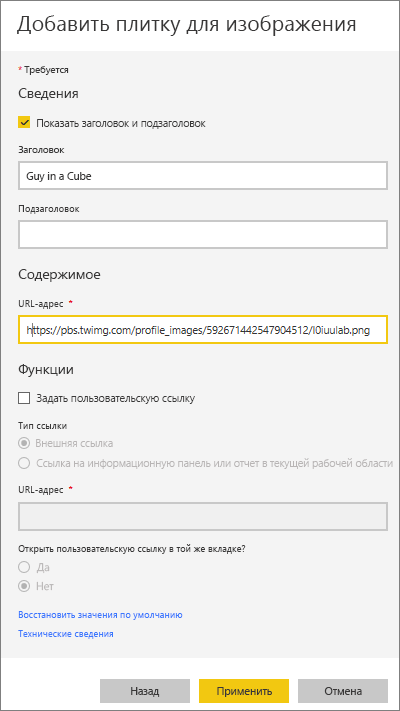
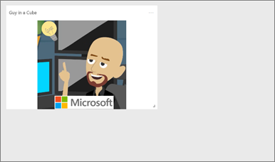
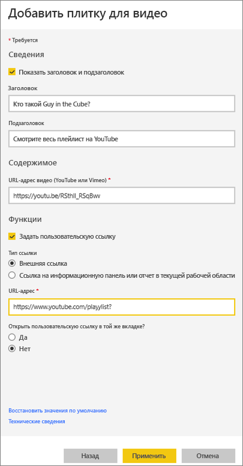
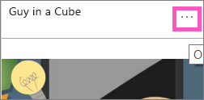
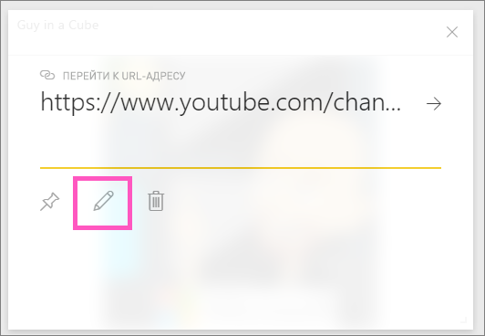

# <a name="add-image-text-video-and-more-to-your-dashboard"></a>Добавление изображения, текста, видео и другого содержимого на информационную панель
<iframe width="560" height="315" src="https://www.youtube.com/embed/e2PD8m1Q0vU" frameborder="0" allowfullscreen></iframe>


## <a name="add-tile"></a>Добавление плитки
Элемент управления **Добавить плитку** позволяет напрямую добавлять изображение, текстовое поле, видео, потоковую передачу данных или веб-код на панель мониторинга.

1. В верхней части строки меню выберите **Добавить плитку**. В связи с ограниченным пространством вы можете увидеть только знак "плюс" .
   
    
2. Выберите добавляемый тип плитки: **изображение**, **текстовое поле**, **видео**, **веб-содержимое** или **пользовательские данные потоковой передачи**.
   
    

## <a name="add-an-image"></a>Добавление изображения
Предположим, вы хотите, чтобы на информационной панели отображалась эмблема вашей организации или какое-либо другое изображение. Необходимо сохранить файл образа в сети и ссылку на него. Убедитесь, что для доступа к файлу образа не нужны специальные учетные данные. Например, для OneDrive и SharePoint требуется проверка подлинности, поэтому образы, хранящиеся в этих службах, нельзя добавить на информационную панель таким способом.  

1. Выберите элементы **Изображение** > **Далее**.
2. Добавьте сведения об изображении в окно **Добавление плитки для изображения**.
   
    
   
   * Чтобы отобразить заголовок над изображением, выберите *Показать заголовок и подзаголовок* и введите заголовок и подзаголовок.
   * Введите URL-адрес изображения.
   * Чтобы сделать плитку гиперссылкой, выберите **Задать пользовательскую связь** и введите URL-адрес.  Когда коллеги щелкнут это изображение или заголовок, они будут перенаправлены на этот URL-адрес.
   * Нажмите кнопку **Применить**.  На информационной панели измените размер изображения или переместите его (если необходимо).
     
     

## <a name="add-a-text-box-or-dashboard-heading"></a>Добавление текстового поля или заголовка панели мониторинга
1. Выберите элементы **Текстовое поле > Далее**.
   
   > **Примечание**. Чтобы добавить заголовок панели мониторинга, введите его в текстовом поле и увеличьте шрифт.
   > 
2. Форматирование текстового поля.
   
   * Чтобы отобразить заголовок над текстовым полем, выберите **Показать заголовок и подзаголовок** и введите заголовок и подзаголовок.
   * Введите и отформатируйте содержимое текстового поля.  
   * При необходимости задайте настраиваемую ссылку для заголовка. Настраиваемая ссылка может указывать на внешний сайт, панель мониторинга или отчет в рабочей области. Но в этом примере мы добавили гиперссылки на само текстовое поле, поэтому флажок **Задать настраиваемую ссылку** не будет установлен.

     
   
3. Нажмите кнопку **Применить**.  На информационной панели измените размер текстового поля или переместите его (если необходимо).
   
   

## <a name="add-a-video"></a>Добавление видео
Плитка с видео YouTube или Vimeo, добавленная на панель мониторинга, воспроизводится прямо на ней.

1. Выберите элементы **Видео > Далее**.
2. Добавьте сведения о видео в область **Добавление плитки видео**.
   
    
   
   * Чтобы отобразить заголовок и подзаголовок над плиткой с видео, выберите *Показать заголовок и подзаголовок* и введите заголовок и подзаголовок. В этом примере мы добавим подзаголовок, а затем преобразуем его в гиперссылку на весь список воспроизведения на YouTube.
   * Введите URL-адрес для видео.
   * Добавьте гиперссылку для заголовка и подзаголовка.  Возможно, после того как ваши коллеги посмотрят встроенное видео, вы захотите, чтобы они просмотрели весь список воспроизведения на YouTube, — добавьте ссылку на ваш список воспроизведения.
   * Нажмите кнопку **Применить**.  На информационной панели измените размер видео или переместите его (если необходимо).
     
      
3. Выберите плитку с видео для воспроизведения видеоролика.
4. Выберите подзаголовок для переключение на список воспроизведения на YouTube.

## <a name="add-streaming-data"></a>Добавление данных потоковой передачи
<iframe width="560" height="315" src="https://www.youtube.com/embed/kOuINwgkEkQ" frameborder="0" allowfullscreen></iframe>

## <a name="add-web-content"></a>Добавление веб-содержимого
Вставьте или введите любое HTML-содержимое.  Power BI добавляет его на информационную панель в виде плитки. Введите код внедрения вручную или скопируйте его с сайтов, таких как Twitter, YouTube, embed.ly и многих других.

1. Выберите элементы **Веб-содержимое > Далее**.
2. Добавьте данные в области **Добавление плитки веб-содержимого**.
   
    
   
   * Чтобы отобразить заголовок над плиткой, выберите *Показать заголовок и подзаголовок* и введите заголовок и/или подзаголовок.
   * Введите встроенный код. В этом примере мы копируем канал Twitter.
3. Нажмите кнопку **Применить**.  На информационной панели измените размер плитки с веб-содержимым или переместите ее (если необходимо).
     
      

## <a name="tips-for-embedding-web-content"></a>Советы по внедрению веб-содержимого
* Для элементов IFrame используйте безопасный источник. Если при вводе кода внедрения элемента IFrame вы получаете пустую плитку, проверьте, не используется ли для источника IFrame протокол **http** .  Если это так, измените его на **https**.
  
  ```
  <iframe src="https://xyz.com">
  ```
* Измените ширину и высоту. Этот код внедрения внедряет видео и устанавливает размер видеопроигрывателя 560 x 315 пикселей.  Этот размер останется прежним при изменении размеров плитки.
  
  ```
  <iframe width="560" height="315"
  src="https://www.youtube.com/embed/Cle_rKBpZ28" frameborder="0"
   allowfullscreen></iframe>
  ```
  
  Если вы хотите, чтобы проигрыватель масштабировался в соответствии с размером плитки, задайте ширину и высоту равными 100 %.
  
  ```
  <iframe width="100%" height="100%"
  src="https://www.youtube.com/embed/Cle_rKBpZ28" frameborder="0"
   allowfullscreen></iframe>
  ```
* Этот код встраивает твит и сохраняет на информационной панели ссылки на следующие элементы: подкаст **AFK**, страница Twitter пользователя **@GuyInACube**, элемент **Подписаться**, **#аналитика**, **Ответить**, **Ретвитнуть** и **Нравится**.  При выборе плитки открывается подкаст в Twitter.
  
  ```
  <blockquote class="twitter-tweet" data-partner="tweetdeck">
  <p lang="en" dir="ltr">Listen to
  <a href="https://twitter.com/GuyInACube">@GuyInACube</a> talk to
  us about making videos about Microsoft Business Intelligence
  platform
  <a href="https://t.co/TmRgalz7tv">https://t.co/TmRgalz7tv </a>
  <a href="https://twitter.com/hashtag/analytics?src=hash">
  #analytics</a></p>&mdash; AFTK Podcast (@aftkpodcast) <a
  href="https://twitter.com/aftkpodcast/status/693465456531771392">
  January 30, 2016</a></blockquote> <script async src="//platform.twitter.com/widgets.js" charset="utf-8"></script>
  ```

## <a name="edit-a-tile"></a>Изменение плитки
Порядок изменения плитки...

1. Наведите указатель на правый верхний угол плитки и щелкните многоточие.
   
    
2. Выберите значок изменения, чтобы повторно открыть область **Подробности о плитке** и внести изменения.
   
    

## <a name="considerations-and-troubleshooting"></a>Рекомендации и устранение неполадок
* Чтобы упростить перемещение плитки на информационной панели, добавьте заголовок и/или подзаголовок.
* Если вы хотите внедрить часть содержимого с веб-сайта, однако этот сайт не предоставляет код внедрения, который можно было бы скопировать, обратитесь к embed.ly для создания кода внедрения.

## <a name="next-steps"></a>Дальнейшие действия
[Плитки панели мониторинга в Power BI](service-dashboard-tiles.md)

Появились дополнительные вопросы? [Ответы на них см. в сообществе Power BI](http://community.powerbi.com/).

