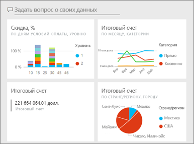
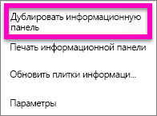
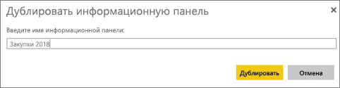
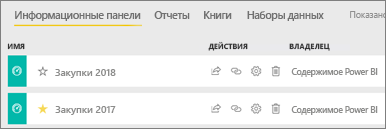

# Создание копии информационной панели Power BI

Есть много разных причин для создания копии собственной панели мониторинга. Эта копия будет сохранена в ту же (активную) рабочую область. Может быть, вы хотите внести изменения и проверить ее производительность по сравнению с исходной панелью или создать немного отличающиеся версии, чтобы предоставить их коллегам и участникам команды, а также распределить в регионах. Возможно, коллега восхищается дизайном вашей информационной панели и хочет использовать его, чтобы составлять отчеты для руководства. Или, например, у вас есть новая база данных с одинаковой структурой и типами данных и вы хотите повторно использовать уже созданную информационную панель. Это тоже можно сделать, но для этого потребуется немного поработать в Power BI Desktop. 

Создавать дубликаты панелей мониторинга, к которым вы получили доступ как к приложениям, нельзя.

1. Откройте информационную панель.
2. В правом верхнем углу щелкните многоточие (...) и выберите **Дублировать информационную панель**.
   
   
3. Присвойте информационной панели имя и выберите **Duplicate** (Дублировать). 
   
   
4. Новая панель мониторинга сохранится в той же рабочей области, что и исходная. 
   
   

## Дальнейшие действия
* [Изменение и удаление плитки на информационной панели](service-dashboard-edit-tile.md) 
* [Советы по созданию эффективной панели мониторинга Power BI](service-dashboards-design-tips.md) 

Появились дополнительные вопросы? [Ответы на них см. в сообществе Power BI.](http://community.powerbi.com/)

